## Configuración

* VmWare
* [ISO Windows Server 2016 ](https://www.microsoft.com/en-us/evalcenter/evaluate-windows-server-2016)
* ProductKey: [https://docs.ovh.com/us/es/dedicated/clave-windows/](https://docs.ovh.com/us/es/dedicated/clave-windows/)
* Desactivamos el Flopy
* Capacidad: 60 GB


**Usuario creado**

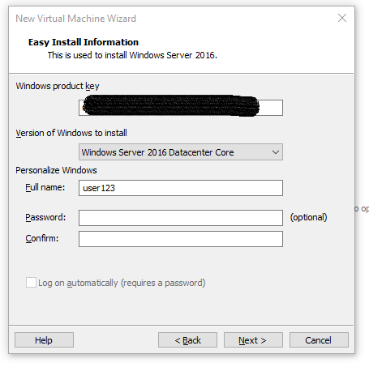

**Propiedades**

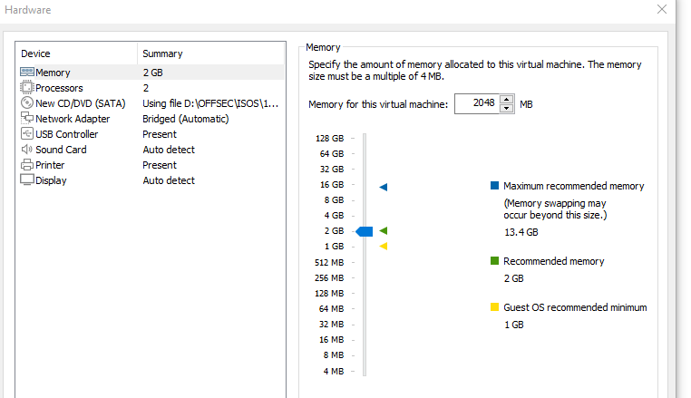

Presionar F10 para cargar la iso.
Colocamos el idioma de su preferencia.

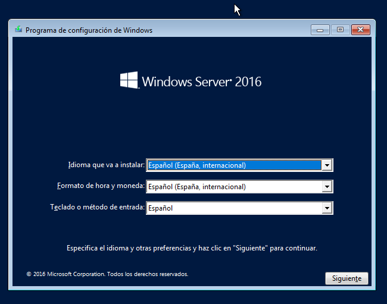

Seleccionamos `datacenter evaluation`

> Esta opción reduce la administración y el servicio al instalar sólo el contenido necesario para ejecutar la mayoria de aplicaciones y roles de servidor.
> **Importante**: No incluye ninuna GUI.

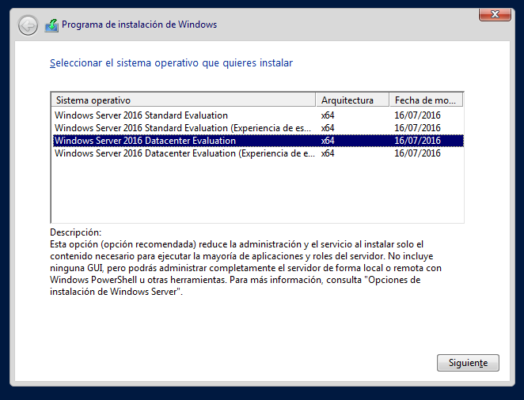

Aceptamos los términos de licencia.

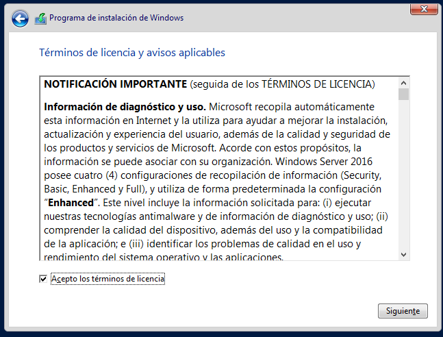

Elejimos la opción de `personalizada`.

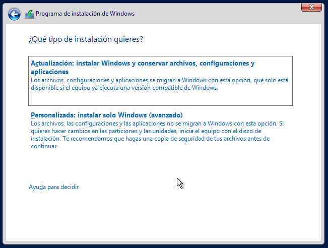

Seleccionamos el espacio asignado.

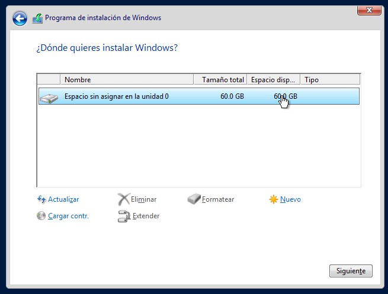

Y por último damos a siguiente, esperamos a que termine el proceso  
> Está parte puede demorar dependiendo de los recursos de sus sistema

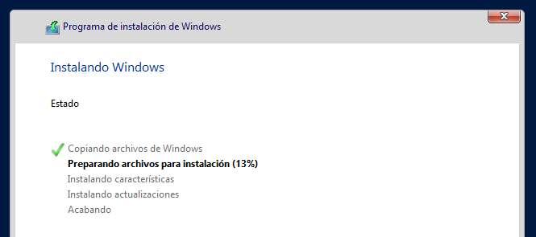

----

Una vez que termine nos mandará un mensaje para agregar una contraseña al usuario `administrador`.  
Éste será las credenciales que le asigné:  
`administrador:admin123$!`

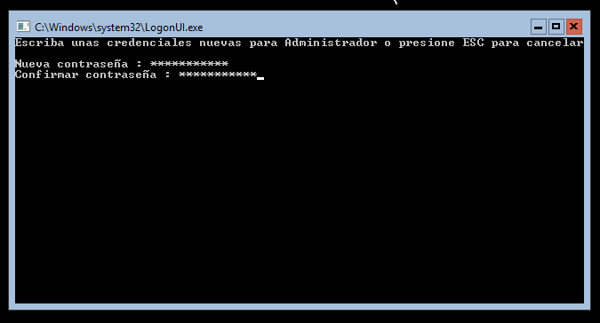

Instalo las ``VmWare Tools` para poder obtener portapapeles con el host principal ap´licando el siguiente comando.

```
D:setup.exe
```

Postiormente reinicio la máquina: `shutdown /r /t 0`

----

**Instalar los servicios de Active Directory**

```
Add-WindowsFeature RSAT-ADDS
Install-WindowsFeature -Name AD-Domain-Services -IncludeManagementTools
Import-Module ServerManager
Import-Module ADDSDeployment
```

**Cambiar el nombre del equipo**

```
Rename-Computer -NewName "DC-Company"
```

**Configurando AD**

```
Install-ADDSForest -CreateDnsDelegation:$false -DatabasePath "C:\\Windows\\NTDS" -DomainMode "7" -DomainName "fsociety.local" -DomainNetbiosName "fsociety" -ForestMode "7" -InstallDns:$true -LogPath "C:\\Windows\\NTDS" -NoRebootOnCompletion:$false -SysvolPath "C:\\Windows\\SYSVOL" -Force:$true
```

Nos pedirá una contraseña para el usuario administrador de dominio.  
La contraseña que coloqué fue: `administrador : P@$$w0rd123$!`

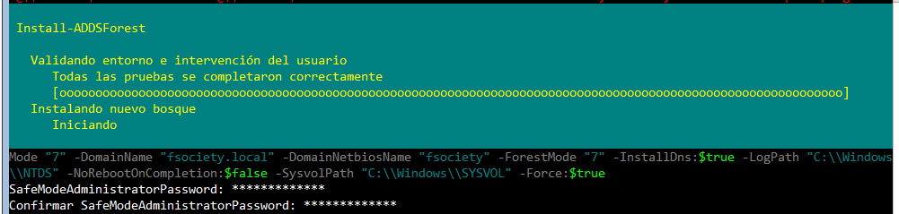

La máquina se reiniciará, ahora nos autenticaremos como un usuario administrador de dominio.

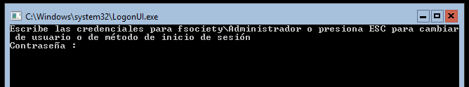

**Creando usuarios**

```
New-ADUser -Name "ealderson" -GivenName "Elliot" -Surname "Alderson" -SamAccountName "ealderson" -AccountPassword (ConvertTo-SecureString -String "Password1" -AsPlainText -Force) -ChangePasswordAtLogon $False -DisplayName "Elliot Alderson" -Enabled $True
New-ADUser -Name "dalderson" -GivenName "Darlene" -Surname "Alderson" -SamAccountName "dalderson" -AccountPassword (ConvertTo-SecureString -String "Password2" -AsPlainText -Force) -ChangePasswordAtLogon $False -DisplayName "Darlene Alderson" -Enabled $True
New-ADUser -Name "amoss" -GivenName "Angela" -Surname "Moss" -SamAccountName "amoss" -AccountPassword (ConvertTo-SecureString -String "Password3" -AsPlainText -Force) -ChangePasswordAtLogon $False -DisplayName "Angela Moss" -Enabled $True
```

**Desinstalar Windows Defender**  
Para prevenir errores en los ataques lo recomendable es desactivar el `Windows Defender` pero por comodidad prefiero desinstalarlo.

```
Uninstall-WindowsFeature -Name Windows-Defender
```

### Ataques AD

**Kerberoasting attack**

```
net localgroup Administradores fsociety\amoss /add
setspn -s http/fsociety.local:80 amoss
```

**Comprobar usuario**

```
setspn -Q */* | findstr SVC_SQLService
```

**ASRepRoast Attack**

```
Set-ADAccountControl SVC_SQLService -DoesNotRequirePreAuth $True
```

**SMB relay**

```
Set-SmbClientConfiguration -RequireSecuritySignature 0 -EnableSecuritySignature 0 -Confirm -Force
```

**DNSAdmin**

```
net localgroup "DnsAdmins" mvazquez /add
```

**Ver información del recurso compartido**

```
Get-SmbShareAccess -Name Data
```

Otros:

> Add-WindowsFeature: Instale roles, servicios de rol y características especificados en un equipo que ejecute Windows Server 2008 R2
