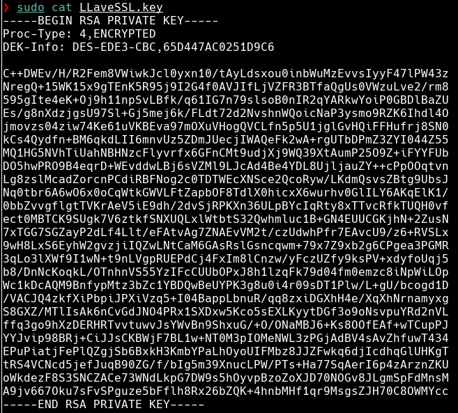
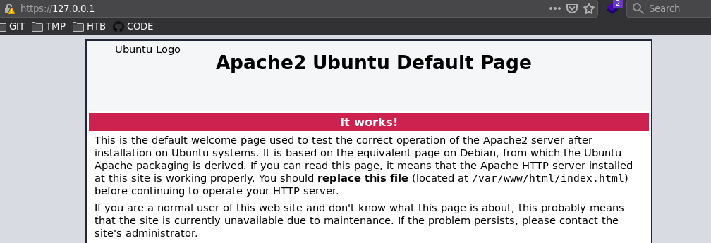
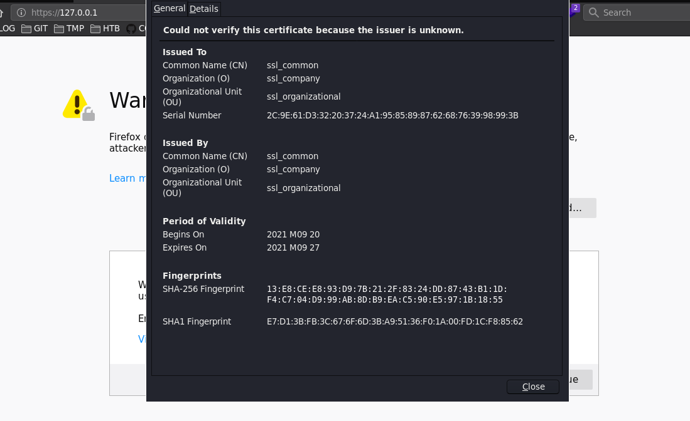

​Venga vamos a ello. ya con el servicio de apache iniciado... vemos que a través de nuestra ip privada o simplemente escribiendo `localhost` accedemos a nuestro servidor.  
Comencemos a configurarlo.

Nos iremos a la ruta `/etc/apache2` y escribiremos el siguiente comando para generar nuestra llave `ssl`:

```
❯ sudo openssl genrsa -des3 -out LLaveSSL.key
Generating RSA private key, 2048 bit long modulus (2 primes)
...............................+++++
.........................................................................................................................+++++
e is 65537 (0x010001)
Enter pass phrase for LLaveSSL.key:
Verifying - Enter pass phrase for LLaveSSL.key:
```

Hemos tenido que escribir una contraseña... en nuestro caso he escrito `ssl123`. Vemos como nuestra llave ha sido generada:



Ahora gracias a nuestra llave creamos un certificado de la siguiente forma:

```
❯ sudo openssl req -new -key LLaveSSL.key -out miCertificado.csr
Enter pass phrase for LLaveSSL.key:
You are about to be asked to enter information that will be incorporated
into your certificate request.
What you are about to enter is what is called a Distinguished Name or a DN.
There are quite a few fields but you can leave some blank
For some fields there will be a default value,
If you enter '.', the field will be left blank.
-----
Country Name (2 letter code) [AU]:ssl_peru
string is too long, it needs to be no more than 2 bytes long
Country Name (2 letter code) [AU]:ES
State or Province Name (full name) [Some-State]:ssl_provincia
Locality Name (eg, city) []:ssl_city
Organization Name (eg, company) [Internet Widgits Pty Ltd]:ssl_company
Organizational Unit Name (eg, section) []:ssl_organizational
Common Name (e.g. server FQDN or YOUR name) []:ssl_common
Email Address []:ssl@test.com

Please enter the following 'extra' attributes
to be sent with your certificate request
A challenge password []:ssl_password
An optional company name []:ssl_optional
```

Los datos no tienen por qué ser reales... serán los que aparecerán a la hora de ver el certificado desde la web, en este caso sólo os muestro. La clave introducida fue clave.

----

Ahora toca firmar nuestro certificado y darle un período de validez.  
En nuestro caso vamos a darle unos 7 días.

```
❯ sudo openssl x509 -req -days 7 -in miCertificado.csr -signkey LLaveSSL.key -out miCertificadoFirmado.crt
Signature ok
subject=C = ES, ST = ssl_provincia, L = ssl_city, O = ssl_company, OU = ssl_organizational, CN = ssl_common, emailAddress = ssl@test.com
Getting Private key
Enter pass phrase for LLaveSSL.key:
```

Ya estamos listos para copiar nuestra llave y nuestro certificado firmado a los directorios correspondientes del `ssl`.

----

​Pero antes, tendremos que aplicar el siguiente comando de lo contrario de nada servirá copiar dichos ficheros en las rutas correspondientes, pues no funcionará:

```
> sudo a2enmod ssl
```

Y ahora sí:

```
└──╼# sudo cp LLaveSSL.key /etc/ssl/private/
└──╼# sudo cp miCertificadoFirmado.crt /etc/ssl/certs
```

El siguiente paso es editar nuestro fichero por defecto del `ssl`, ya que tendremos que comentar las rutas por defecto y sustituirlas por las nuevas donde se alojan nuestro certificado y la llave.

Para ello debajo de `SSLEngine on` tendremos que escribir estas 3 líneas en fichero `/etc/apache2/sites-available`:

```
[...]
#   SSL Engine Switch:
#   Enable/Disable SSL for this virtual host.
SSLEngine on
SSLOptions +FakeBasicAuth +ExportCertData +StrictRequire
SSLCertificateKeyFile /etc/ssl/certs/miCertificadoFirmado.crt
SSLCertificateKeyFile /etc/ssl/private/LLaveSSL.key
#   A self-signed (snakeoil) certificate can be created by installing
#   the ssl-cert package. See
#   /usr/share/doc/apache2/README.Debian.gz for more info.
[...]
```

Ya está todo listo, ahora tan sólo tenemos que hacer una recarga del fichero default `ssl` y reiniciar `apache`:

```
❯ sudo a2ensite default-ssl.conf
❯ sudo service apache2 restart
```

----

Vemos que nos piden nuestra contraseña... y ahora si probamos accediendo por ejemplo desde firefox por https:



También podemos visualizar el certificado.


