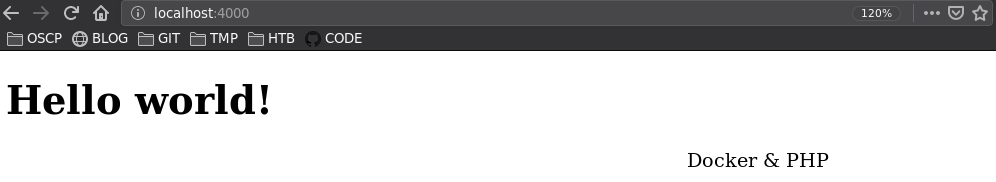

| argumento | descripción                                   |
|-----------|-----------------------------------------------|
| build     | contruye una imágen a partir de un Dockerfile |
| -t        | nombre para la imágen                         |
| -d        | segundo plano                                 |
| --name    | nombre del contenedor                         |
| -p        | [port_local]:[port_container]                 |
| -v        | [vol_local]:[vol_docker]

## Esctructura

```
── DOCKER-PHP
   ├── Dockerfile
   └── src
       ├── about.html
       └── index.php
```

**Archivo `Dockerfile`**

```
FROM php:7.4-apache
COPY /src /var/www/html
EXPOSE 80
```

**Carpeta `src`**

```
File: about.html
<h1>
    About
</h1>
```

```
File: index.php
<!DOCTYPE html>
<html lang="en" dir="ltr">
    <head>
        <meta charset="utf-8">
        <title>Docker & PHP</title>
    </head>
    <body>

        <h1>
                <?php echo "Hello world!"; ?>
        </h1>

        <marquee>Docker & PHP</marquee>

    </body>
</html>
```


Construir la imágen

```
> docker build -t hello-php  .
```

Correr el contenedor

```
❯ docker run -p 4000:80 -d -v $(pwd)/src:/var/www/html --name myServer hello-php
```




Conectar al contenedor

```
❯ docker ps  | awk 'NR==2' | awk '{print  $1}'
❯ docker  exec -it $(!!) bash
```

Detener el contenedor

```
> docker stop <id>
```


