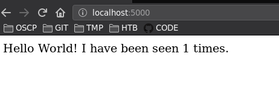
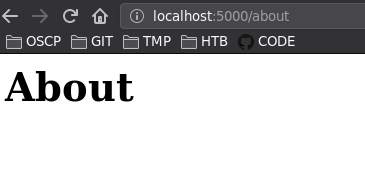

### docker-compose

**ports**: [port_local]:[port_container]  
**web y redis**: imágenes docker  
**build**: opciones de configuración que se aplican en el momento de compilación  
[https://docs.docker.com/compose/compose-file/compose-file-v3/](https://docs.docker.com/compose/compose-file/compose-file-v3/)

> redis: motor de base de datos en memoria basado en almacenamientoen tablas de hashes y de código abierto

## Estructura

```
.
├── app.py
├── docker-compose.yml
├── Dockerfile
├── notes.md
├── __pycache__
│   └── app.cpython-37.pyc
└── requirements.txt
```

### app.py

```
import time

import redis
from flask import Flask

app = Flask(__name__)
cache = redis.Redis(host='redis', port=6379)

def get_hit_count():
    retries = 5
    while True:
        try:
            return cache.incr('hits')
        except redis.exceptions.ConnectionError as exc:
            if retries == 0:
                raise exc
            retries -= 1
            time.sleep(0.5)

@app.route('/')
def hello():
    count = get_hit_count()
    return 'Hello World! I have been seen {} times.\n'.format(count)

@app.route('/about')
def about():
    return "<h1>About</h1>"
```

### Dockerfile

```
FROM python:3.7-alpine
WORKDIR /code
ENV FLASK_APP=app.py
ENV FLASK_RUN_HOST=0.0.0.0
RUN apk add --no-cache gcc musl-dev linux-headers
COPY requirements.txt requirements.txt
RUN pip install -r requirements.txt
EXPOSE 5000
COPY . .
CMD ["flask", "run"]
```

### requirements.txt

```
flask
redis
```

### docker-compose-yml

```
version: "3.7"
services:
  web:
    build:
      context: .
      network: host
    ports:
      - "5000:5000"
    volumes:
      - .:/code
    environment:
      FLASK_ENV: development
  redis:
    image: "redis:alpine"
```

----

Crear contenedor

```
docker-compose up
```

Visualizando desde la web.



Ruta `about`



```
❯ docker-compose ps   
         Name                       Command               State           Ports         
----------------------------------------------------------------------------------------
compose-python_redis_1   docker-entrypoint.sh redis ...   Up      6379/tcp              
compose-python_web_1     flask run                        Up      0.0.0.0:5000->5000/tcp
```

Ver las variables de entorno dentro del contenedor creado

```
❯ docker-compose run web env
PATH=/usr/local/bin:/usr/local/sbin:/usr/local/bin:/usr/sbin:/usr/bin:/sbin:/bin
HOSTNAME=ec75e9c3bb25
TERM=xterm
FLASK_ENV=development
LANG=C.UTF-8
GPG_KEY=0D96DF4D4110E5C43FBFB17F2D347EA6AA65421D
PYTHON_VERSION=3.7.12
PYTHON_PIP_VERSION=21.2.4
PYTHON_SETUPTOOLS_VERSION=57.5.0
PYTHON_GET_PIP_URL=https://github.com/pypa/get-pip/raw/c20b0cfd643cd4a19246ccf204e2997af70f6b21/public/get-pip.py
PYTHON_GET_PIP_SHA256=fa6f3fb93cce234cd4e8dd2beb54a51ab9c247653b52855a48dd44e6b21ff28b
FLASK_APP=app.py
FLASK_RUN_HOST=0.0.0.0
HOME=/root
```

Ejecutar una shell en el contenedor

```
 ❯ docker-compose run web sh  
/code # ifconfig
eth0      Link encap:Ethernet  HWaddr 02:42:AC:16:00:04  
          inet addr:172.22.0.4  Bcast:172.22.255.255  Mask:255.255.0.0
          UP BROADCAST RUNNING MULTICAST  MTU:1500  Metric:1
          RX packets:8 errors:0 dropped:0 overruns:0 frame:0
          TX packets:0 errors:0 dropped:0 overruns:0 carrier:0
          collisions:0 txqueuelen:0 
          RX bytes:656 (656.0 B)  TX bytes:0 (0.0 B)

lo        Link encap:Local Loopback  
          inet addr:127.0.0.1  Mask:255.0.0.0
          UP LOOPBACK RUNNING  MTU:65536  Metric:1
          RX packets:0 errors:0 dropped:0 overruns:0 frame:0
          TX packets:0 errors:0 dropped:0 overruns:0 carrier:0
          collisions:0 txqueuelen:1000 
          RX bytes:0 (0.0 B)  TX bytes:0 (0.0 B)
```

Detener los contenedores

```
❯ docker-compose stop      
Stopping compose-python_web_1   ... done
Stopping compose-python_redis_1 ... done
```

Eliminar los contenedores

```
❯ docker-compose down
```
