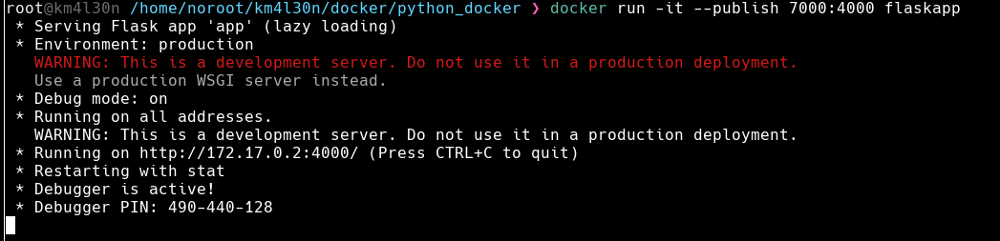
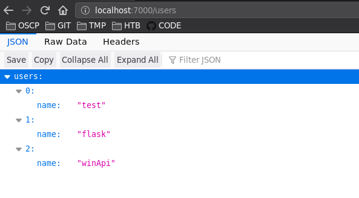

### Flask

**jsonify()**: convertir un objeto a json

### Alpine

**apk**: administrador de paquetes  
**--no-ache**: no utilizar memoria caché en caso tenga un paquete

### Esctructura

```
.
├── Dockerfile
├── requirements.txt
├── src
│   ├── app.py
│   ├── __pycache__
│   └── users.py
└── venv
```

### Dockerfile

```
FROM alpine:3.10

RUN apk add --no-cache python3-dev \
    && pip3 install --upgrade pip

WORKDIR /app

COPY . /app

RUN pip3 --no-cache-dir install -r requirements.txt

CMD ["python3","src/app.py"]
```

### Requirements

```
click==8.0.1
Flask==2.0.1
itsdangerous==2.0.1
Jinja2==3.0.1
MarkupSafe==2.0.1
Werkzeug==2.0.1
```

### app.py

```
from flask import Flask, jsonify
from users import users

app = Flask(__name__)

@app.route("/", methods=['GET'])
def ping():
    return jsonify({"response":"Hello World"})

@app.route("/users")
def userHandler():
    return jsonify({"users": users})


if __name__=="__main__":
    app.run(host="0.0.0.0", port=4000, debug=True)
```

### users.py

```
users = [
    {"name" : "test"},
    {"name" : "flask"},
    {"name" : "winApi"},
]
```

## Comandos usados

```
docker build -t flaskapp . --network host
docker run -it flaskapp /bin/sh
pip freeze > requirements.txt
docker run -it --publish 7000:4000 flaskapp
docker exec -it 6d4e81f7ffd0 /bin/sh
docker run -it --publish 7000:4000 --detach flaskapp
```



Realizo una petición web al localhost

```
❯ curl -s http://127.0.0.1:7000/users | jq
{
  "users": [
    {
      "name": "test"
    },
    {
      "name": "flask"
    },
    {
      "name": "winApi"
    }
  ]
}
```

Visualizando desde el navegador.


