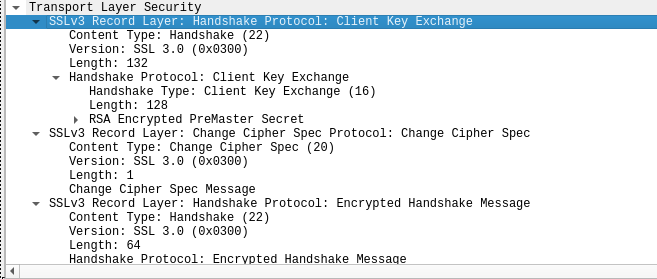
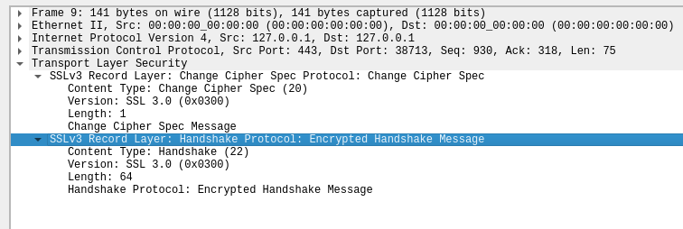
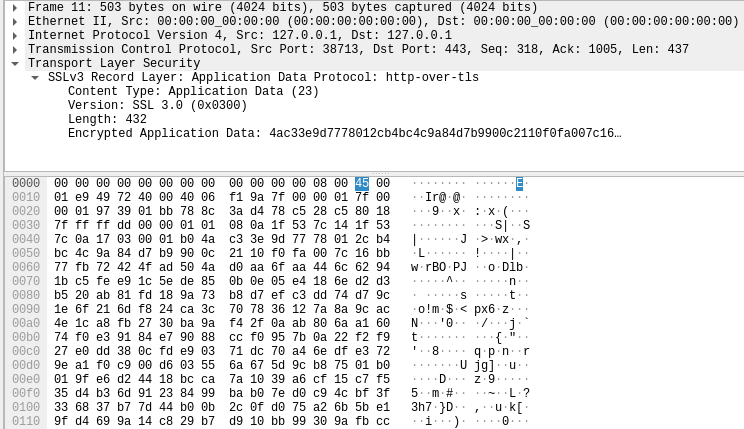
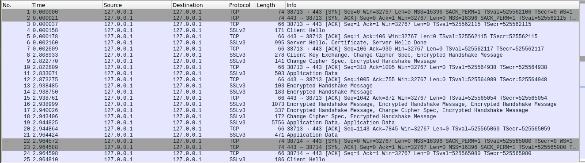
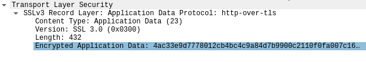
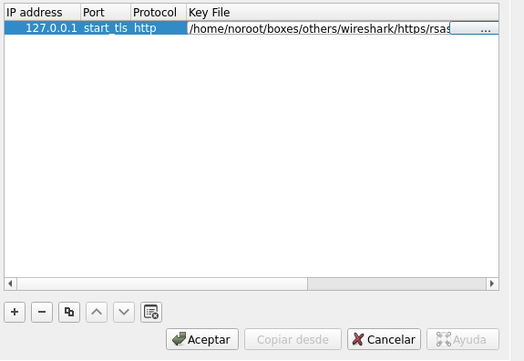
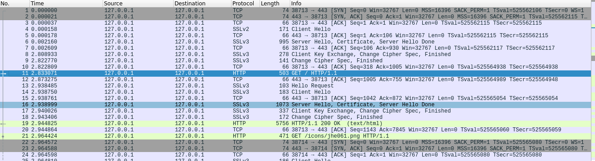
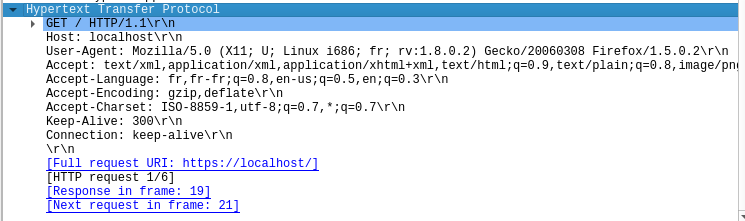
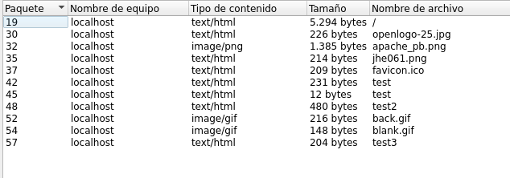

**HTTPS** o Hypertext Transfer Protocol Secure puede ser uno de los protocolos más molestos de comprender desde la perspectiva del análisis de paquetes y puede resultar confuso comprender los pasos necesarios para analizar los paquetes HTTPS.

### Descripción general del tráfico HTTPS

Antes de enviar información cifrada, el cliente y el servidor deben acordar varios pasos para crear un túnel seguro.

- El cliente y el servidor acuerdan una versión de protocolo
- El cliente y el servidor seleccionan un algoritmo criptográfico
- El cliente y el servidor pueden autenticarse entre sí; este paso es opcional
- Crea un túnel seguro con una clave pública

Podemos comenzar a analizar el tráfico HTTPS mirando los paquetes para el protocolo de enlace entre el cliente y el servidor. A continuación se muestra un paquete **Client Hello** que muestra la capa de registro `SSLv2`, el tipo de protocolo de enlace y la versión `SSL`.

A continuación se muestra el paquete **Server Hello** que envía información similar al paquete Client Hello, sin embargo, esta vez incluye detalles de la sesión e información del certificado `SSL`

A continuación se muestra el paquete de intercambio de claves de cliente, esta parte del protocolo de enlace determinará la **clave pública** que se utilizará para cifrar más mensajes entre el cliente y el servidor.

En el siguiente paquete, el servidor confirmará la clave pública y creará el túnel seguro, todo el tráfico después de este punto se cifrará según las especificaciones acordadas enumeradas anteriormente.

El tráfico entre el Cliente y el Servidor ahora está encriptado y `necesitará la clave secreta` para desencriptar el flujo de datos que se envía entre los dos hosts.

----

### Análisis práctico de paquetes HTTPS

Para practicar y poner manos a la obra con los paquetes HTTPS, podemos analizar el PCAP **snakeoil2_070531** y el conjunto de claves de descifrado proporcionado por Wireshark.

Primero necesitamos cargar el PCAP en Wireshark. Navegue a Archivo> Abrir y seleccione el PCAP de snakeoil2.

Al observar la captura de paquetes anterior, podemos ver que todas las solicitudes están encriptadas. Mirando más de cerca los paquetes, podemos ver el protocolo de enlace **HTTPS**, así como las propias solicitudes cifradas. Echemos un vistazo más de cerca a una de las solicitudes cifradas: Paquete 11.

Podemos confirmar a partir de los detalles del paquete que los datos de la aplicación están encriptados. Puede utilizar una **clave RSA** en Wireshark para ver los datos sin cifrar. Para cargar una clave RSA navegue a **Editar> Preferencias> Protocolos> TLS> [+]**. Si está utilizando una versión anterior de Wireshark, esta será `SSL` en lugar de `TLS`. Deberá completar las distintas secciones del menú con las siguientes preferencias:

Dirección IP: 127.0.0.1  
Puerto: start_tls  
Protocolo: http  
Archivo de claves: ubicación de la **clave RSA**

Ahora que tenemos una **clave RSA** importada a Wireshark, si volvemos a la captura de paquetes, podemos ver que el flujo de datos ahora no está encriptado.

Ahora podemos ver las solicitudes HTTP en flujos de datos sin cifrar. Si miramos más a fondo uno de los detalles del paquete, podemos ver más de cerca el flujo de datos sin cifrar. 

Al observar los detalles del paquete, podemos ver información muy importante, como el `URI` de solicitud y el `User-Agent`, que puede ser muy útil en aplicaciones prácticas de Wireshark, como la búsqueda de amenazas y la administración de redes.

Ahora podemos usar otras funciones para organizar el flujo de datos, como usar la función de exportación de objetos HTTP , para acceder a esta función, navegue hasta Archivo> Exportar objetos> HTTP

